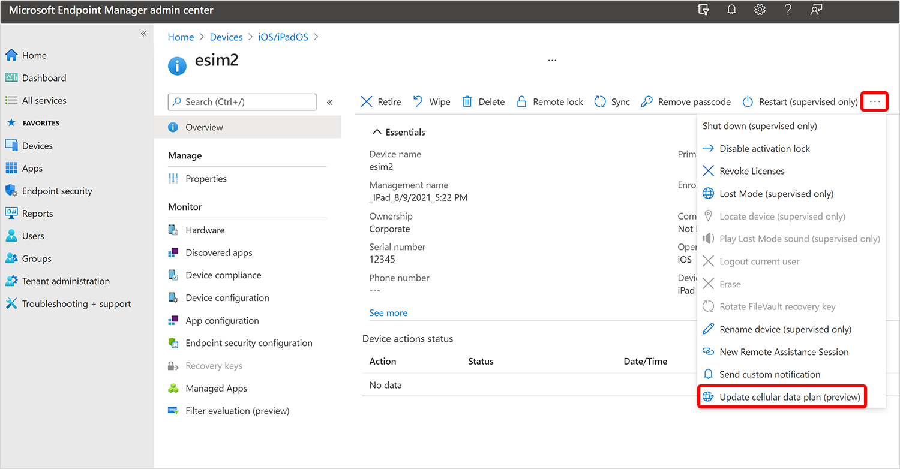

# Remote device action: update cellular data plan

The *update cellular data plan* remote action lets you remotely activate an eSIM cellular plan on supported iOS/iPadOS devices, making it easier to manage connectivity for users without physical SIM cards.

## Prerequisites

:::row:::
:::column span="1":::
[!INCLUDE [platform](../../includes/requirements/platform.md)]

:::column-end:::
:::column span="3":::

> This remote action supports the following platforms:
>
> - iOS/iPadOS

:::column-end:::
:::row-end:::

:::row:::
:::column span="1":::

[!INCLUDE [rbac](../../includes/requirements/rbac.md)]

> To execute this remote action, at a minimum, use an account that has one of the following roles:
>
> - [Help Desk Operator][INT-R1]
> - [School Administrator][INT-R2]
> - [Custom role][INT-RC] that includes:
>   - The permission **Remote tasks/Update cellular data plan**
>   - Permissions that provide visibility into and access to managed devices in Intune (for example, Organization/Read, Managed devices/Read)

## Remotely update the cellular data plan from the Intune admin center

1. In the [Microsoft Intune admin center][INT-AC], select **Devices** > [**All devices**][INT-ALLD].
1. From the devices list, select a device.
1. At the top of the device overview pane, find the row of remote action icons. Select **Update cellular data plan (preview)**.
    
1. Enter the activation server URL for your mobile carrier and select **Update cellular plan**.

## User experience

When you select the **Update cellular data plan** action, the device receives a command to activate the eSIM cellular data plan. The user experience on the device is as follows:

- Cellular data starts working.
- The active cellular data plan is listed in the cellular section of the **Settings** app on the device.

For more information about devices that support eSIM, see the Apple support article [Using Dual SIM with an eSIM](https://support.apple.com/HT209044).

## Reference links

- Microsoft Graph API: [activateDeviceEsim action][GRAPH-1]

<!--links-->

<!-- admin center links -->

[INT-AC]: https://go.microsoft.com/fwlink/?linkid=2109431
[INT-ALLD]: https://go.microsoft.com/fwlink/?linkid=2333814

<!-- role links -->

[INT-R1]: /intune/intune-service/fundamentals/role-based-access-control-reference#help-desk-operator
[INT-R2]: /intune/intune-service/fundamentals/role-based-access-control-reference#school-administrator
[INT-R4]: /intune/intune-service/fundamentals/role-based-access-control-reference#endpoint-security-manager
[INT-RC]: /intune/intune-service/fundamentals/create-custom-role

<!-- API links -->

[GRAPH-1]: /graph/api/intune-devices-manageddevice-activateDeviceEsim
