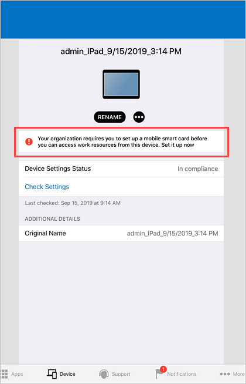
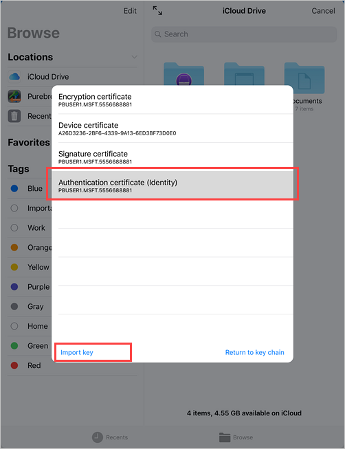

---
# required metadata

title: Enroll iOS or iPadOS device with Intune Company Portal and DISA Purebred  
description: Learn how to enroll an iOS or iPadOS device and set up derived credential authentication with DISA Purebred.  
keywords:
author: lenewsad
ms.author: lanewsad
manager: laurawi
ms.date: 09/15/2025  
ms.topic: end-user-help
ms.service: microsoft-intune
ms.subservice: end-user
ms.assetid: 
searchScope:
 - User help

# optional metadata

ROBOTS:  
#audience:

ms.reviewer: rishitasarin
ms.suite: ems
#ms.tgt_pltfrm:
ms.custom: intune-enduser
ms.collection:
- tier2
---

# Set up iOS or iPadOS device with Company Portal and DISA Purebred  

Enroll your device with the Intune Company Portal app to gain secure, mobile access to your organization's email, files, and apps. After your device is enrolled, it becomes *managed*. Your organization can assign policies and apps to the device through a mobile device management (MDM) provider, such as Intune.  

During enrollment, you'll also install a derived credential on your device. Your organization might require you to use the derived credential as an authentication method when accessing resources, or for signing and encrypting emails. 

You likely need to set up a derived credential if you use a smart card to:

* Sign in to school or work apps, Wi-Fi, and virtual private networks (VPN).  
* Sign and encrypt school or work emails using S/MIME certificates.  

In this article, you will:  

   * Enroll a mobile iOS or iPadOS device with Intune Company Portal.  
   * Get a derived credential from your organization's derived credential provider, [DISA Purebred](https:\//cyber.mil/pki-pke/purebred/).  

## What are derived credentials?  
A derived credential is a certificate that's derived from your smart card credentials and installed on your device. It grants you remote access to work resources, while preventing unauthorized users from accessing sensitive information.  

Derived credentials are used to: 
* Authenticate students and employees who sign in to school or work apps, Wi-Fi, and VPN.  
* Sign and encrypt school or work emails with S/MIME certificates.  

Derived credentials are an implementation of the National Institute of Standards and Technology (NIST) guidelines for Derived Personal Identity Verification (PIV) credentials as part of Special Publication (SP) 800-157.  

## Prerequisites

 To complete enrollment, you must have:

* Your school or work-provided smart card
* Access to a computer or kiosk where you can sign in with your smart card
* Your mobile device
* The Intune Company Portal app for iOS and iPadOS installed on your device   

You'll also need to contact a Purebred agent or representative during setup.  

## Enroll device  
1. Open the Company Portal app for iOS/iPadOS on your mobile device and sign in with your work account.  

1. Write down the onscreen code.  

      

1. Switch to your smart card-enabled device and go to https://microsoft.com/devicelogin. If you're a government employee signing in from another device, you'll need to change the settings on your device so that you're redirected to the government cloud for authentication. For more information about the setting changes you need to make, see [Troubleshoot iOS/iPadOS enrollment errors](/troubleshoot/mem/intune/device-enrollment/troubleshoot-ios-enrollment-errors#authentication-doesnt-redirect-to-the-government-cloud).  
1. Enter the code you previously wrote down.  
1. Insert your smart card to sign in.  
1. Return to the Company Portal app on your mobile device and follow the onscreen instructions to enroll your device.  
1. After enrollment is complete, Company Portal will notify you to set up your smart card. Tap the notification. If you don't get a notification, check your email.   

      
    
1. On the **Setup mobile smart card access** screen:  
    a. Tap the link to your organization's set up instructions. If your organization doesn't provide additional instructions, you'll be sent to this article.  
    b. Select **Open** to open the Purebred app.  

      
1. When prompted to allow Company Portal to open the Purebred Registration app, select **Open**.   

      

## Set up Purebred app 
Set up the Purebred app on your device. The following versions are supported with Intune Company Portal:  

- Version 3
- Version 2  

We recommend installing the latest version of the app. Install only one version on your device. Installing more than one instance of the Purebred app could cause problems.  

### Purebred version 3 
1. When the app works, work with your organization's Purebred agent to enroll your device in the Purebred system.  
1. After the setup is complete, return to the Company Portal app.
1. On the **Setup mobile smart card access** screen, tap **Continue**.  
1. From the **Import certificates** screen, retrieve and import the derived credential you got from DISA Purebred. 
   1. Tap **Continue**.  
   1. Tap **Browse**, and then tap the three dots **(…)** to open the overflow menu. 
   1. Tap **Edit Sidebar**. 
   1. Turn on **PurebredRegistration**. Then tap the check mark. 
   1. Tap **PurebredRegistration** on the sidebar. 
   1. A list of certificates and zip files should appear. The zip files contain different combinations of certificates. Once you know which certificate or zip file you want to use, tap the zip file or certificate to import it. 
      > [!CAUTION] 
      > Examine the contents of the zip file or certificate to confirm that you are selecting the right one. If you accidentally tap the wrong zip file or certificate, it will be imported and you won’t be able to go back without starting over. To see the contents of a zip file, press and hold the zip file, and then tap **View zip Details**. Tap **Dismiss** when you're ready to move on from the details. To view the details of an individual certificate, press and hold a certificate file, and then tap **View certificate details**.  
1. Wait for the success message in the Purebred app. It should appear within a few minutes. Tap **Done** to end setup. 

### Purebred version 2 
1. When the app works, work with your organization's Purebred agent to configure and download the Purebred pre-enrollment configuration profile.   
1. Go to the Settings app > **General** > **Profiles & Device Management** > **Install Profile** and tap **Install**.  
1. Enter your device passcode.  
1. Install the profile. You might need to tap **Install** more than once to start the installation. 
1. Return to the Purebred Registration app. Follow your Purebred agent's instructions to continue.  
1. After you download the configuration profile, go to the Settings app > **General** > **Profiles & Device Management** > **Install Profile** and tap **Install**.   
1.  Enter your device passcode.
1. Install the profile. You might need to tap **Install** more than once to start the installation. 
1. After installation is complete, return to the Company Portal app.  
1.  On the **Setup mobile smart card access** screen, tap **Continue**.  

1. From the **Import certificates** screen, you'll retrieve and import the derived credential you got from DISA Purebred.  

    a. Tap **Continue**.   

      
    b. Go to iCloud Drive **Browse** > **Locations** and tap **More Locations**.  

      
    c. Tap the switch to enable **Purebred Key Chain**.  

       

    d. Tap **Purebred Credential Package**.  

      
    f. A list of certificates appears. Select one and then tap **Import key**.  

     
1. Return to the Company Portal app and wait for Company Portal to finish setting up your device.   

## Next steps  
After enrollment is complete, you have access to work resources, such as email, Wi-Fi, and any apps that your organization makes available. For more information about how to get, search for, install, and uninstall apps in Company Portal, see:

* [Manage apps from the Company Portal website](manage-apps-cpweb.md)  
* [Use managed apps on your device](use-managed-apps-on-your-device-ios.md)  

Still need help? Contact your company support. For contact information, check the [Company Portal website](https://go.microsoft.com/fwlink/?linkid=2010980).

