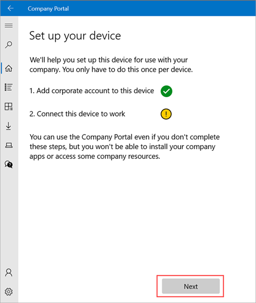
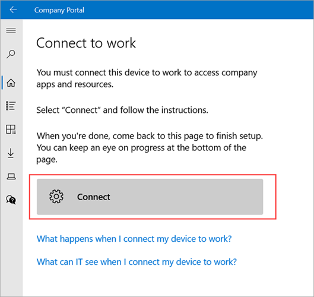
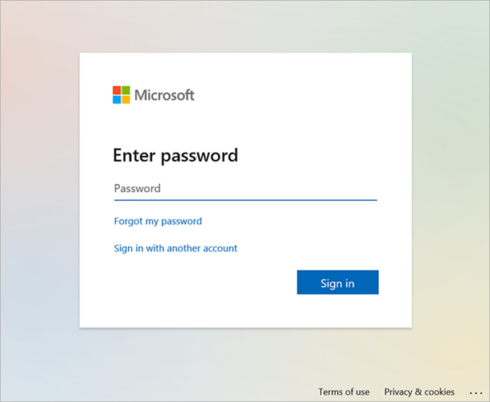
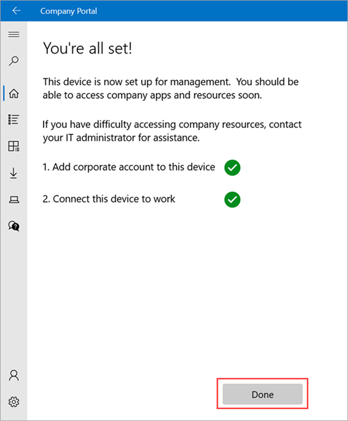

# Enroll Windows devices in Intune

**Applies to**
- Windows 

 > [!IMPORTANT]
 > [!INCLUDE [windows-10-support](../includes/windows-10-support.md)]

Enroll your Windows device in Intune to get mobile access to work or school apps, email, and Wi-Fi.

To identify the version of Windows running on your device, see [Which version of Windows operating system am I running?](https://go.microsoft.com/fwlink/?linkid=2166188).
 
> [!VIDEO https://www.youtube.com/embed/TKQxEckBHiE?rel=0]

## Get Company Portal
You can enroll Windows devices through the Intune Company Portal website or app. Devices running Windows 7 or 8.1 must enroll through the Company Portal website. To access Company Portal:

* Install the app from the [Microsoft Store](https://go.microsoft.com/fwlink/?linkid=2141417).
* [Sign on to the Company Portal website](https://go.microsoft.com/fwlink/?linkid=2010980) with your work or school credentials.

## Enroll devices  

Use Intune Company Portal to enroll devices running on Windows 10, version 1607 and later, and Windows 11.  
1. Open Company Portal and sign in with your work or school account.

2. On the **Home** screen, select **Next** to set up your device.

    

3. Select **Connect**.

    

4. Sign in with your work or school account again. If you're using the Company Portal website, the sign-in prompt may open in a new window.

    

5. On the **Setting up your device** screen, select **Go**.
6. After setup is complete, return to the Company Portal app. Select **Next**.
7. Select **Done** to exit setup.

    

## Sync device to fix connection problems

After enrolling, if you have trouble accessing work or school things, try syncing your device. For more information about syncing, see [Sync device](sync-your-device-manually-windows.md).  

## Troubleshooting
For a non-exhaustive list of error messages and resolutions, see [Troubleshoot Windows device access](troubleshoot-your-windows-10-device-windows.md).

## Support for IT administrators

If you're an IT administrator and run into problems while enrolling devices, see [Troubleshooting Windows device enrollment problems in Microsoft Intune](/troubleshoot/mem/intune/device-enrollment/troubleshoot-windows-enrollment-errors). This article lists common errors, their causes, and steps to resolve them.

## Next steps
If you need more help setting up your device or using Company Portal, contact your support person. Sign in to the [Company Portal website](https://go.microsoft.com/fwlink/?linkid=2010980) for your organization's contact information.

