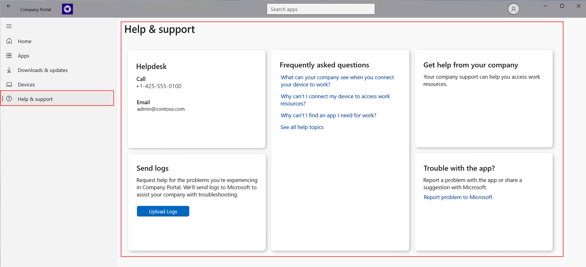

---
# required metadata

title: Get help and support in Intune Company Portal for Windows 
description: Access help and support options in the Intune Company Portal app for Windows.   
keywords:
author: lenewsad
ms.author: lanewsad
manager: dougeby
ms.date: 10/16/2024
ms.topic: end-user-help
ms.service: microsoft-intune
ms.subservice: end-user
ms.assetid: bd428c14-7d75-42de-9322-b57323a01f06
searchScope:
 - User help

# optional metadata

ROBOTS:  
#audience:

ms.reviewer:
ms.suite: ems
#ms.tgt_pltfrm:
ms.custom: intune-enduser
ms.collection:
- tier2
---

# Get help and support in Company Portal app for Windows   

Go to  **Help & support** in the Intune Company Portal app for Windows to troubleshoot app and access problems. 

   > [!div class="mx-imgBorder"]
   >  

From Help & support, you can:  

* Request help and send logs  
* Report problems with the app 
* View helpdesk contact details
* Find answers to your frequently asked questions (FAQs)  

If the problem you're experiencing prevents you from accessing help and support options in the Company Portal app, you can access support options on the [Company Portal website](https://go.microsoft.com/fwlink/?linkid=2010980).  

## Request help and send logs

Email your organization about problems you experience in Company Portal. Select **Upload Logs** to open the email template in your preferred mail app. In the body of the email, describe the problem. For more information, see [Send logs to your company support from the Company Portal app for Windows](send-logs-to-your-it-admin-cp-windows.md).  

## Report app problems to Microsoft  
If you experience trouble in the app, select **Report problem to Microsoft**. Then on the **Feedback for Microsoft** page, choose from the following options:    

* Report a problem or bug that you see in the app  
* Send a suggestion or idea you have for the app  
* Leave a review for the app in Microsoft Store   

## View helpdesk contact details  
Use your organization's contact information to quickly troubleshoot work or school access.  

## Find answers to frequently asked questions  
Under **Frequently asked questions** find the most common questions people ask when enrolling their devices. Select a question to go to the relevant help article on Microsoft Learn.  

## IT pro and administrator documentation  
For help and support documentation for IT pros and Intune administrators, see:   

* [Microsoft Learn](/): Home to the technical documentation where you can explore all guides and articles by product.  
* [Microsoft Intune product family documentation](../../index.yml): Official product documentation for Microsoft Intune product family, which includes Microsoft Intune, Microsoft Configuration Manager, and Windows Autopilot.  
* [Troubleshooting device enrollment in Intune](/troubleshoot/mem/intune/troubleshoot-device-enrollment-in-intune): Help and support docs for troubleshooting device enrollment issues in Microsoft Intune.  
