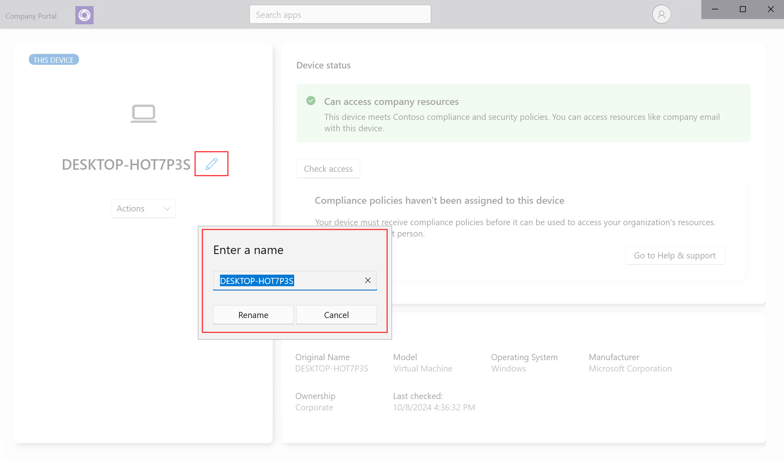

# Rename device from the Company Portal app for Windows

Rename a device to make it easier to recognize and manage in the Intune Company Portal app. The Company Portal app for Windows lets you rename the following types of connected devices:

* Windows 
* iOS
* Android

## Rename device

After you rename a device, its name immediately changes in the app.

1. Open the Company Portal app and go to **Devices**.
1. Select the device you want to rename.
1. Select the **Edit** pencil icon that's next to the current device name. Enter the new name, and then select **Rename**.

   > [!div class="mx-imgBorder"]
   > 

Still need help? Contact your IT support person. For contact information, sign into the Company Portal app or [Company Portal website](https://go.microsoft.com/fwlink/?linkid=2010980) with your work or school account.

>[!NOTE]
>The rename action in the Company Portal app gives employees and students the chance to rename enrolled devices to something that's easy to recognize. This change only applies to the name in Company Portal, and not to the device name or management name that appears in the Microsoft Intune admin center. If you're an IT administrator and need more information about managing device details in the admin center, see:
>
>- [Rename a device with Microsoft Intune](../remote-actions/device-rename.md).
>- [View device details with Microsoft Intune](../fundamentals/device-inventory.md#hardware-device-details).
