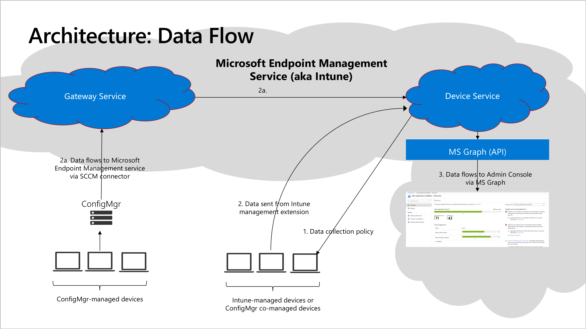

# Endpoint analytics data collection

This article explains the data flow, data collection, and how to stop gathering data for Endpoint analytics. For more information on our data handling policies, see Intune's [Data storage and processing](../intune/protect/privacy-data-store-process.md) and the [Microsoft Trust Center](https://www.microsoft.com/trust-center/privacy/data-location).

## Data flow

Endpoint analytics is available in all Intune locations in global Azure. Endpoint analytics respects the storage location elections made by the administrator for customer data. The following illustration shows how required functional data flows from individual devices through our data services, transient storage, and to your tenant. 

1. An [Intune Service Administrator role](../intune/fundamentals/role-based-access-control.md) [starts gathering data](enroll-intune.md#bkmk_onboard).

    - For Intune-managed devices, this step configures the **Intune data collection** policy. By default, this policy is assigned to "All Devices". You can [change the assignment](settings.md#bkmk_set) at any time to a subset of devices or no devices at all.

    - For Configuration Manager-managed devices, enable [Endpoint analytics data collection and enroll devices](enroll-configmgr.md#bkmk_cm_enroll).

1. Devices send required functional data.

    - For Intune and co-managed devices with the assigned policy, devices send required functional data in near real time directly to the Microsoft Endpoint Management Service in the Microsoft public cloud where is processed every 24 hours. For more information, see [Endpoints required for Intune-managed devices](troubleshoot.md#endpoints-required-for-intune-managed-devices).

    - For Configuration Manager-managed devices, data flows to the Microsoft Endpoint Management Service through the ConfigMgr [tenant attach](../configmgr/tenant-attach/device-sync-actions.md) connector. Devices don't need direct access to the Microsoft public cloud, but the ConfigMgr connector is cloud attached and requires connection to an Intune tenant. Devices send data to the Configuration Manager Server role every 24 hours, and the connector sends data to the Gateway Service every hour. For more information, see [Tenant attach data collection](../configmgr/tenant-attach/data-collection.md)

1. The Microsoft Endpoint Management service processes data for each device and publishes the results for both individual devices and organizational aggregates in the Intune admin center using [MS Graph APIs](/graph/api/resources/intune-device-mgt-conceptual?view=graph-rest-beta&preserve-view=true). The maximum latency end to end is 96 hours.
  
> [!Note]  
> When you first setup Endpoint analytics, add new clients to the [Intune data collection policy](settings.md#bkmk_profile), or [enable device upload](../configmgr/tenant-attach/device-sync-actions.md#bkmk_edit) for a new collection, the reports in endpoint analytics portal may not show complete data right away. The data required to compute the startup score for a device is generated during boot time. Depending on power settings and user behavior, it may take weeks after a device has been enrolled to show the startup score on the Intune admin center.

##  Data collection

Endpoint analytics data collection falls into the [optional](../intune/protect/privacy-data-collect.md#optional-data) category. Below are some examples of the optional data collected for devices enrolled in endpoint analytics:

- Diagnostic, performance, and usage data tied to a user and/or device
  - **logOnId**
  - **bootId:** The system boot ID
  - **coreBootTimeInMilliseconds:** Time for core boot
  - **totalBootTimeInMilliseconds:** Total boot time
  - **updateTimeInMilliseconds:** Time for OS updates to complete
  - **gpLogonDurationInMilliseconds**: Time for Group policies to process
  - **desktopShownDurationInMilliseconds:** Time for desktop (explorer.exe) to be loaded
  - **desktopUsableDurationInMilliseconds:** Time for desktop (explorer.exe) to be usable
  - **topProcesses:** List of processes loaded during boot with name, with cpu usage stats and app details (Name, publisher, version). For example *{\"ProcessName\":\"svchost\",\"CpuUsage\":43,\"ProcessFullPath\":\"C:\\\\Windows\\\\System32\\\\svchost.exe\",\"ProductName\":\"Microsoft&reg; Windows&reg; Operating System\",\"Publisher\":\"Microsoft Corporation\",\"ProductVersion\":\"10.0.18362.1\"}*
- Device data not tied to a device or user (if this data is tied to a device or user, Intune treats it as identified data)
  - **ID:** Unique device ID used by Windows Update
  - **localId:** A locally defined unique ID for the device. This ID isn't the human-readable device name. 
  Most likely equal to the value stored at HKLM\Software\Microsoft\SQMClient\MachineId.
  - **aaddeviceid:** Azure Active Directory device ID
  - **orgId:** Unique GUID representing the Microsoft 365 Tenant
- Application inventory, like
  - **name:** Windows
  - **ver:** The version of the current OS.

> [!Important]  
> Our data handling policies are described in the [Microsoft Trust Center](https://www.microsoft.com/trust-center/privacy/data-location). We only use your customer data to provide you the services you signed up for. As described during the onboarding process, we anonymize and aggregate the scores from all enrolled organizations to keep the **All organizations (median)** baseline up-to-date.

##  Stop gathering data

- If you're enrolling Intune managed devices only, unselect the **Endpoint analytics** scope from  the [Intune data collection policy](settings.md#bkmk_profile) created during sign-up. Optionally, [revoke consent](settings.md#bkmk_consent) to share anonymized and aggregate metrics for seeing updated Endpoint analytics scores and insights.

- If you're enrolling devices that are managed by Configuration Manager, you’ll need to do the following steps to disable data upload in Configuration Manager:

   1. In the Configuration Manager console, go to **Administration** > **Cloud Services** > **Co-management**.
   1. Select **CoMgmtSettingsProd** then click **Properties**.
   1. On the **Configure upload** tab, uncheck the option to **Enable Endpoint analytics for devices uploaded to Microsoft Endpoint Manager**.
   1. Optionally, [revoke consent](settings.md#bkmk_consent) to share anonymized and aggregate metrics for seeing updated Endpoint analytics scores and insights.

- Disable Endpoint analytics data collection in Configuration Manager (optional):

   1. In the Configuration Manager console, go to **Administration** > **Client Settings** > **Default Client Settings**.
   1. Right-click and select **Properties** then select the **Computer Agent** settings.
   1. Set **Enable Endpoint analytics data collection** to **No**.
  > [!Important]
  > If you have an existing custom client agent setting that's been deployed to your devices, you'll need to update the **Enable Endpoint analytics data collection** option in that custom setting then redeploy it to your machines for it to take effect.

## Resources

For more information about related privacy aspects, see the following articles:

- [Microsoft Privacy Statement](https://go.microsoft.com/fwlink/?LinkId=521839)
- [Windows 10 and privacy compliance](/windows/privacy/windows-10-and-privacy-compliance)
- [Licensing terms and documentation](https://www.microsoft.com/licensing/terms)  
- [Security and privacy at Microsoft Azure data centers](https://azure.microsoft.com/global-infrastructure/)  
- [Confidence in the trusted cloud](https://azure.microsoft.com/overview/trusted-cloud/)  
- [Trust Center](https://www.microsoft.com/trustcenter)
- [Intune Data storage and processing](../intune/protect/privacy-data-store-process.md)
