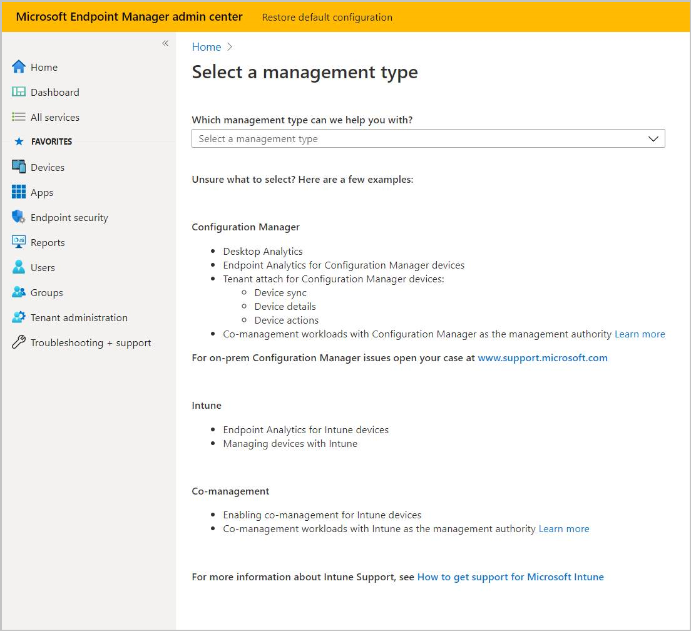
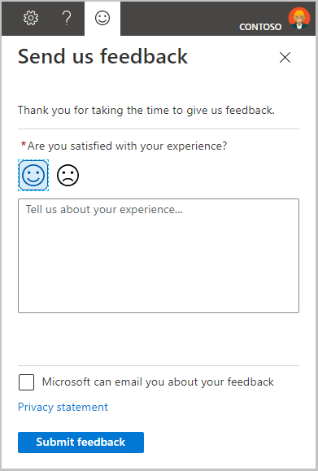

# Get support for Endpoint analytics

Microsoft provides global technical, pre-sales, billing, and subscription support for Endpoint analytics. Support is available both online and by phone for paid and trial subscriptions. Online technical support is available in English and Japanese. Phone support and online billing support are available in additional languages.

Before contacting Microsoft Support, first review the following articles:

- [Prerequisites](enroll-intune.md#bkmk_prereq)
- [Troubleshoot Endpoint analytics](troubleshoot.md)

## Help and support

To request help for Endpoint analytics, use the **Help and Support** option in the portal under **Troubleshooting + support**. This action files an online support ticket for Endpoint analytics. To create and manage a support incident, your account must have a Microsoft Entra role that includes the action **microsoft.office365.supportTickets/tickets/manage**. For more information, see [administrator roles in Microsoft Entra ID](/azure/active-directory/users-groups-roles/directory-assign-admin-roles).

If the issue is more broadly for Intune than just Endpoint analytics, follow the instructions in the [How to get support in Microsoft Intune](../get-support.md) article to open a new support request. For an issue that is more broadly for Configuration Manager than just Endpoint analytics, go to [Microsoft support](https://aka.ms/cmcbsupport) to open a new support request.

##  Share product feedback

<!-- 5451636 -->

To share your feedback about Endpoint analytics, select the **Send a Smile** icon at the top of the portal on the right side. Use the text box to provide your feedback and select **Submit feedback** when done.

## See also

- [Find help for Configuration Manager](../configmgr/core/understand/find-help.md)
- [Support for Microsoft Intune](../get-support.md)
