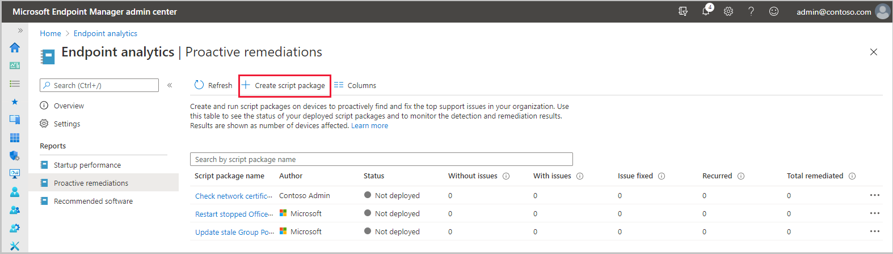
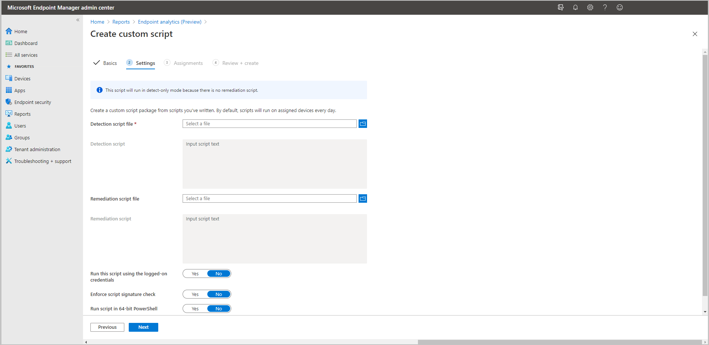
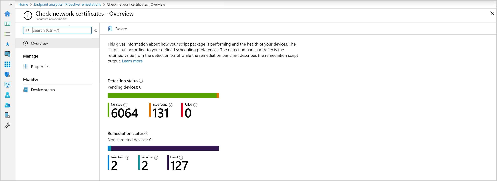

# Tutorial: Proactive remediations

Proactive remediations in Endpoint analytics helps you fix common support issues before end-users notice issues. Use Proactive remediations to help increase your [User experience score](enroll-intune.md#bkmk_view).

In this tutorial, you learn how to:  

> [!div class="checklist"]  
> * Review prerequisites for Proactive remediations
> * Deploy a built-in script package
> * Deploy a custom script package
> * Monitor the script packages  

##  About Proactive remediations

Proactive remediations are script packages that can detect and fix common support issues on a user's device before they even realize there's a problem. These remediations can help reduce support calls. You can create your own script package, or deploy one of the script packages we've written and used in our environment for reducing support tickets.

Each script package consists of a detection script, a remediation script, and metadata. Through Intune, you can deploy these script packages and see reports on their effectiveness.

##  Prerequisites

- Devices enrolled into Endpoint analytics.
   - For more information, see [Enroll Configuration Manager managed devices](enroll-configmgr.md) and [Enroll Intune managed devices](enroll-intune.md).

Whether enrolling devices via Intune or Configuration Manager, Proactive remediation scripting has the following requirements:
- Devices must be Azure AD joined or hybrid Azure AD joined and meet one of the following conditions:
  - Is managed by Intune and runs an Enterprise, Professional, or Education edition of Windows 10 or later.
  - A [co-managed](../configmgr/comanage/overview.md) device running Windows 10, version 1903 or later. Co-managed devices on preceding versions of Windows 10 will need the [Client apps workload](../configmgr/comanage/workloads.md#client-apps) pointed to Intune (only applicable up to version 1607).

### Licensing

Proactive remediations requires the [licensing for Endpoint analytics](enroll-intune.md#bkmk_prereq) and also requires users of the devices to have one of the following licenses:

- Windows 10/11 Enterprise E3 or E5 (included in Microsoft 365 F3, E3, or E5)
- Windows 10/11 Education A3 or A5 (included in Microsoft 365 A3 or A5)
- Windows 10/11 Virtual Desktop Access (VDA) per user

### Permissions

- For Proactive remediations, the user needs permissions appropriate to their role under the **Device configurations** category. Permissions in the **Endpoint Analytics** category aren't needed if the user only uses Proactive remediations.

- An [Intune Service Administrator](/azure/active-directory/users-groups-roles/directory-assign-admin-roles#intune-service-administrator-permissions) is required to confirm licensing requirements before using proactive remediations for the first time.

###  Script requirements

- You can have up to 200 script packages.
- A script package can contain a detection script only or both a detection script and a remediation script. 
   - A remediation script only runs if the detection script uses exit code `exit 1`, meaning the issue was detected.
- Ensure the scripts are encoded in UTF-8.
  - If the option **Enforce script signature check** is enabled in the [Settings](#bkmk_prs_deploy) page of creating a script package, then make sure that the scripts are encoded in UTF-8 not UTF-8 BOM.
- The maximum allowed output size limit is 2048 characters.
- If the option **Enforce script signature check** is enabled in the [Settings](#bkmk_prs_deploy) page of creating a script package, the script runs using the device's PowerShell execution policy. The default execution policy for Windows client computers is **Restricted**. The default execution for Windows Server devices is **RemoteSigned**. For more information, see [PowerShell execution policies](/powershell/module/microsoft.powershell.core/about/about_execution_policies#powershell-execution-policies).
   - Scripts built into Proactive remediations are signed and the certificate is added to the **Trusted Publishers** certificate store of the device.
   - When using third-party scripts that are signed, make sure the certificate is in the **Trusted Publishers** certificate store. As with any certificate, the certificate authority must be trusted by the device.
  - Scripts without **Enforce script signature check** use the **Bypass** execution policy.
- Don't put secrets in scripts. Consider using parameters to handle secrets instead. <!--13957089-->
- Don't put reboot commands in detection or remediations scripts. <!--13957089-->

##  Deploy built-in script packages

There are built-in script packages you can use to get started with Proactive remediations. The **Microsoft Intune Management Extension** service gets the scripts from Intune and runs them. The scripts are rerun every 24 hours by default. The following built-in script packages just need to be assigned:

- **Update stale Group Policies** – Stale Group Policies can lead to helpdesk tickets related to connectivity and internal resource access.
- **Restart Office Click-to-run service** – When the Click-to-run service is stopped, Office apps fail to start leading to helpdesk calls.

To assign the script package:

1. From the **Proactive remediations** node, select one of the built-in script packages.
1. Select **Properties**, then next the **Assignments** heading, select **Edit**.
1. Choose the groups you want to **Assign to** and any **Excluded groups** for the script package.
1. To change the **Scope tags**, select **Edit** then **Select scope tags**.
1. If you would like to change the schedule, select the ellipses and choose **Edit** to specify your settings then **Apply** to save them.
1. When you're done, select **Review + save**.  

##  Create and deploy custom script packages

The **Microsoft Intune Management Extension** service gets the scripts from Intune and runs them. The scripts are rerun every 24 hours. You can copy the provided scripts and deploy them, or you can create your own script packages. To deploy script packages, follow the instructions below:

### Copy the provided detection and remediation scripts

1. Copy the scripts from the [PowerShell scripts](powershell-scripts.md#bkmk_ps_scripts) article.
    - Script files whose names start with `Detect` are detection scripts. Remediation scripts start with `Remediate`.
    - For a description of the scripts, see the [Script descriptions](powershell-scripts.md#bkmk_scripts).
1. Save each script using the provided name. The name is also in the comments at the top of each script. Ensure the saved scripts are encoded in UTF-8.
    - You can use a different script name, but it won't match the name listed in the [Script descriptions](powershell-scripts.md#bkmk_scripts).

### Deploy the script packages
Proactive remediation scripts need to be encoded in UTF-8. Uploading these scripts rather than editing them directly in your browser helps ensure that the script encoding is correct so your devices can execute them. 

1. Go to the **Proactive remediations** node in the console.
1. Choose the **Create script package** button to create a script package.
     
1. In the **Basics** step, give the script package a **Name** and optionally, a **Description**. The **Publisher** field can be edited, but defaults to your name. **Version** can't be edited.
1. On the **Settings** step, upload both the **Detection script file** and the **Remediation script file** by doing the following steps:
   1. Select the folder icon.
   1. Browse to the `.ps1` file.
   1. Choose the file and select **Open** to upload it.

    The detection script must use exit code `exit 1` if the target issue is detected. The remediation script won't run when there's any other exit code, including an empty output, since it results in an *issue is not found* state. Review the [Sample detection script](powershell-scripts.md#bkmk_ps_scripts) for an example of exit code usage.

   You need the corresponding detection and remediation script to be in the same package. For example, the `Detect_Expired_User_Certificates.ps1` detection script corresponds with the `Remediate_Expired_User_Certificates.ps1` remediation script.
       
1. Finish the options on the **Settings** page with the following recommended configurations:
   - **Run this script using the logged-on credentials**: This setting is dependent on the script. For more information, see the [Script descriptions](powershell-scripts.md#bkmk_scripts).
   - **Enforce script signature check**: No
   - **Run script in 64-bit PowerShell**: No

   For information about enforcing script signature checks, see [Script requirements](#bkmk_requirements).
1. Click **Next** then assign any **Scope tags** you need.
1. In the **Assignments** step, select the device groups to which you want to deploy the script package. When you're ready to deploy the packages to your users or devices, you can also use filters. For more information, see [Create filters in Microsoft Intune](../intune/fundamentals/filters.md). 
   >[!NOTE]
   > Don't mix user and device groups across include and exclude assignments. 
1. Complete the **Review + Create** step for your deployment.

##  Client policy retrieval and client reporting

The client retrieves policy for proactive remediations scripts at the following times:

- After a restart of the device or Intune management extension service
- After a user signs into the client
- Once every 8 hours
   - The 8 hour script retrieval schedule is fixed based on when the Intune management extension service starts. The schedule isn't altered by user sign ins.

The client reports proactive remediation information at the following times:

- When a script is set to run once, the results are reported after the script runs.
- Recurring scripts follow a 7 day reporting cycle:
  - Within the first 6 days, the client reports only if a change occurs. The first time the script runs would be considered a change.
  - Every 7 days the client sends a report even if there wasn't a change.

##  Monitor your script packages

1. Under **Reporting** > **Endpoint analytics - Proactive remediations**, you can see an overview of your detection and remediation status.
       
1. Select **Device status** to get status details for each device in your deployment.
       

##  Export script output
<!-- 10198545 -->
To help you easily analyze returned outputs, use the **Export** option to save the output as a `.csv` file. Exporting the output to a `.csv` file allows you to analyze the returned outputs when remediations run on devices with issues. Exporting also allows you to share the results with others for additional analysis.  

## Next steps

- Get the [PowerShell scripts](powershell-scripts.md) for Proactive remediations.
- View [Startup performance](startup-performance.md).
- Learn more about [PowerShell script security](../configmgr/apps/deploy-use/learn-script-security.md).
