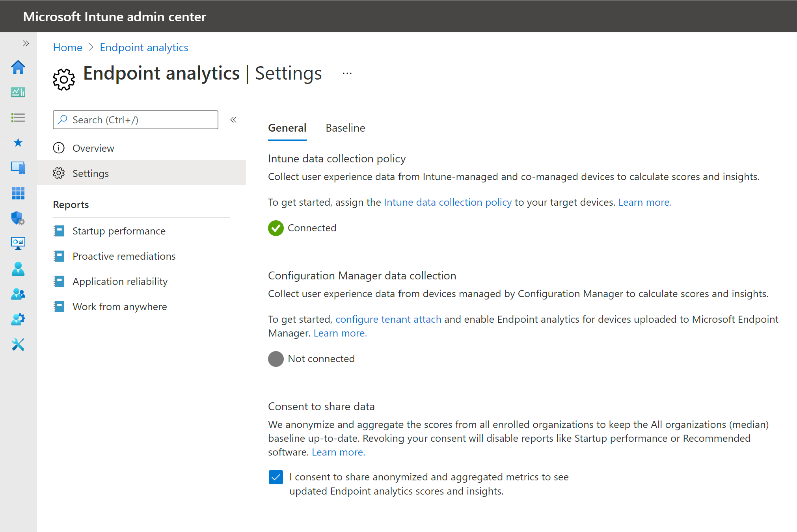
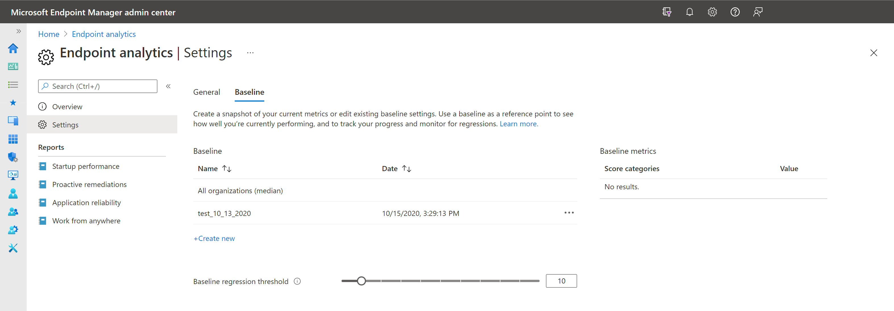

#  Endpoint analytics settings

From the settings page, you can select **General** or **Baseline**. Each of these settings is described here:

##  General settings

The **General** page in **Settings** allows you to see if Intune startup performance data collection has been enabled. It's automatically enabled for all your devices by default when you select **Start** to enable user-experience analytics. You can go to the Intune data collection policy node to change the set of devices on which boot and sign in records are collected.

  

###  Intune data collection policy

To assign this setting to a subset of devices, [Create a profile](../intune/configuration/device-profile-create.md#create-the-profile) with  the following information:

- **Platform**: Select **Windows 10 and later**

- **Profile Type**: Select **Template**

- **Profile**: Select **Windows health monitoring**
  
- **Name**: Enter a descriptive name for the profile, like **Intune data collection policy**

- **Description**: Enter a description for the profile. This setting is optional, but recommended.

- In **Configuration Settings**:

  - **Health Monitoring**: Select **Enable** to collect event information from supported Windows 10 or later devices

  - **Scope**: Select **Endpoint analytics**. Windows updates scope isn't used by endpoint analytics.

- Use the [Scope tags](../intune/configuration/device-profile-create.md#scope-tags) and [Applicability rules](../intune/configuration/device-profile-create.md#applicability-rules) to filter the profile to specific IT groups or devices in a group that meet a specific criteria.

### Configuration Manager data connector

To connect your Configuration Manager hierarchy with Endpoint analytics, you need to enable [Microsoft Intune tenant attach](../configmgr/tenant-attach/device-sync-actions.md). 

Once connected, you can [choose which devices you'd like to target](enroll-configmgr.md#bkmk_cm_enroll) for Endpoint analytics in the Configuration Manager console.

> [!NOTE] 
> Some devices, such as non-Windows devices, are not eligible for Endpoint analytics, but may be eligible for [device actions with Microsoft Intune tenant attach](../configmgr/tenant-attach/device-sync-actions.md). Including these devices in your targeted collection will have no effect on Endpoint Analytics.

###  Consent to share data

When you share anonymized data and aggregate metrics, enrolled organizations keep the **All organizations (median)** baseline updated. You can revoke consent to share this data at any time. When you revoke consent, it disables reports that rely on data for calculating insights such as startup performance. The data currently in the reports immediately becomes stale and new data isn't added. Prior to revoking consent, data is displayed for up to 60 days until historical data is no longer available.

To revoke consent:

1. On the Endpoint analytics settings page, clear the checkbox that states **I consent to share anonymized and aggregate metrics to see updated Endpoint analytics scores and insights**.
1. Select **Yes** to confirm the action.
1. Optionally, [stop gathering data](data-collection.md#bkmk_stop).

##  Baseline management

You can compare your current scores and subscores to others by setting a baseline.

1. There's a built-in baseline for **All organizations (median)**, which allows you to compare your scores to a typical enterprise.

   > [!Important]  
   > We anonymize and aggregate the scores from all enrolled organizations to keep the **All organizations (median)** baseline up-to-date. You can [stop gathering data](data-collection.md#bkmk_stop) at any time.

1. You can create new baselines based on your current metrics to track progress or view regressions over time. Select the **Create new** button and give your new baseline a name. We recommend a name that includes the date, so it's easier to select from the drop-down in the reports pages.

   > [!Note]
   > You must open at least one Endpoint analytics report, such as [Startup performance](startup-performance.md), during your browser session before you are able to create a new baseline.
   
1. There's a limit of 20 baselines per tenant. You can delete old baselines that are no longer needed.
1. Your current metrics are flagged red and shown as regressed if they fall below the current baseline in your reports. It's perfectly normal for metrics to fluctuate from day to day. So you can set a regression threshold, which defaults to 10%. With this threshold, metrics are only flagged as regressed if they've regressed by more than 10%.

   

## Next steps

- [Enroll Intune devices](enroll-intune.md)
- [Enroll Configuration Manager devices](enroll-configmgr.md)
