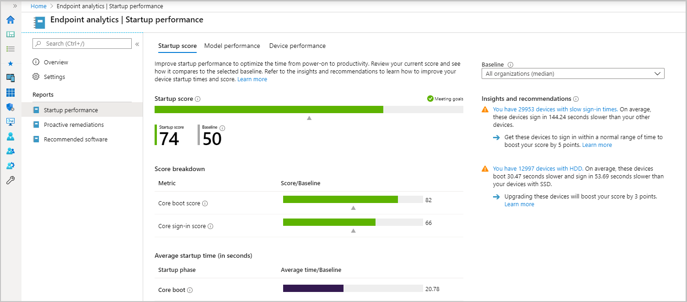

#  Startup performance

The startup performance score helps IT get users from power-on to productivity quickly, without lengthy boot and sign-in delays.

##  Prerequisites

Startup performance insights are only available for:
- Devices running version 1903 or later of Windows 10 Enterprise
   - Home and Pro editions aren't currently supported.
- The devices must be Azure AD joined or hybrid Azure AD joined.
   - Workplace joined machines aren't currently supported.

##  Startup score

The startup performance score helps IT get users from power-on to productivity quickly, without lengthy boot and sign-in delays. The **Startup score** is a number between 0 and 100. This score is a weighted average of **Boot score** and the **Sign-in** score, which are computed as follows:

- **Boot score**: Based on the time from power-on to sign in. We look at the last boot time from each device, excluding the update phase, then score it from 0 (poor) to 100 (exceptional). These scores are averaged to provide an overall tenant boot score.
- **Sign-in score**: Based on the time from when credentials have been entered until the user can access a responsive desktop (meaning the desktop has rendered and the CPU usage has fallen below 50% for at least 2 seconds). We look at the last sign-in time to each device, excluding first sign-ins or sign-ins immediately after a feature update, then score it from 0 (poor) to 100 (exceptional). These scores are averaged to provide an overall tenant boot score.

> [!NOTE]
> If you are not seeing startup performance data from all your devices, see [Troubleshooting device enrollment and startup performance](troubleshoot.md#bkmk_enrollment_tshooter).

## Insights

The **Startup performance** page also provides a prioritized list of **Insights and recommendations**, described in the following sections:

###  Hard disk drives

Startup performance provides an insight on the number of devices on which the boot drive is a hard disk. Hard disk drives typically result in boot times three to four times longer than solid-state drives. We also report the expected improvement to start up performance you would gain by moving to solid-state drives.

Click though to see the list of devices that have hard disk drives. The recommended action is to upgrade these devices to solid-state drives.

###  Group Policy

Startup performance provides an insight on the number of devices that have delays to boot and sign-in times caused by Group Policy. Clicking through takes you to the devices view. The view is sorted by Group Policy time, so you can see affected devices for further troubleshooting.

If you click through to a particular device, you can see its boot and sign-in history. The history helps you determine if the issue is a regression and when it might have occurred.

While there are many articles on how to optimize Group Policies performance, you may choose to migrate to cloud-management instead. Migrating to cloud-management allows you to use [Intune security baselines](../intune/protect/security-baselines.md) and the soon-to-be-released Policy Analytics tool.

###  Slow boot and sign-in times

Startup performance provides an insight on the number of devices with slow boot or sign-in times. A boot score or sign-in score of "0" means it's slow. Clicking through takes you to the devices view. The devices are sorted by core boot time or core sign-in time respectively, so you can see affected devices for further troubleshooting.

If you click through to a particular device, you can see its boot and sign-in history. The history helps you determine if the issue was a regression and when it might have occurred.

## Reporting tabs

The **Startup performance** page has reporting tabs that provide support for the insights, including:

- **Model performance**. This tab lets you see the boot and sign-in performance by device model, which can help you identify if performance problems are isolated to particular models.
- **Device performance**. This tab provides boot and sign-in metrics for all your devices. You can sort by a particular metric (for example, GP sign-in time) to see which devices have the worst scores for that metric to help with troubleshooting. You can also search for a device by name. If you click through a device you can see its boot and sign-in history, which can help you identify if there was a recent regression
- **Startup processes**. Startup processes can negatively impact the user experience by increasing the length of time that users must wait for the desktop to become responsive. This tab (if visible; we've only flighted this tab to some customers) will show you which processes are impacting the sign-in "time to responsive desktop" phase; that is - keeping the CPU above 50% after the desktop has rendered. The table only lists processes that impact a minimum of 10 devices in your tenant.  

## Next steps

Use [Proactive remediations](proactive-remediations.md) to help fix common support issues before end-users notice issues.