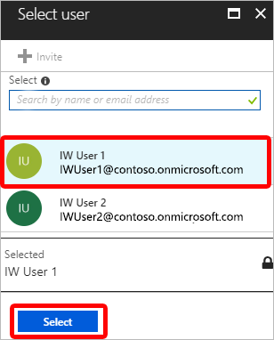

---
# required metadata

title: Create device groups for Windows Autopilot - Microsoft Intune | Microsoft Docs
titleSuffix: Microsoft Intune
description: Learn how to create device groups for Windows Autopilot.
keywords:
author: aczechowski
ms.author: aaroncz
ms.reviewer: jubaptis
manager: dougeby
ms.date: 02/09/2022
ms.topic: how-to
ms.service: microsoft-intune
ms.subservice: enrollment
ms.localizationpriority: high
ms.technology:
ms.assetid: a2dc5594-a373-48dc-ba3d-27aff0c3f944

# optional metadata

#ROBOTS:
#audience:

ms.suite: ems
search.appverid: MET150
#ms.tgt_pltfrm:
ms.custom: seodec18
ms.collection: 
- M365-modern-desktop
- m365initiative-coredeploy
- M365-identity-device-management
- highpri
---

# Create device groups

**Applies to**

- Windows 11
- Windows 10
- Windows Holographic, version 2004 or later

> [!NOTE]
> HoloLens 2 devices require Windows Autopilot self-deploying mode. For more information about using Windows Autopilot to deploy HoloLens 2 devices, see [Windows Autopilot for HoloLens 2](/hololens/hololens2-autopilot). **Assign to User** is not applicable for self-deployment Autopilot mode on Hololens 2.

## Create an Autopilot device group using Intune

1. In the [Microsoft Endpoint Manager admin center](https://go.microsoft.com/fwlink/?linkid=2109431), select **Groups** > **New group**.
2. In **New Group**, configure the following properties:

    - **Group type**: Select **Security**.
    - **Group name** and **Group description**: Enter a name and description for your group.
    - **Azure AD roles can be assigned to the group (Preview)**: **Yes** allows Azure AD roles to be assigned to the group you're creating. Once set, the group is permanently and always allowed to be assigned Azure AD roles. When set to **No**, Azure AD roles aren't assigned to the this group.

      For more information, see [Use cloud groups to manage role assignments in Azure AD](/azure/active-directory/roles/groups-concept).

    - **Membership type**: Choose how devices become members of this group. Select **Assigned**, **Dynamic user**, or **Dynamic Device**. For more information, see [Add groups to organize users and devices](../intune/fundamentals/groups-add.md).
    - **Owners**: Select users that own the group. Owners can also delete this group.
    - **Members**: Select Autopilot devices that belong to this group. Autopilot devices that aren't enrolled show the serial number for the device name.
    - **Dynamic device members**: Select **Add dynamic query** > **Add expression**.

      Create rules using Autopilot device attributes. Autopilot devices that meet these rules are automatically added to the group. Creating an expression using non-autopilot attributes doesn't guarantee that devices included in the group are registered to Autopilot.

      When creating expressions:
      
      - To create a group that includes all of your Autopilot devices, enter: `(device.devicePhysicalIDs -any (_ -contains "[ZTDId]"))`.
      - Intune's group tag field maps to the `OrderID` attribute on Azure AD devices. To create a group that includes all Autopilot devices with a specific group tag (the Azure AD device `OrderID`), enter: `(device.devicePhysicalIds -any (_ -eq "[OrderID]:179887111881"))`.
      - To create a group that includes all your Autopilot devices with a specific Purchase Order ID, enter: `(device.devicePhysicalIds -any (_ -eq "[PurchaseOrderId]:76222342342"))`
 
      **Save** your expressions.

3. Select **Create**.

> [!NOTE]
> Anything assigned to these attributes will only be assigned if the device is Autopilot registered.

## Add devices

For information about formatting and using a CSV file to manually add Windows Autopilot devices, see [Manually register devices with Windows Autopilot](add-devices.md).

## Assign a user to a specific Autopilot device

> [!NOTE]
> Assigning a licensed user to a registered Autopilot device using Microsoft Endpoint Manager no longer pre-fills any user information as described below. Please see [Updates to the Windows Autopilot sign-in and deployment experience](https://techcommunity.microsoft.com/t5/intune-customer-success/updates-to-the-windows-autopilot-sign-in-and-deployment/ba-p/2848452) for details on this change. This change does not impact user assigned policies and apps which are still deployed to the device when a licensed user is assigned. See [Windows Autopilot for pre-provisioned deployment](./pre-provision.md#preparation) for details on this.

You can assign a licensed Intune user to a specific Autopilot device. This assignment:
- Pre-fills a user from Azure Active Directory in the [company-branded](/azure/active-directory/fundamentals/customize-branding) sign-in page during Windows setup.
- Lets you set a custom greeting name.
- Doesn't pre-fill or modify Windows sign-in.

Prerequisites: 
- Azure Active Directory Company Branding has been configured.
- Windows 10, version 1809 or later.

> [!NOTE]
> Assigning a user to a specific Autopilot device doesn't work if you are using ADFS.

1. In the [Microsoft Endpoint Manager admin center](https://go.microsoft.com/fwlink/?linkid=2109431), choose **Devices** > **Windows** > **Windows enrollment** > **Devices** (under **Windows Autopilot Deployment Program** > choose the device > **Assign user**.

    

2. Choose an Azure user licensed to use Intune and choose **Select**.

    

3. In the **User Friendly Name** box, type a friendly name or just accept the default. This string is the friendly name that displays when the user signs in during Windows setup.

    

4. Choose **Ok**.

## Using Autopilot in other portals

If you aren't interested in mobile device management, you can use Autopilot in other portals. While using other portals is an option, we recommend you only use Intune to manage your Autopilot deployments. When you use Intune and another portal, Intune isn't able to: 

- Display changes to profiles created in Intune, but edited in another portal.
- Synchronize profiles created in another portal.
- Display changes to profile assignments done in another portal.
- Synchronize profile assignments done in another portal.
- Display changes to the device list that were made in another portal.

## Windows Autopilot for existing devices

You can group Windows devices by a correlator ID when enrolling using [Autopilot for existing devices](https://techcommunity.microsoft.com/t5/Windows-IT-Pro-Blog/New-Windows-Autopilot-capabilities-and-expanded-partner-support/ba-p/260430) through Configuration Manager. The correlator ID is a parameter of the Autopilot configuration file. The [Azure AD device attribute enrollmentProfileName](/azure/active-directory/users-groups-roles/groups-dynamic-membership#rules-for-devices) is automatically set to equal "OfflineAutopilotprofile-\<correlator ID\>". So, arbitrary Azure AD dynamic groups can be created based off correlator ID by using the enrollmentprofileName attribute.

>[!WARNING] 
> Because the correlator ID is not pre-listed in Intune, the device may report any correlator ID they want. If the user creates a correlator ID matching an Autopilot or Apple ADE profile name, the device will be added to any dynamic Azure AD device group based off the enrollmentProfileName attribute. To avoid this conflict:
> - Always create dynamic group rules matching against the *entire* enrollmentProfileName value
> - Never name Autopilot or Apple ADE profiles beginning with "OfflineAutopilotprofile-".

## Next steps

After you have created a device group, you can configure and apply a Windows Autopilot deployment profile to each device in the group. Deployment profiles determine the deployment mode, and customize the OOBE for your end users. For more information, see [Configure deployment profiles](profiles.md).

For more information about managing your Windows Autopilot devices, see [What is Microsoft Intune device management?](../intune/remote-actions/device-management.md)
