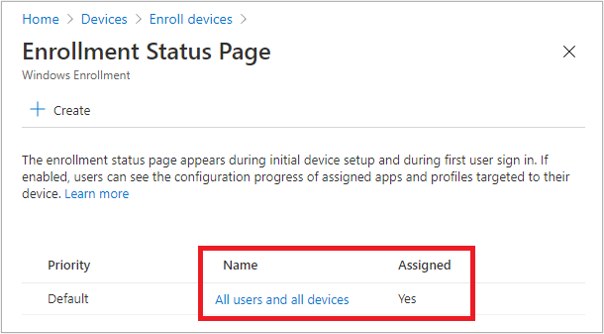
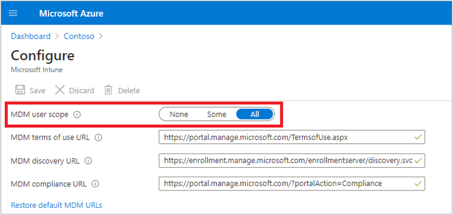

# Windows Autopilot Deployment for existing devices

**Applies to**

- Windows 11
- Windows 10

Modern desktop deployment with Windows Autopilot helps you easily deploy the latest version of Windows to your existing devices. The apps you need for work can be automatically installed. Your work profile is synchronized, so you can resume working right away.

This topic describes how to convert Windows 7 or Windows 8.1 domain-joined computers to Windows 10 or Windows 11 devices joined to either Azure Active Directory or Active Directory (Hybrid Azure AD Join) by using Windows Autopilot.

Converting all targeted devices to Autopilot isn't supported for transforming a hybrid Azure AD device into a Azure AD Autopilot device.

> [!NOTE]
> Windows Autopilot for existing devices only supports user-driven Azure Active Directory and Hybrid Azure AD profiles. Self-deploying and pre-provisioning profiles are not supported.

## Prerequisites

- A currently supported version of Microsoft Endpoint Configuration Manager current branch.
- The [Windows ADK](/windows-hardware/get-started/adk-install)
    - For more information on Configuration Manager support, see [Support for the Windows ADK in Configuration Manager](../configmgr/core/plan-design/configs/support-for-windows-adk.md).
- Assigned Microsoft Intune Licenses
- Azure Active Directory Premium
- A supported version of Windows 10 or Windows 11 imported into Configuration Manager as an OS image

  > [!IMPORTANT]
  > If you're using Windows 10 version 1903 with Configuration Manager's built-in **Windows Autopilot existing device** task sequence template, see the [Known issues](known-issues.md). One of the steps in this task sequence must be edited to work properly with Windows 10, version 1903.

## Procedures

### Configure the Enrollment Status Page (optional)

If you want, you can set up an [enrollment status page](enrollment-status.md) for Autopilot using Intune.

To enable and configure the enrollment and status page:

1. Open [Intune in the Azure portal](https://aka.ms/intuneportal).
2. Access **Intune > Device enrollment > Windows enrollment** and [Set up an enrollment status page](/intune/windows-enrollment-status). 
3. Access **Azure Active Directory > Mobility (MDM and MAM) > Microsoft Intune** and [Configure automatic MDM enrollment](/configmgr/mdm/deploy-use/enroll-hybrid-windows#enable-windows-automatic-enrollment) and configure the MDM user scope for some or all users. 

See the following examples.

<br><br>


### Create the JSON file 

>[!TIP]
>To run the following commands on a computer running Windows Server 2012/2012 R2 or Windows 7/8.1, you must first download and install the [Windows Management Framework](https://www.microsoft.com/download/details.aspx?id=54616).

1. On an Internet connected Windows PC or server, open an elevated Windows PowerShell command window
2. Enter the following lines to install the necessary modules

    #### Install required modules

    ```powershell
    Install-PackageProvider -Name NuGet -MinimumVersion 2.8.5.201 -Force
    Install-Module AzureAD -Force
    Install-Module WindowsAutopilotIntune -Force
    Install-Module Microsoft.Graph.Intune -Force
    ```
   
3. Enter the following lines and provide Intune administrative credentials:
   - Be sure that the user account you specify has sufficient administrative rights.

     ```powershell
     Connect-MSGraph
     ```
     The user and password for your account will be requested using a standard Azure AD form. Type your username and password and then click **Sign in**. 
     <br>See the following example:

     

     If this is the first time you've used the Intune Graph APIs, you'll be prompted to enable Microsoft Intune PowerShell read and write permissions. To enable these permissions:
   - Select **Consent on behalf or your organization**
   - Click **Accept**

4. Next, retrieve and display all the Autopilot profiles available in the specified Intune tenant in JSON format:

    #### Retrieve profiles in Autopilot for existing devices JSON format

    ```powershell
    Get-AutopilotProfile | ConvertTo-AutopilotConfigurationJSON
    ```

    See the following sample output: (use the horizontal scroll bar at the bottom to view long lines)

    ```powershell
    PS C:\> Get-AutopilotProfile | ConvertTo-AutopilotConfigurationJSON
    {
        "CloudAssignedTenantId": "1537de22-988c-4e93-b8a5-83890f34a69b",
        "CloudAssignedForcedEnrollment": 1,
        "Version": 2049,
        "Comment_File": "Profile Autopilot Profile",
        "CloudAssignedAadServerData": "{\"ZeroTouchConfig\":{\"CloudAssignedTenantUpn\":\"\",\"ForcedEnrollment\":1,\"CloudAssignedTenantDomain\":\"M365x373186.onmicrosoft.com\"}}",
        "CloudAssignedTenantDomain": "M365x373186.onmicrosoft.com",
        "CloudAssignedDomainJoinMethod": 0,
        "CloudAssignedOobeConfig": 28,
        "ZtdCorrelationId": "7F9E6025-1E13-45F3-BF82-A3E8C5B59EAC"
    }
    ```

    Each profile is encapsulated within braces **{ }**. In the previous example, a single profile is displayed.

    See the following table for a description of properties used in the JSON file.


   |                          Property                          |                                                                                                                                                                        Description                                                                                                                                                                         |
   |------------------------------------------------------------|------------------------------------------------------------------------------------------------------------------------------------------------------------------------------------------------------------------------------------------------------------------------------------------------------------------------------------------------------------|
   |                 Version (number, optional)                 | The version number that identifies the format of the JSON file. For Windows 10 1809, the version specified must be 2049.                                                                                                                  |
   |           CloudAssignedTenantId (guid, required)           | The Azure Active Directory tenant ID that should be used. This property is the GUID for the tenant, and can be found in properties of the tenant. The value shouldn't include braces.                                                                                       |
   |        CloudAssignedTenantDomain (string, required)        | The Azure Active Directory tenant name that should be used, for example: tenant.onmicrosoft.com.                                                                                                                                  |
   |         CloudAssignedOobeConfig (number, required)         | This property is a bitmap that shows which Autopilot settings were configured. Values include: SkipCortanaOptIn = 1, OobeUserNotLocalAdmin = 2, SkipExpressSettings = 4, SkipOemRegistration = 8, SkipEula = 16                                                                           |
   |      CloudAssignedDomainJoinMethod (number, required)      |                                                                                                                                    This property specifies whether the device should join Azure Active Directory or Active Directory (Hybrid Azure AD Join). Values include: Azure AD Join = 0, Hybrid Azure AD Join = 1                                                        |
   |      CloudAssignedForcedEnrollment (number, required)      |                                                                                                                         Specifies that the device should require Azure AD Join and MDM enrollment. <br>0 = not required, 1 = required.                                                                                                                         |
   |             ZtdCorrelationId (guid, required)              | A unique GUID (without braces) that will be provided to Intune as part of the registration process. ZtdCorrelationId will be included in enrollment message as “OfflineAutoPilotEnrollmentCorrelator”. This attribute will be present only if the enrollment is taking place on a device registered with Zero Touch Provisioning via offline registration. |
   | CloudAssignedAadServerData (encoded JSON string, required) |                                                  An embedded JSON string used for branding. It requires Azure AD corp branding enabled. <br> Example value: "CloudAssignedAadServerData": "{\"ZeroTouchConfig\":{\"CloudAssignedTenantUpn\":\"\",\"CloudAssignedTenantDomain\":\"tenant.onmicrosoft.com\"}}"                                                   |
   |         CloudAssignedDeviceName (string, optional)         | The name automatically assigned to the computer. This follows the naming pattern convention configured in Intune Autopilot profile. Or you can specify an explicit name to use. |


5. The Autopilot profile must be saved as a JSON file in ASCII or ANSI format. Windows PowerShell defaults to Unicode format. So, if you redirect output of the commands to a file, also specify the file format. For example, to save the file in ASCII format using Windows PowerShell, you can create a directory (ex: c:\Autopilot) and save the profile as shown below: (use the horizontal scroll bar at the bottom if needed to view the entire command string)

    ```powershell
    Get-AutopilotProfile | ConvertTo-AutopilotConfigurationJSON | Out-File c:\Autopilot\AutopilotConfigurationFile.json -Encoding ASCII
    ```
    **IMPORTANT**: The file name must be named **AutopilotConfigurationFile.json** and be encoded as ASCII/ANSI. 

    If preferred, you can save the profile to a text file and edit in Notepad. In Notepad, when you choose **Save as** you must select Save as type: **All Files** and choose ANSI from the drop-down list next to **Encoding**. See the following example.

    

    After saving the file, move the file to a location suitable as a Microsoft Endpoint Configuration Manager package source.

    > [!IMPORTANT]
    > Multiple JSON profile files can be used, but each must be named **AutopilotConfigurationFile.json** in order for OOBE to follow the Autopilot experience. The file also must be encoded as ANSI.
    >
    > **Saving the file with Unicode or UTF-8 encoding or saving it with a different file name will cause Windows 10 OOBE to not follow the Autopilot experience**.

### Create a package containing the JSON file

1. In Configuration Manager, navigate to **\Software Library\Overview\Application Management\Packages**
2. On the ribbon, select **Create Package**
3. In the **Create Package and Program Wizard** enter the following **Package** and **Program Type** details:
    - _Name_: **Autopilot for existing devices config**
    - Select **This package contains source files**.
    - _Source folder_: Click **Browse** and specify a UNC path containing the AutopilotConfigurationFile.json file. 
    - Click **OK** and then click **Next**.
    - _Program Type_: **Don't create a program**
4. Select **Next** twice and then click **Close**.

**NOTE**: If you change user-driven Autopilot profile settings in Intune at a later date, you must also update the JSON file and redistribute the associated Configuration Manager package.

### Create a target collection

> [!NOTE]
> You can also choose to reuse an existing collection.

1. Navigate to **\Assets and Compliance\Overview\Device Collections**
2. On the ribbon, click **Create** and then click **Create Device Collection**
3. In the **Create Device Collection Wizard** enter the following **General** details:
   - _Name_: **Autopilot for existing devices collection**
   - Comment: (optional)
   - _Limiting collection_: Click **Browse** and select **All Systems**

     >[!NOTE]
     >You can optionally choose to use an alternative collection for the limiting collection. The device to be upgraded must be running the ConfigMgr agent in the collection that you select.

4. Click **Next**, then enter the following **Membership Rules** details:
   - Click **Add Rule** and specify either a direct or query-based collection rule to add the target test Windows 7 devices to the new collection.
   - For example, if the hostname of the computer to be wiped and reloaded is PC-01 and you want to use Name as the attribute:
      1. Click **Add Rule > Direct Rule > (wizard opens) > Next**.
      2. Enter **PC-01** next to **Value**.
      3. Click **Next** > **PC-01** (under **Resources**). See the following examples.

         
         

5. Continue creating the device collection with the default settings:
    - Use incremental updates for this collection: not selected
    - Schedule a full update on this collection: default
    - Click **Next** twice and then click **Close**

### Create an Autopilot for existing devices Task Sequence

>[!TIP]
>The next procedure requires a boot image for Windows 10 1803 or later. Review your available boot images in the Configuration Manager conole under **Software Library\Overview\Operating Systems\Boot images** and verify that the **OS Version** is 10.0.17134.1 (Windows 10 version 1803) or later.

1. In the Configuration Manager console, navigate to **\Software Library\Overview\Operating Systems\Task Sequences**
2. On the Home ribbon, click **Create Task Sequence**
3. Select **Install an existing image package** and then click **Next**
4. In the Create Task Sequence Wizard enter the following details:
   - _Task sequence name_: **Autopilot for existing devices**
   - _Boot Image_: Click **Browse** and select a Windows 10 boot image (1803 or later)
   - Click **Next** > **Browse** > select a Windows 10 **Image package** and **Image Index**, version 1803 or later.
   - Select the **Partition and format the target computer before installing the operating system** checkbox.
   - Select or clear **Configure task sequence for use with BitLocker** checkbox. This is optional.
   - _Product Key_ and _Server licensing mode_: Optionally enter a product key and server licensing mode.
   - _Randomly generate the local administrator password and disable the account on all support platforms (recommended)_: Optional.
   - _Enable the account and specify the local administrator password_: Optional.
   - Click **Next**, and then on the Configure Network page choose **Join a workgroup** and specify a name (ex: workgroup) next to **Workgroup**.

     > [!IMPORTANT]
     > The Autopilot for existing devices task sequence will run the **Prepare Windows for capture** action which uses the System Preparation Tool (sysprep). This action will fail if the target machine is joined to a domain.
     
     >[!IMPORTANT]
     > The System Preparation Tool (sysprep) will run with the /Generalize parameter which, on Windows 10 versions 1903 and 1909, will delete the Autopilot profile file and the machine will boot into OOBE phase instead of Autopilot phase. To fix this issue, please see [Windows Autopilot - known issues](known-issues.md).

5. Click **Next**, and then click **Next** again to accept the default settings on the Install Configuration Manager page.
6. On the State Migration page, enter the following details:
   - Clear the **Capture user settings and files** checkbox.
   - Clear the **Capture network settings** checkbox.
   - Clear the **Capture Microsoft Windows settings** checkbox.
   - Click **Next**.

     >[!NOTE]
     >Because the Autopilot for existing devices task sequence completes while in Windows PE, User State Migration Toolkit (USMT) data migration isn't supported as there is no way to restore the user state into the new OS. Also, the User State Migration Toolkit (USMT) does not support Azure AD-joined devices.

7. On the Include Updates page, choose one of the three available options. This selection is optional.
8. On the Install applications page, you can optionally add applications.
9. Click **Next**, confirm settings, click **Next**, and then click **Close**.
10. Right click on the Autopilot for existing devices task sequence and click **Edit**.
11. In the Task Sequence Editor under the **Install Operating System** group, click the **Apply Windows Settings** action.
12. Click **Add** then click **New Group**.
13. Change the group **Name** from **New Group** to **Autopilot for existing devices config**.
14. Click **Add**, point to **General**, then click **Run Command-line**.
15. Verify that the **Run Command-line** step is nested under the **Autopilot for existing devices config** group.
16. Change the **Name** to **Apply Autopilot for existing devices config file**, paste the following into the **Command line** text box > **Apply**:
    ```
    cmd.exe /c xcopy AutopilotConfigurationFile.json %OSDTargetSystemDrive%\windows\provisioning\Autopilot\ /c
    ```
    - **AutopilotConfigurationFile.json** must be the name of the JSON file present in the Autopilot for existing devices package that was created earlier.

     > [!IMPORTANT]
     > The AutopilotConfigurationFile.json file will persist on the device across all future device wipes and resets. The only way for the JSON file to be fully removed is to perform a clean install of the operating system.


17. In the **Apply Autopilot for existing devices config file** step, select the **Package** > **Browse**.
18. Select the **Autopilot for existing devices config** package created earlier and click **OK**. An example is displayed at the end of this section.
19. Under the **Setup Operating System** group, click the **Setup Windows and Configuration Manager** task.
20. Click **Add** and then click **New Group**.
21. Change **Name** from **New Group** to **Prepare Device for Autopilot**
22. Verify that the **Prepare Device for Autopilot** group is the last step in the task sequence. Use the **Move Down** button if necessary.
23. With the **Prepare device for Autopilot** group selected, click **Add**, point to **Images** and then click **Prepare ConfigMgr Client for Capture**.
24. Add a second step by clicking **Add**, pointing to **Images**, and clicking **Prepare Windows for Capture**. Use the following settings in this step:
    - _Automatically build mass storage driver list_: **Not selected**
    - _Don't reset activation flag_: **Not selected**
    - _Shut down the computer after running this action_: **Optional**

    

25. Click **OK** to close the Task Sequence Editor.

> [!NOTE]
> On Windows 10 1903 and 1909, the **AutopilotConfigurationFile.json** is deleted by the **Prepare Windows for Capture** step. For more information and a workaround, see [Windows Autopilot - known issues](known-issues.md).

### Deploy Content to Distribution Points

Next, ensure that all content required for the task sequence is deployed to distribution points.

1. Right click on the **Autopilot for existing devices** task sequence and click **Distribute Content**.
2. Click **Next**, **Review the content to distribute**, and then click **Next**.
3. On the Specify the content distribution page, click **Add** to specify either a **Distribution Point** or **Distribution Point Group**.
4. On the Add Distribution Points or Add Distribution Point Groups wizard, specify content destinations that let the task sequence retrieve the JSON file.
5. When you're finished specifying content distribution, click **Next** twice then click **Close**.

### Deploy the OS with Autopilot Task Sequence

1. Right click on the **Autopilot for existing devices** task sequence and then click **Deploy**.
2. In the Deploy Software Wizard enter the following **General** and **Deployment Settings** details:
    - _Task Sequence_: **Autopilot for existing devices**.
    - _Collection_: Click **Browse** and then select **Autopilot for existing devices collection** (or another collection you prefer).
    - Click **Next** to specify **Deployment Settings**.
    - _Action_: **Install**.
    - _Purpose_: **Available**. You can optionally select **Required** instead of **Available**. This setting isn't recommended during the test because inadvertent configurations may have negative impact.
    - _Make available to the following_: **Only Configuration Manager Clients**. Note: Choose the option here that is relevant for the context of your test. If the target client doesn't have the Configuration Manager agent or Windows installed, you must select an option that includes PXE or Boot Media.
    - Click **Next** to specify **Scheduling** details.
    - _Schedule when this deployment will become available_: Optional
    - _Schedule when this deployment will expire_: Optional
    - Click **Next** to specify **User Experience** details.
    - _Show Task Sequence progress_: Selected.
    - _Software Installation_: Not selected.
    - _System restart (if necessary to complete the installation)_: Not selected.
    - _Commit changed at deadline or during a maintenance windows (requires restart)_: Optional.
    - _Allow task sequence to be run for client on the Internet_: Optional
    - Click **Next** to specify **Alerts** details.
    - _Create a deployment alert when the threshold is higher than the following_: Optional.
    - Click **Next** to specify **Distribution Points** details.
    - _Deployment options_: **Download content locally when needed by the running task sequence**.
    - _When no local distribution point is available, use a remote distribution point_: Optional.
    - _Allow clients to use distribution points from the default site boundary group_: Optional.
    - Click **Next**, confirm settings, click **Next**, and then click **Close**.

### Complete the client installation process

1. On the target Windows 7 or Windows 8.1 client computer, choose Start > type **Software Center** > press Enter.

2. In the software library, select **Autopilot for existing devices** and click **Install**. See the following example:

    
    

The Task Sequence will:
1. Download content
2. Reboot the device
3. Format the drives
4. Install Windows
5. Prepare for Autopilot

After the task sequence has completed, the device will boot into OOBE and provide an Autopilot experience.


>[!NOTE]
>If joining devices to Active Directory (Hybrid Azure AD Join), it is necessary to create a Domain Join device configuration profile that is targeted to "All Devices" (since there is no Azure Active Directory device object for the computer to do group-based targeting). For more information, see [User-driven mode for hybrid Azure Active Directory join](user-driven.md#user-driven-mode-for-hybrid-azure-active-directory-join).

### Register the device for Windows Autopilot

Devices provisioned with Autopilot only receive the guided OOBE Autopilot experience on first boot. 
After updating Windows, make sure to register the device so it has the Autopilot experience when the PC resets. You can enable automatic registration for an assigned group using the **Convert all targeted devices to Autopilot** setting. For more information, see [Create an Autopilot deployment profile](profiles.md#create-an-autopilot-deployment-profile).

Also see [Adding devices to Windows Autopilot](add-devices.md).

## Speeding up the deployment process

To remove around 20 minutes from the deployment process, see Michael Niehaus's blog with instructions for [Speeding up Windows Autopilot for existing devices](/archive/blogs/mniehaus/speeding-up-windows-autopilot-for-existing-devices).
