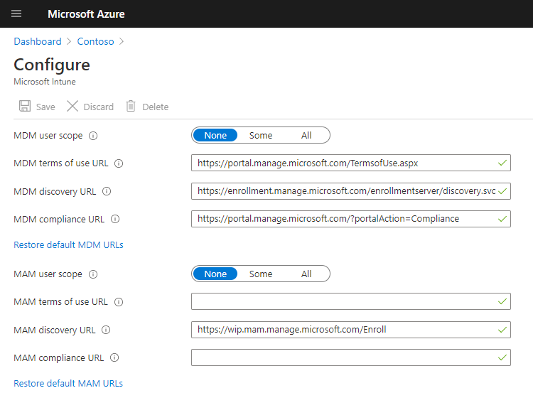
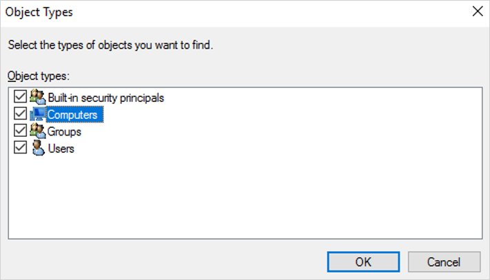
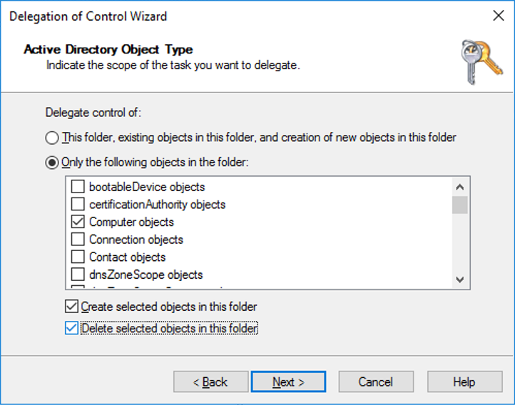
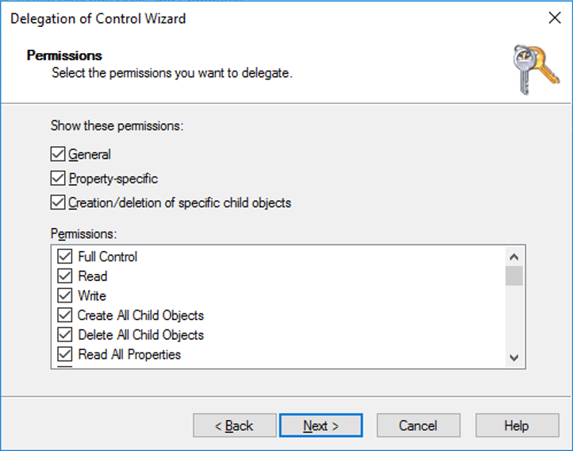

 
# Deploy hybrid Azure AD-joined devices by using Intune and Windows Autopilot

**Applies to:**

- Windows 11
- Windows 10

You can use Intune and Windows Autopilot to set up hybrid Azure Active Directory (Azure AD)-joined devices. To do so, follow the steps in this article.  For more information about hybrid Azure AD join, see [Understanding hybrid Azure AD join and co-management](https://techcommunity.microsoft.com/t5/microsoft-endpoint-manager-blog/understanding-hybrid-azure-ad-join-and-co-management/ba-p/2221201).

## Prerequisites

Successfully configure your [hybrid Azure AD-joined devices](/azure/active-directory/devices/hybrid-azuread-join-plan). Be sure to [verify your device registration](/azure/active-directory/devices/howto-hybrid-join-verify) by using the Get-MsolDevice cmdlet.

### Device enrollment prerequisites

The device to be enrolled must follow these requirements:

- Use Windows 11 or Windows 10 version 1809 or later.
- Have access to the internet [following Windows Autopilot network requirements](./networking-requirements.md).
- Have access to an Active Directory domain controller.
- Successfully ping the domain controller of the domain you're trying to join.
- If using Proxy, WPAD Proxy settings option must be enabled and configured.
- Undergo the out-of-box experience (OOBE).
- Use an authorization type that Azure Active Directory supports in OOBE.

Although not required, configuring hybrid Azure AD join for AD FS enables a faster Windows Autopilot Azure AD registration process during deployments.

### Intune connector server prerequisites

- The Intune Connector for Active Directory must be installed on a computer that's running Windows Server 2016 or later with .NET Framework version 4.7.2 or later.

- The server hosting the Intune Connector must have access to the internet and your Active Directory.

    > [!NOTE]
    > The Intune Connector server requires standard domain client access to domain controllers, which includes the RPC port requirements it needs to communicate with Active Directory. For more information, see the following articles:
    >
    > - [Service overview and network port requirements for Windows](/troubleshoot/windows-server/networking/service-overview-and-network-port-requirements)
    > - [How to configure a firewall for Active Directory domains and trusts](/troubleshoot/windows-server/identity/config-firewall-for-ad-domains-and-trusts)
    > - [Hybrid Identity Required Ports and Protocols](/azure/active-directory/hybrid/reference-connect-ports)

- To increase scale and availability, you can install multiple connectors in your environment. We recommend installing the Connector on a server that's not running any other Intune connectors. Each connector must be able to create computer objects in any domain that you want to support.

- If your organization has multiple domains and you install multiple Intune Connectors, you must use a service account that can create computer objects in all domains, even if you plan to implement hybrid Azure AD join only for a specific domain. If these domains are untrusted domains, you must uninstall the connectors from domains in which you don't want to use Windows Autopilot. Otherwise, with multiple connectors across multiple domains, all connectors must be able to create computer objects in all domains.

  This connector service account must have the following permissions:

  - [**Log on as a service**](/windows/security/threat-protection/security-policy-settings/log-on-as-a-service)
  - Must be part of the **Domain user** group
  - Must be a member of the local **Administrators** group on the Windows server that hosts the connector

- The Intune Connector requires the [same endpoints as Intune](../intune/fundamentals/intune-endpoints.md).

## Set up Windows automatic MDM enrollment

1. Sign in to Azure, in the left pane, select **Azure Active Directory** > **Mobility (MDM and MAM)** > **Microsoft Intune**.

2. Make sure users who deploy Azure AD-joined devices by using Intune and Windows are members of a group included in **MDM User scope**.

<!-- Commenting out image since screenshot incorrectly shows the MDM user scope option set to None instead of Some or All

    

-->

3. Use the default values in the **MDM Terms of use URL**, **MDM Discovery URL**, and **MDM Compliance URL** boxes, and then select **Save**.

## Increase the computer account limit in the Organizational Unit

The Intune Connector for your Active Directory creates autopilot-enrolled computers in the on-premises Active Directory domain. The computer that hosts the Intune Connector must have the rights to create the computer objects within the domain.

In some domains, computers aren't granted the rights to create computers. Additionally, domains have a built-in limit (default of 10) that applies to all users and computers that aren't delegated rights to create computer objects. The rights must be delegated to computers that host the Intune Connector on the organizational unit where hybrid Azure AD-joined devices are created.

The organizational unit that's granted the rights to create computers must match:

- The organizational unit that's entered in the Domain Join profile.
- If no profile is selected, the computer's domain name for your domain.

1. Open **Active Directory Users and Computers (DSA.msc)**.

2. Right-click the organizational unit to use to create hybrid Azure AD-joined computers > **Delegate Control**.

    

3. In the **Delegation of Control** wizard, select **Next** > **Add** > **Object Types**.

4. In the **Object Types** pane, select the **Computers** > **OK**.

    

5. In the **Select Users, Computers, or Groups** pane, in the **Enter the object names to select** box, enter the name of the computer where the Connector is installed.

    

6. Select **Check Names** to validate your entry > **OK** > **Next**.

7. Select **Create a custom task to delegate** > **Next**.

8. Select **Only the following objects in the folder** > **Computer objects**.

9. Select **Create selected objects in this folder** and **Delete selected objects in this folder**.

    

10. Select **Next**.

11. Under **Permissions**, select the **Full Control** check box. This action selects all the other options.

    

12. Select **Next** > **Finish**.

## Install the Intune Connector

Before beginning the installation, make sure that all of the [Intune connector server prerequisites](#intune-connector-server-prerequisites) have been met.

### Install steps

1. Turn off Internet Explorer Enhanced Security Configuration. By default Windows Server has Internet Explorer Enhanced Security Configuration turned on. If you're unable to sign in to the Intune Connector for Active Directory, then turn off Internet Explorer Enhanced Security Configuration for the Administrator.  To turn off Internet Explorer Enhanced Security Configuration:

   1. On the server where the Intune Connector will be installed, open **Server Manager**.
   2. In the left pane of Server Manager, select **Local Server**.
   3. In the right **PROPERTIES** pane of Server Manager, select the **On** or **Off** link next to **IE Enhanced Security Configuration**.
   4. In the **Internet Explorer Enhanced Security Configuration** window, select **Off** under **Administrators:**, and then select **OK**.

2. In the [Microsoft Intune admin center](https://go.microsoft.com/fwlink/?linkid=2109431), select **Devices** > **Windows** > **Windows enrollment** > **Intune Connector for Active Directory** > **Add**.

3. Follow the instructions to download the Connector.

4. Open the downloaded Connector setup file, *ODJConnectorBootstrapper.exe*, to install the Connector.

5. At the end of the setup, select **Configure Now**.

6. Select **Sign In**.

7. Enter the Global administrator or Intune administrator role credentials.
 The user account must have an assigned Intune license.

8. Go to **Devices** > **Windows** > **Windows enrollment** > **Intune Connector for Active Directory**, and then confirm that the connection status is **Active**.

> [!NOTE]
>
> - The Global administrator role is a temporary requirement at the time of installation.
> - After you sign in to the Connector, it can take several minutes to appear in the [Microsoft Intune admin center](https://go.microsoft.com/fwlink/?linkid=2109431). It appears only if it can successfully communicate with the Intune service.
> - Inactive Intune connectors still appear in the Intune Connectors blade and will automatically be cleaned up after 30 days.

After installing the Intune Connector, it will start logging in the **Event Viewer** under the path **Applications and Services Logs** > **Microsoft** > **Intune** > **ODJConnectorService**. Under this path you will find **Admin** and **Operational** logs.

> [!NOTE]
>
> The Intune Connector originally logged in the **Event Viewer** directly under **Applications and Services Logs** in a log called **ODJ Connector Service**. However, logging for the Intune Connector has since moved to the path **Applications and Services Logs** > **Microsoft** > **Intune** > **ODJConnectorService**. If you find that the **ODJ Connector Service** log at the original location is empty or not updating, check the new path location instead.

### Configure web proxy settings

If you have a web proxy in your networking environment, ensure that the Intune Connector for Active Directory works properly by referring to [Work with existing on-premises proxy servers](../intune/enrollment/autopilot-hybrid-connector-proxy.md).

## Create a device group

1. In the [Microsoft Intune admin center](https://go.microsoft.com/fwlink/?linkid=2109431), select **Groups** > **New group**.

2. In the **Group** pane, choose the following options:

    1. For **Group type**, select **Security**.
    2. Enter a **Group name** and **Group description**.
    3. Select a **Membership type**.

3. If you selected **Dynamic Devices** for the membership type, in the **Group** pane, select **Dynamic device members**.

4. Select **Edit** in the **Rule syntax** box and enter one of the following code lines:

    - To create a group that includes all your Autopilot devices, enter `(device.devicePhysicalIDs -any _ -contains "[ZTDId]")`.
    - Intune's Group Tag field maps to the OrderID attribute on Azure AD devices. If you want to create a group that includes all of your Autopilot devices with a specific Group Tag (OrderID), type: `(device.devicePhysicalIds -any _ -eq "[OrderID]:179887111881")`.
    - To create a group that includes all your Autopilot devices with a specific Purchase Order ID, enter `(device.devicePhysicalIds -any _ -eq "[PurchaseOrderId]:76222342342")`.

5. Select **Save** > **Create**.

## Register your Autopilot devices

Select one of the following ways to enroll your Autopilot devices.

### Register Autopilot devices that are already enrolled

1. Create an Autopilot deployment profile with **Convert all targeted devices to Autopilot** set to **Yes**.

2. Assign the profile to a group that contains the members that you want to automatically register with Autopilot.

For more information, see [Create an Autopilot deployment profile](profiles.md).

### Register Autopilot devices that aren't enrolled

If your devices aren't yet enrolled, you can register them yourself. For more information, see [Manual registration](manual-registration.md).

### Register devices from an OEM

If you're buying new devices, some OEMs can register the devices for you. For more information, see [OEM registration](oem-registration.md).

### Display registered Autopilot device

Before they're enrolled in Intune, *registered* Autopilot devices are displayed in three places (with names set to their serial numbers):

- The **Autopilot Devices** pane in the Intune in the Azure portal. Select **Device enrollment** > **Windows enrollment** > **Devices**.
- The **Azure AD devices** pane in the Intune in the Azure portal. Select **Devices** > **Azure AD Devices**.
- The **Azure AD All Devices** pane in Azure Active Directory in the Azure portal by selecting **Devices** > **All Devices**.

After your Autopilot devices are *enrolled*, they're displayed in four places:

- The **Autopilot Devices** pane in the Intune in the Azure portal. Select **Device enrollment** > **Windows enrollment** > **Devices**.
- The **Azure AD devices** pane in the Intune in the Azure portal. Select **Devices** > **Azure AD Devices**.
- The **Azure AD All Devices** pane in Azure Active Directory in the Azure portal. Select **Devices** > **All Devices**.
- The **All Devices** pane in the Intune in the Azure portal. Select **Devices** > **All Devices**.

After your Autopilot devices are enrolled, their names become the hostname of the device. By default, the hostname begins with *DESKTOP-*.
A device object is pre-created in Azure AD once a device is registered in Autopilot. When a device goes through a hybrid Azure AD deployment, by design, another device object is created resulting in duplicate entries.

## BYO VPNs

The following is a list of VPN clients that have been tested and validated:

### VPN clients

- In-box Windows VPN client
- Cisco AnyConnect (Win32 client)
- Pulse Secure (Win32 client)
- GlobalProtect (Win32 client)
- Checkpoint (Win32 client)
- Citrix NetScaler (Win32 client)
- SonicWall (Win32 client)
- FortiClient VPN (Win32 client)

> [!NOTE]
> The above above list of VPN clients isn't a comprehensive list of all VPN clients that work with Autopilot. Contact the respective VPN vendor regarding compatibility and supportability with Autopilot or regarding any issues with using a VPN solution with Autopilot.

### Not supported VPN clients

The following VPN solutions are known not to work with Autopilot and therefore aren't supported for use with Autopilot:

- UWP-based VPN plug-ins
- Anything that requires a user cert
- DirectAccess

> [!NOTE]
> When using BYO VPNs, you should select **Yes** for the **Skip AD connectivity check** option in the Windows Autopilot deployment profile. Always-On VPNs should not require this option since it will connect automatically.

## Create and assign an Autopilot deployment profile

Autopilot deployment profiles are used to configure the Autopilot devices.

1. In the [Microsoft Intune admin center](https://go.microsoft.com/fwlink/?linkid=2109431), select **Devices** > **Windows** > **Windows enrollment** > **Deployment Profiles** > **Create Profile**.

2. On the **Basics** page, type a **Name** and optional **Description**.

3. If you want all devices in the assigned groups to automatically convert to Autopilot, set **Convert all targeted devices to Autopilot** to **Yes**. All corporate owned, non-Autopilot devices in assigned groups will register with the Autopilot deployment service. Personally owned devices won't be converted to Autopilot. Allow 48 hours for the registration to be processed. When the device is unenrolled and reset, Autopilot will enroll it. After a device is registered in this way, disabling this option or removing the profile assignment won't remove the device from the Autopilot deployment service. You must instead [remove the device directly](add-devices.md#delete-autopilot-devices).

4. Select **Next**.

5. On the **Out-of-box experience (OOBE)** page, for **Deployment mode**, select **User-driven**.

6. In the **Join to Azure AD as** box, select **Hybrid Azure AD joined**.

7. If you're deploying devices off of the organization's network using VPN support, set the **Skip Domain Connectivity Check** option to **Yes**. For more information, see [User-driven mode for hybrid Azure Active Directory join with VPN support](user-driven.md#user-driven-mode-for-hybrid-azure-ad-join-with-vpn-support).

8. Configure the remaining options on the **Out-of-box experience (OOBE)** page as needed.

9. Select **Next**.

10. On the **Scope tags** page, select [scope tags](../intune/fundamentals/scope-tags.md) for this profile.

11. Select **Next**.

12. On the **Assignments** page, select **Select groups to include** > search for and select the device group > **Select**.

13. Select **Next** > **Create**.

It takes about 15 minutes for the device profile status to change from *Not assigned* to *Assigning* and, finally, to *Assigned*.

## (Optional) Turn on the enrollment status page

1. In the [Microsoft Intune admin center](https://go.microsoft.com/fwlink/?linkid=2109431), select **Devices** > **Windows** > **Windows enrollment** > **Enrollment Status Page**.

2. In the **Enrollment Status Page** pane, select **Default** > **Settings**.

3. In the **Show app and profile installation progress** box, select **Yes**.

4. Configure the other options as needed.

5. Select **Save**.

## Create and assign a Domain Join profile

1. In the [Microsoft Intune admin center](https://go.microsoft.com/fwlink/?linkid=2109431), select **Devices** > **Configuration profiles** > **Create Profile**.

2. Enter the following properties:
    - **Name**: Enter a descriptive name for the new profile.
    - **Description**: Enter a description for the profile.
    - **Platform**: Select **Windows 10 and later**.
    - **Profile type**: Select **Templates**, choose the template name **Domain Join**, and select **Create**.

3. Enter the **Name** and **Description** and select **Next**.

4. Provide a **Computer name prefix** and **Domain name**.

5. (Optional) Provide an **Organizational unit** (OU) in [DN format](/windows/desktop/ad/object-names-and-identities#distinguished-name). Your options include:

    - Provide an OU in which you've delegated control to your Windows 2016 device that is running the Intune Connector.
    - Provide an OU in which you've delegated control to the root computers in your on-premises Active Directory.
    - If you leave this blank, the computer object will be created in the Active Directory default container (`CN=Computers` if you never [changed it](/troubleshoot/windows-server/identity/redirect-users-computers-containers)).

    Here are some valid examples:
      - `OU=Sub OU,OU=TopLevel OU,DC=contoso,DC=com`
      - `OU=Mine,DC=contoso,DC=com`

    Here are some examples that aren't valid:
      - `CN=Computers,DC=contoso,DC=com` (you can't specify a container, instead leave the value blank to use the default for the domain)
      - `OU=Mine` (you must specify the domain via the `DC=` attributes)

    > [!NOTE]
    > Don't use quotation marks around the value in **Organizational unit**.

6. Select **OK** > **Create**. The profile is created and displayed in the list.

7. [Assign a device profile](../intune/configuration/device-profile-assign.md#assign-a-policy-to-users-or-groups) to the same group used at the step [Create a device group](windows-autopilot-hybrid.md#create-a-device-group). Different groups can be used if there's a need to join devices to different domains or OUs.

> [!NOTE]
> The naming capabilities for Windows Autopilot for Hybrid Azure AD Join don't support variables such as %SERIAL% and only support prefixes for the computer name.

## Next steps

After you configure Windows Autopilot, learn how to manage those devices. For more information, see [What is Microsoft Intune device management?](../intune/remote-actions/device-management.md).
