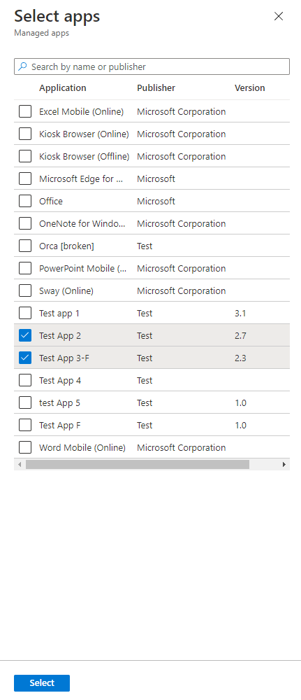
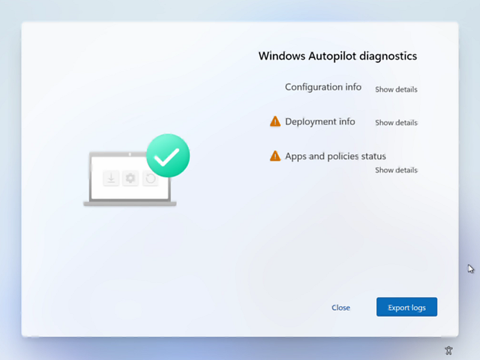
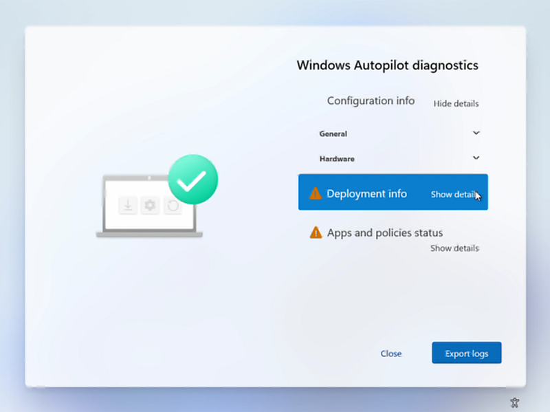

# Windows Autopilot: What's new

**Applies to**

- Windows 11
- Windows 10
- Windows Holographic, version 2004

## Enrollment Status Page

With the 2202 Intune release, functionality has been added to the [Enrollment Status Page](enrollment-status.md) UI. The application picker for selecting blocking apps has additional improvements for admins:
- A search box has been added for easier selection of apps
- Fixes issue where store apps could not be differentiated between Online and Offline modes
- A new column has been added for **Version** to see which version of the application is selected

See the following example:

## Autopilot agility rolling out

Autopilot agility is a new feature that allows updates and bug fixes to the OOBE experience. These updates occur before device enrollment, after the AADJ login page and may result in an additional reboot and authentication prompt to the user. This feature is rolling out to Windows 10 1909 and 2004/20H2 with August cumulative update and is not yet available for Windows 11.

## One-time self-deployment and pre-provisioning

We made a change to the Windows Autopilot self-deployment mode and pre-provisioning mode experience, adding in a step to delete the device record as part of the device re-use process. This change impacts all Windows Autopilot deployments where the Autopilot profile is set to self-deployment or pre-provisioning mode. This change will only affect a device when it is re-used or when it is reset and attempts to redeploy. For more information, see [Updates to the Windows Autopilot sign-in and deployment experience](https://techcommunity.microsoft.com/t5/intune-customer-success/updates-to-the-windows-autopilot-sign-in-and-deployment/ba-p/2848452)

## Update to the Windows Autopilot sign-in experience

Users must enter their credentials at initial sign-in during enrollment. We no longer allow pre-population of the Azure Active Directory (Azure AD) User Principal Name (UPN). For more information, see [Updates to the Windows Autopilot sign-in and deployment experience](https://techcommunity.microsoft.com/t5/intune-customer-success/updates-to-the-windows-autopilot-sign-in-and-deployment/ba-p/2848452)

## MFA changes to Windows Autopilot enrollment flow

To improve the baseline security for Azure Active Directory (Azure AD), we changed Azure AD behavior for multi-factor authentication (MFA) during device registration. Previously, if a user completed MFA as part of their device registration, the MFA claim was carried over to the user state after registration was complete. Going forward, the MFA claim is not preserved after registration and users will be prompted to redo MFA for any apps that require MFA by policy. For more information, see [Windows Autopilot MFA changes to enrollment flow](https://techcommunity.microsoft.com/t5/intune-customer-success/windows-autopilot-mfa-changes-to-enrollment-flow/ba-p/2774687).

## Windows Autopilot diagnostics page

When you deploy Windows 11 with Autopilot, you can enable users to view additional detailed troubleshooting information about the Autopilot provisioning process. A new **Windows Autopilot diagnostics** page is available to provide IT admins and end users with a user-friendly view to troubleshoot Windows Autopilot failures. 

An example of the diagnostics page is shown below. In this example, **Configuration info** is expanded first by clicking on **Show details**. Next, the user expands **Deployment info** and displays details about **Network Connectivity**, **Autopilot Settings**, and **Enrollment Status**. The user also has the option to **Export logs** for detailed [troubleshooting](troubleshoot-oobe.md) analysis.

 
 

The diagnostics page can be enabled by going to the [ESP profile](../intune/enrollment/windows-enrollment-status.md) and selecting **Yes** to **Turn on log collection and diagnostics page for end users**. 

The diagnostics page is currently supported for commercial OOBE, and Autopilot user-driven mode. It is currently available on Windows 11. Windows 10 users can still collect and export diagnostic logs when this setting is enabled in Intune. 

## Windows Autopilot for HoloLens 2

Windows Autopilot now enables you to configure HoloLens 2 devices! For more information, see [Windows Autopilot for HoloLens 2](/hololens/hololens2-autopilot).

## Feature name change

September, 2020

The Windows Autopilot white glove feature has been renamed to **Windows Autopilot for pre-provisioned deployment**. All references in our documentation to **white glove** have been replaced with: **pre-provisioning**.  The term **white glove** might still appear in some blogs and other articles about Windows Autopilot. These references correspond to the pre-provisioning process described in [this article](pre-provision.md).

## New in Windows 10, version 2004

With this release, you can configure Windows Autopilot [user-driven](user-driven.md) Hybrid Azure Active Directory join with VPN support. This support is also backported to Windows 10, version 1909 and 1903.

If you configure the language settings in the Autopilot profile and the device is connected to Ethernet, all scenarios will now skip the language, locale, and keyboard pages. In previous versions, this was only supported with self-deploying profiles.

## New in Windows 10, version 1903

[Windows Autopilot pre-provisioning](pre-provision.md) is new in Windows 10, version 1903. See the following video:

 

> [!VIDEO https://www.youtube.com/embed/nE5XSOBV0rI]

Also new in this version of Windows:
- The Intune enrollment status page (ESP) now tracks Intune Management Extensions.
- [Cortana voiceover and speech recognition during OOBE](windows-autopilot-scenarios.md#cortana-voiceover-and-speech-recognition-during-oobe) is disabled by default for all Windows 10 Pro Education, and Enterprise SKUs.
- [Windows Autopilot is self-updating during OOBE](windows-autopilot-scenarios.md#windows-autopilot-is-self-updating-during-oobe). Starting with the Windows 10, version 1903 Autopilot functional and critical updates will begin downloading automatically during OOBE.
- Windows Autopilot will set the diagnostics data level to Full during OOBE on devices running Windows 10 version 1903 or later. 

## New in Windows 10, version 1809

Windows Autopilot [self-deploying mode](self-deploying.md) is a zero touch device provisioning process. Simply power on the device, connect to Ethernet, and Autopilot automatically configures the device. End users don't have to press the "Next” button during the deployment process. 

You can use Windows Autopilot self-deploying mode to register the device to an AAD tenant, enroll in your organization’s MDM provider, and provision policies and applications. No user authentication or user interaction is required.

>[!NOTE]
>Window 10, version 1903 or later is required to use self-deploying mode due to issues with TPM device attestation in Windows 10, version 1809.

## Related topics

[What's new in Microsoft Intune](/intune/whats-new) 
[What's new in Windows 10](/windows/whats-new/)
