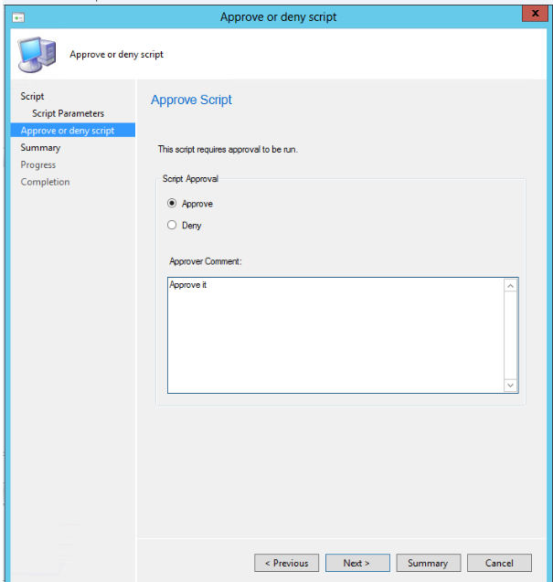
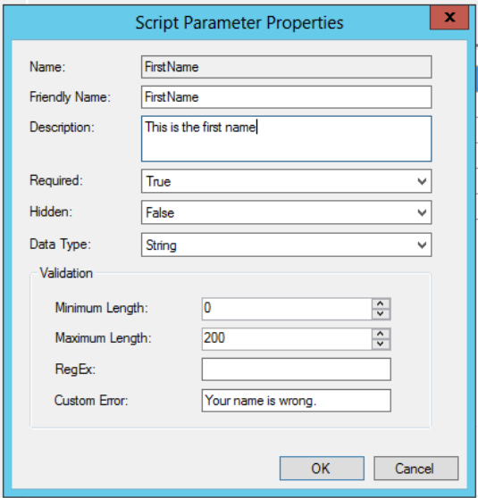
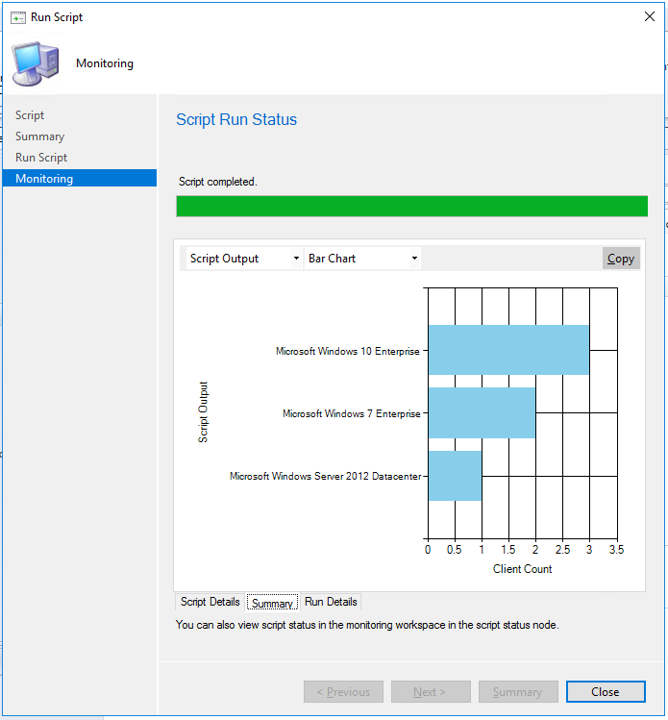
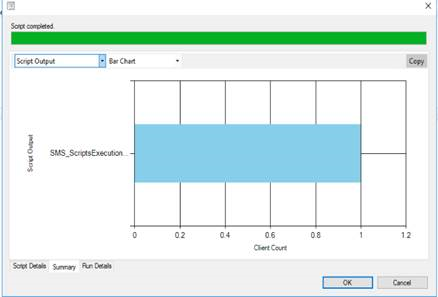

# Create and run PowerShell scripts from the Configuration Manager console

*Applies to: Configuration Manager (current branch)*

<!--1236459-->
Configuration Manager has an integrated ability to run PowerShell scripts. PowerShell has the benefit of creating sophisticated, automated scripts that are understood and shared with a larger community. The scripts simplify building custom tools to administer software and let you accomplish mundane tasks quickly, allowing you to get large jobs done more easily and more consistently.  

> [!Note]  
> In version 2006 and earlier, Configuration Manager doesn't enable this optional feature by default. You must enable this feature before using it. For more information, see [Enable optional features from updates](../../core/servers/manage/optional-features.md).<!--505213-->  


With this integration in Configuration Manager, you can use the *Run Scripts* functionality to do the following things:

- Create and edit scripts for use with Configuration Manager.
- Manage script usage through roles and security scopes. 
- Run scripts on collections or individual on-premises managed Windows PCs.
- Get rapid aggregated script results from client devices.
- Monitor script execution and view reporting results from script output.

> [!WARNING]
> - Given the power of scripts, we remind you to be intentional and careful with their usage. We have built in additional safeguards to assist you; segregated roles and scopes. Be sure to validate the accuracy of scripts before running them and confirm they are from a trusted source, to prevent unintended script execution. Be mindful of extended characters or other obfuscation and educate yourself about securing scripts. [Learn more about PowerShell script security](learn-script-security.md)
> - Certain anti-malware software may inadvertently trigger events against the Configuration Manager Run Scripts or CMPivot features. It is recommended to exclude %windir%\CCM\ScriptStore so that the anti-malware software permits those features to run without interference.

## Prerequisites

- To run PowerShell scripts, the client must be running PowerShell version 3.0 or later. However, if a script you run contains functionality from a later version of PowerShell, the client on which you run the script must be running that version of PowerShell.
- Configuration Manager clients must be running the client from the 1706 release, or later in order to run scripts.
- To use scripts, you must be a member of the appropriate Configuration Manager security role.
- To import and author scripts - Your account must have **Create** permissions for **SMS Scripts**.
- To approve or deny scripts - Your account must have **Approve** permissions for **SMS Scripts**.
- To run scripts - Your account must have **Run Script** permissions for **Collections**.

For more information about Configuration Manager security roles:</br>
[Security scopes for run scripts](#security-scopes)</br>
[Security roles for run scripts](#bkmk_ScriptRoles)</br>
[Fundamentals of role-based administration](../../core/understand/fundamentals-of-role-based-administration.md).

## Limitations

Run Scripts currently supports:

- Scripting languages: PowerShell
- Parameter types: integer, string, and list.


>[!WARNING]
>Be aware that when using parameters, it opens a surface area for potential PowerShell injection attack risk. There are various ways to mitigate and work around, such as using regular expressions to validate parameter input or using predefined parameters. Common best practice is not to include secrets in your PowerShell scripts (no passwords, etc.). [Learn more about PowerShell script security](learn-script-security.md) <!--There are external tools available to validate your PowerShell scripts such as the [PowerShell Injection Hunter](https://www.powershellgallery.com/packages/InjectionHunter/1.0.0) tool. -->


## Run Script authors and approvers

Run Scripts uses the concept of *script authors* and *script approvers* as separate roles for implementation and execution of a script. Having the author and approver roles separated allows an important process check for the powerful tool that Run Scripts is. There's an additional *script runners* role that allows execution of scripts, but not creation or approval of scripts. See [Create security roles for scripts](#bkmk_ScriptRoles).

### Scripts roles control

By default, users can't approve a script they've authored. Because scripts are powerful, versatile, and potentially deployed to many devices, you can separate the roles between the person that authors the script and the person that approves the script. These roles give an additional level of security against running a script without oversight. You're able to turn off secondary approval, for ease of testing.

### Approve or Deny a script

Scripts must be approved, by the *script approver* role, before they can be run. To approve a script:

1. In the Configuration Manager console, click **Software Library**.
2. In the **Software Library** workspace, click **Scripts**.
3. In the **Script** list, choose the script you want to approve or deny and then, on the **Home** tab, in the **Script** group, click **Approve/Deny**.
4. In the **Approve or deny script** dialog box, select **Approve**, or **Deny** for the script. Optionally, enter a comment about your decision.  If you deny a script, it can't be run on client devices. <br>

1. Complete the wizard. In the **Script** list, you see the **Approval State** column change depending on the action you took.

### Allow users to approve their own scripts

This approval is primarily used for the testing phase of script development.

1. In the Configuration Manager console, click **Administration**.
2. In the **Administration** workspace, expand **Site Configuration**, and then click **Sites**.
3. In the list of sites, choose your site and then, on the **Home** tab, in the **Sites** group, click **Hierarchy Settings**.
4. On the **General** tab of the **Hierarchy Settings Properties** dialog box, clear the checkbox **Script authors require additional script approver**.

>[!IMPORTANT]
>As a best practice, you shouldn't allow a script author to approve their own scripts. It should only be allowed in a lab setting. Carefully consider the potential impact of changing this setting in a production environment.

## Security scopes
  
Run Scripts uses security scopes, an existing feature of Configuration Manager, to control scripts authoring and execution through assigning tags that represent user groups. For more information on using security scopes, see [Configure role-based administration for Configuration Manager](../../core/servers/deploy/configure/configure-role-based-administration.md).

## <a name="bkmk_ScriptRoles"></a> Create security roles for scripts
The three security roles used for running scripts aren't created by default in Configuration Manager. To create the script runners, script authors, and script approvers roles, follow the outlined steps.

1. In the Configuration Manager console, go to **Administration** >**Security** >**Security Roles**
2. Right-click on a role and click **Copy**. The role you copy has permissions already assigned. Make sure you take only the permissions that you want. 
3. Give the custom role a **Name** and a **Description**. 
4. Assign the security role the permissions outlined below.  

### Security Role Permissions  

**Role Name**: Script Runners  
- **Description**: These permissions enable this role to only run scripts that were previously created and approved by other roles.  
- **Permissions:** Ensure the following are set to **Yes**.  

|Category|Permission|State|
|---|---|---|
|Collection|Run Script|Yes|
|Site|Read|Yes|
|SMS Scripts|Read|Yes|


**Role Name**: Script Authors  
- **Description**: These permissions enable this role to author scripts, but they can't approve or run them.  
- **Permissions**: Ensure the following permissions are set.
 
|Category|Permission|State|
|---|---|---|
|Collection|Run Script|No|
|Site|Read|Yes|
|SMS Scripts|Create|Yes|
|SMS Scripts|Read|Yes|
|SMS Scripts|Delete|Yes|
|SMS Scripts|Modify|Yes|


**Role Name**: Script Approvers  
- **Description**: These permissions enable this role to approve scripts, but they can't create or run them.  
- **Permissions:** Ensure the following permissions are set.  

|Category|Permission|State|
|---|---|---|
|Collection|Run Script|No|
|Site|Read|Yes|
|SMS Scripts|Read|Yes|
|SMS Scripts|Approve|Yes|
|SMS Scripts|Modify|Yes|

     
**Example of SMS Scripts permissions for the script authors role**  

 


## Create a script

1. In the Configuration Manager console, click **Software Library**.
2. In the **Software Library** workspace, click **Scripts**.
3. On the **Home** tab, in the **Create** group, click **Create Script**.
4. On the **Script** page of the Create **Script** wizard, configure the following settings:
    - **Script Name** - Enter a name for the script. Although you can create multiple scripts with the same name, using duplicate names makes it harder for you to find the script you need in the Configuration Manager console.
    - **Script language** - Currently, only PowerShell scripts are supported.
    - **Import** - Import a PowerShell script into the console. The script is displayed in the **Script** field.
    - **Clear** - Removes the current script from the Script field.
    - **Script** - Displays the currently imported script. You can edit the script in this field as necessary.
5. Complete the wizard. The new script is displayed in the **Script** list with a status of **Waiting for approval**. Before you can run this script on client devices, you must approve it. 

> [!IMPORTANT]
> Avoid scripting a device reboot or a restart of the Configuration Manager agent when using the Run Scripts feature. Doing so could lead to a continuous rebooting state. If needed, there are enhancements to the client notification feature that enable restarting devices. The [pending restart column](../../core/clients/manage/manage-clients.md#restart-clients) can help identify devices that need a restart. 
> <!--SMS503978  -->

## Script parameters

Adding parameters to a script provides increased flexibility for your work. You can include up to 10 parameters. The following outlines the Run Scripts feature's current capability with script parameters for; *String*, *Integer* data types. Lists of preset values are also available. If your script has unsupported data types, you get a warning.

In the **Create Script** dialog, click **Script Parameters** under **Script**.

Each of your script's parameters has its own dialog for adding further details and validation. If there's a default parameter in the script, it will be enumerated in the parameter UI and you can set it. Configuration Manager won't overwrite the default value since it will never modify the script directly. You can think of this as "pre-populated suggested values" are provided in the UI, but Configuration Manager doesn't provide access to "default" values at run-time. This can be worked around by editing the script to have the correct defaults. <!--17694323-->

>[!IMPORTANT]
> Parameter values can't contain a single quote. </br></br>
> There is a known issue where parameter values that include or are enclosed in single quotes don't get passed to the script properly. When specifying default parameter values containing a space within a script, use double quotes instead. When specifying default parameter values during creation or execution of a **Script**, surrounding the default value in either double or single quotes is not necessary regardless of whether the value contains a space or not.

### Parameter validation

Each parameter in your script has a **Script Parameter Properties** dialog for you to add validation for that parameter. After adding validation, you should get errors if you're entering a value for a parameter that doesn't meet its validation.

#### Example: *FirstName*

In this example, you're able to set the properties of the string parameter, *FirstName*.




The validation section of the **Script Parameter Properties** dialog contains the following fields for your use:

- **Minimum Length** - minimum number of characters of the *FirstName* field.
- **Maximum Length**- maximum number of characters of the *FirstName* field
- **RegEx** - short for *Regular Expression*. For more information on using the Regular Expression, see the next section, *Using Regular Expression validation*.
- **Custom Error** - useful for adding your own custom error message that supersedes any system validation error messages.

#### Using Regular Expression validation

A regular expression is a compact form of programming for checking a string of characters against an encoded validation. For example, you could check for the absence of a capital alphabetic character in the *FirstName* field by placing `[^A-Z]` in the *RegEx* field.

The regular expression processing for this dialog is supported by the .NET Framework. For guidance on using regular expressions, see [.NET Regular Expression](/dotnet/standard/base-types/regular-expressions) and [Regular Expression Language](/dotnet/standard/base-types/regular-expression-language-quick-reference).


## Script examples

Here are a couple examples that illustrate scripts you might want to use with this capability.

### Create a new folder and file

This script creates a new folder and a file within the folder, given your naming input.

``` PowerShell
Param(
[Parameter(Mandatory=$True)]
[string]$FolderName,
[Parameter(Mandatory=$True)]
[string]$FileName
)

New-Item $FolderName -type directory
New-Item $FileName -type file
```

### Get OS Version

This script uses WMI to query the machine for its OS version.

``` PowerShell
Write-Output (Get-WmiObject -Class Win32_operatingSystem).Caption
```

## <a name="bkmk_psedit"></a> Edit or copy PowerShell scripts
<!--3705507-->
You can **Edit** or **Copy** an existing PowerShell script used with the **Run Scripts** feature. Instead of recreating a script that you need to change, now directly edit it. Both actions use the same wizard experience as when you create a new script. When you edit or copy a script, Configuration Manager doesn't persist the approval state.

> [!Tip]  
> Don't edit a script that's actively running on clients. They won't finish running the original script, and you may not get the intended results from these clients.  

### Edit a script

1. Go to the **Scripts** node under the **Software Library** workspace.
1. Select the script to edit, then click **Edit** in the ribbon. 
1. Change or reimport your script in the **Script Details** page.
1. Click **Next** to view the **Summary** then **Close** when you're finished editing.

### Copy a script

1. Go to the **Scripts** node under the **Software Library** workspace.
1. Select the script to copy, then click **Copy** in the ribbon.
1. Rename the script in the **Script name** field and make any additional edits you may need.
1. Click **Next** to view the **Summary** then **Close** when you're finished editing.


## Run a script

After a script is approved, it can be run against a single device or a collection. Once execution of your script begins, it's launched quickly through a high priority system that times-out in one hour. The results of the script are then returned using a state message system.

To select a collection of targets for your script:

1. In the Configuration Manager console, click **Assets and Compliance**.
2. In the Assets and Compliance workspace, click **Device Collections**.
3. In the **Device Collections** list, click the collection of devices on which you want to run the script.
4. Select a collection of your choice, click **Run Script**.
5. On the **Script** page of the **Run Script** wizard, choose a script from the list. Only approved scripts are shown.
6. Click **Next**, and then complete the wizard.

> [!IMPORTANT]
> If a script does not run, for example because a target device is turned off during the one hour time period, you must run it again.

### Target machine execution

The script is executed as the *system* or *computer* account on the targeted client(s). This account has limited network access. Any access to remote systems and locations by the script must be provisioned accordingly.

## Script monitoring

After you have initiated running a script on a collection of devices, use the following procedure to monitor the operation. You are able to monitor a script in real time as it executes, and later return to the status and results for a given Run Script execution. Script status data is cleaned up as part of the [Delete Aged Client Operations maintenance task](../../core/servers/manage/reference-for-maintenance-tasks.md) or deletion of the script.<br>



1. In the Configuration Manager console, click **Monitoring**.
2. In the **Monitoring** workspace, click **Script Status**.
3. In the **Script Status** list, you view the results for each script you ran on client devices. A script exit code of **0** generally indicates that the script ran successfully.

 
   

## Script output

Client's return script output using JSON formatting by piping the script's results to the [ConvertTo-Json](/powershell/module/microsoft.powershell.utility/convertto-json) cmdlet. The JSON format consistently returns readable script output. For scripts that do not return objects as output, the ConvertTo-Json cmdlet converts the output to a simple string that the client returns instead of JSON.  

- Scripts that get an unknown result, or where the client was offline, won't show in the charts or data set. <!--507179-->
- Avoid returning large script output since it's truncated to 4 KB. <!--508488-->
- Convert an enum object to a string value in scripts so they're properly displayed in JSON formatting. <!--508377-->

   

You can view detailed script output in raw or structured JSON format. This formatting makes the output easier to read and analyze. If the script returns valid JSON-formatted text or the output can be converted to JSON using the [ConvertTo-Json](/powershell/module/microsoft.powershell.utility/convertto-json) PowerShell cmdlet, then view the detailed output as either **JSON Output** or **Raw Output**. Otherwise the only option is **Script Output**.

### Example: Script output is convertible to valid JSON

Command: `$PSVersionTable.PSVersion`  

``` Output
Major  Minor  Build  Revision
-----  -----  -----  --------
5      1      16299  551
```

### Example: Script output isn't valid JSON

Command: `Write-Output (Get-WmiObject -Class Win32_OperatingSystem).Caption`  

``` Output
Microsoft Windows 10 Enterprise
```

## Log files

- On the client, by default in C:\Windows\CCM\logs:  
  - **Scripts.log**  
  - **CcmMessaging.log**  

- On the MP, by default in C:\SMS_CCM\Logs:
  - **MP_RelayMsgMgr.log**  

- On the site server, by default in C:\Program Files\Configuration Manager\Logs:
  - **SMS_Message_Processing_Engine.log**

## Automate with Windows PowerShell

You can use the following PowerShell cmdlets to automate some of these tasks:

- [Approve-CMScript](/powershell/module/configurationmanager/approve-cmscript)
- [Deny-CMScript](/powershell/module/configurationmanager/deny-cmscript)
- [Get-CMScript](/powershell/module/configurationmanager/get-cmscript)
- [Invoke-CMScript](/powershell/module/configurationmanager/invoke-cmscript)
- [New-CMScript](/powershell/module/configurationmanager/new-cmscript)
- [Remove-CMScript](/powershell/module/configurationmanager/remove-cmscript)
- [Set-CMScript](/powershell/module/configurationmanager/set-cmscript)

## See Also

- [Configure role-based administration for Configuration Manager](../../core/servers/deploy/configure/configure-role-based-administration.md)
- [Fundamentals of role-based administration](../../core/understand/fundamentals-of-role-based-administration.md)