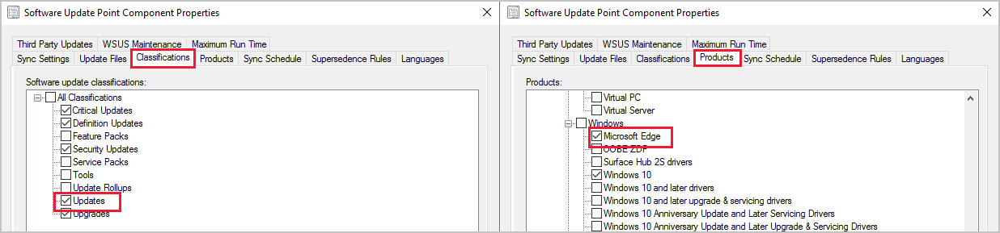

# Microsoft Edge Management

*Applies to: Configuration Manager (Current Branch)*

The all-new Microsoft Edge is ready for business. You can deploy [Microsoft Edge, version 77 and later](/deployedge/) to your users. A PowerShell script is used to install the Edge build selected. The script also turns off automatic updates for Edge so they can be managed with Configuration Manager.

## <a name="bkmk_Microsoft_Edge"></a> Deploy Microsoft Edge
<!--4561024-->
Admins can pick the Beta, Dev, or Stable channel, along with a version of the Microsoft Edge client to deploy. Each release incorporates learnings and improvements from our customers and community.

### Prerequisites for deploying

For clients targeted with a Microsoft Edge deployment:

- PowerShell [Execution Policy](/powershell/module/microsoft.powershell.core/about/about_execution_policies) can't be set to Restricted.
  - PowerShell is executed to perform the installation.

- The Microsoft Edge installer and [CMPivot](../../core/servers/manage/cmpivot.md) are currently signed with the **Microsoft Code Signing PCA 2011** certificate. If you set PowerShell execution policy to **AllSigned**, then you need to make sure that devices trust this signing certificate. You can export the certificate from a computer where you've installed the Configuration Manager console. View the certificate on `"C:\Program Files (x86)\Microsoft Endpoint Manager\AdminConsole\bin\CMPivot.exe"`, and then export the code signing certificate from the certification path. Then import it to the _machine_'s **Trusted Publishers** store on managed devices. You can use the process in the following blog, but make sure to export the _code signing certificate_ from the certification path: [Adding a Certificate to Trusted Publishers using Intune](https://techcommunity.microsoft.com/t5/intune-customer-success/adding-a-certificate-to-trusted-publishers-using-intune/ba-p/1974488).<!--CMADO-7585106, MEMDocs#1571-->

[!INCLUDE [Internet endpoints for deploying Microsoft Edge](../../core/plan-design/network/includes/internet-endpoints-deploy-microsoft-edge.md)]

### <a name="bkmk_autoupdate"></a> Verify Microsoft Edge update policies
<!--4561024-->
Starting in version 2002, you can create a Microsoft Edge application that's set up to receive automatic updates rather than having automatic updates disabled. This change allows you to choose to manage updates for Microsoft Edge with Configuration Manager or allow Microsoft Edge to automatically update. When creating the application, select **Allow Microsoft Edge to automatically update the version of the client on the end user's device** on the **Microsoft Edge Settings** page. If you previously used Group Policy to change this behavior, Group Policy will overwrite the setting made by Configuration Manager during installation of Microsoft Edge. For more information, see [Microsoft Edge update policies](/DeployEdge/microsoft-edge-update-policies).

[](./media/4561024-autoupdate-edge.png#lightbox)

### Create a deployment

Create a Microsoft Edge application using the built-in application experience, which makes Microsoft Edge easier to manage:

1. In the console, under **Software Library**, there's a new node called **Microsoft Edge Management**.
1. Select **Create Microsoft Edge Application** from either the ribbon, or by right-clicking on the **Microsoft Edge Management** node.

   

1. On the **Application Settings** page of the wizard, specify a name, description, and location for the content for the app. Ensure the content location folder you specify is empty.
1. On the **Microsoft Edge Settings** page, select:
   - The channel to deploy
   - The version to deploy
   - If you want to **Allow Microsoft Edge to automatically update the version of the client on the end user's device** (added in version 2002)
1. On the **Deployment** page, decide if you want to deploy the application. If you select **Yes**, you can specify your deployment settings for the application. For more information about deployment settings, see [Deploy applications](deploy-applications.md#bkmk_deploy-general).
1. In **Software Center** on the client device, the user can see and install the application.

   

### Log files for deployment

|Location|Log|Use|
|---|---|---|
| Site server|SMSProv.log|Shows details if the creation of the app or deployment fails.|
| [Varies](../../core/plan-design/hierarchy/log-files.md)|PatchDownloader.log| Shows details if the content download fails|
| Client|  AppEnforce.log|Shows installation information|

## Update Microsoft Edge
<!--4831871-->

The **All Microsoft Edge updates** node is under **Microsoft Edge Management**. This node helps you manage updates for all Microsoft Edge channels.<!--initial edge updates released Jan 15,2020-->

1. To get updates for Microsoft Edge, ensure you have the **Updates** classification and the **Microsoft Edge** product [selected for synchronization](../../sum/get-started/configure-classifications-and-products.md).

   [](./media/4831871-microsoft-edge-product-sup.png#lightbox)

1. In the **Software Library** workspace, expand **Microsoft Edge Management** and click on the **All Microsoft Edge Updates** node.

1. If needed, click **Synchronize Software Updates** in the ribbon to start a synchronization. For more information, see [Synchronize software updates](../../sum/get-started/synchronize-software-updates.md).

   

1. Manage and deploy Microsoft Edge updates like any other update, such as adding them to your [automatic deployment rule](../../sum/deploy-use/automatically-deploy-software-updates.md). Some of the common updates tasks you can do from the **All Microsoft Edge Updates** node include:

   - [Create a phased deployment](../../osd/deploy-use/create-phased-deployment-for-task-sequence.md)
   - [Manually deploy software updates](../../sum/deploy-use/manually-deploy-software-updates.md)
   - [Download software updates](../../sum/deploy-use/download-software-updates.md)

## <a name="bkmk_edge-dash"></a> Microsoft Edge Management dashboard
<!--3871913-->
Starting in Configuration Manager 2002, the Microsoft Edge Management dashboard provides you insights on the usage of Microsoft Edge and other browsers. In this dashboard, you can:

- See how many of your devices have Microsoft Edge installed
- See how many clients have different versions of Microsoft Edge installed.
   - This chart doesn't include Canary Channel.
- Have a view of the installed browsers across devices
- Have a view of preferred browser by device <!--5907383-->
   - Currently for the 2002 release, this chart will be empty.

### Prerequisites for the dashboard

For Configuration Manager version 2203 or later, the [WebView2 console extension](../../core/servers/manage/admin-console-extensions.md#bkmk_notification) must be installed. If needed, select the notification bell in the top right corner of the console to install the extension.<!--10024154-->

Enable the following properties in the below [hardware inventory](../../core/clients/manage/inventory/extend-hardware-inventory.md) classes for the Microsoft Edge Management dashboard:

- **Installed Software - Asset Intelligence (SMS_InstalledSoftware)**
   - Software Code
   - Product Name
   - Product Version

- **Default Browser (SMS_DefaultBrowser)**
   - Browser Program ID

- **Browser Usage (SMS_BrowserUsage)**
   - BrowserName
   - UsagePercentage


### View the dashboard

From the **Software Library** workspace, click **Microsoft Edge Management** to see the dashboard. Change the collection for the graph data by clicking **Browse** and choosing another collection. By default your five largest collections are in the drop-down list. When you select a collection that isn't in the list, the newly selected collection takes the bottom spot on your drop-down list.

[](./media/3871913-microsoft-edge-dashboard.png#lightbox)

> [!TIP]
> The [Power BI sample reports](../../core/servers/manage/powerbi-sample-reports.md) for Configuration Manager includes a report called **Edge Status**. This report can also help with monitoring Edge deployment. <!--5679791, 10123832, 10131458, 10488910-->  

## Known issues

### Hardware inventory may fail to process
<!--7535675-->
Hardware inventory for devices might fail to process. Errors similar to the one below may be seen in the Dataldr.log file:

```text
Begin transaction: Machine=<machine>
*** [23000][2627][Microsoft][SQL Server Native Client 11.0][SQL Server]Violation of PRIMARY KEY constraint 'BROWSER_USAGE_HIST_PK'. Cannot insert duplicate key in object 'dbo.BROWSER_USAGE_HIST'. The duplicate key value is (XXXX, Y). : dbo.dBROWSER_USAGE_DATA
ERROR - SQL Error in
ERROR - is NOT retyrable.
Rollback transaction: XXXX
```

**Mitigation:** To work around this issue, disable the collection of the Browser Usage (SMS_BrowerUsage) hardware inventory class.

## Next steps

[Monitor applications](monitor-applications-from-the-console.md)

[Monitor software updates](../../sum/deploy-use/monitor-software-updates.md)

[Manage and monitor phased deployments](../../osd/deploy-use/manage-monitor-phased-deployments.md)