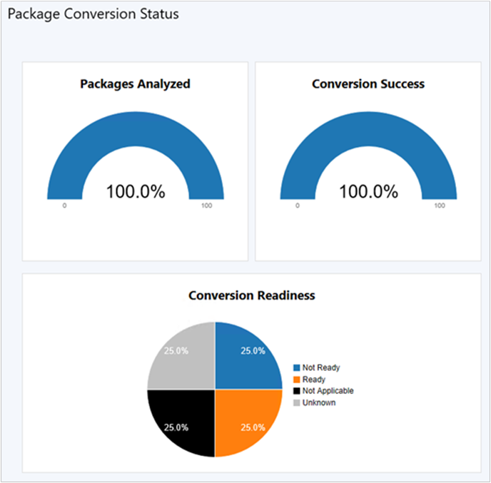

# How to analyze and convert packages with Package Conversion Manager

*Applies to: Configuration Manager (current branch)*

<!--1357861-->

Before you can convert a package, first analyze it. Depending on the results of the analysis, you can then do one of the following tasks:

- **Convert** the package to an application. On the **Package** list in the console, the readiness state displays **Automatic**.  

- **Fix and Convert** the package, attach collections, and create global conditions. On the **Package** list in the console, the readiness state displays **Automatic**.  

- **Fix and Convert** the package. On the **Package** list in the console, the readiness state displays **Manual**.  

- Leave the package unconverted. On the **Package** list in the console, the readiness state displays **Not Applicable**.  

##  How to analyze packages

1. In the Configuration Manager console, go to the **Software Library** workspace. Expand **Application Management**, and select the **Packages** node.  

2. Select the package to convert. On the **Home** tab of the ribbon, in the **Package Conversion** group, select **Analyze Package**. Package Conversion Manager analyzes the package.  

3. To see the readiness state of the package, add the **Readiness** column to the list of packages. The readiness state of the package determines your next action:  

    - **Automatic**: [How to convert packages](#bkmk_convert)  

        To also attach collections and create global conditions with an **Automatic** readiness state, see [How to fix and convert packages](#bkmk_fix).  

    - **Manual**: [How to fix and convert packages](#bkmk_fix)

    - **Not Applicable**: This package is missing required content or a program. Add any missing content or programs and retry analysis. Or leave it in an unconverted state and continue to deploy it as a package.  

    - **Unknown**: First run the **Analyze** task, or wait for the next scheduled analysis. If the state doesn't change, then see [Troubleshoot Package Conversion Manager](troubleshoot-pcm.md).<!-- SCCMDocs#2044 -->

> [!TIP]
> Optionally, you can use the following PowerShell cmdlet to analyze a package: [Invoke-CMAnalyzePackage](/powershell/module/configurationmanager/invoke-cmanalyzepackage).

##  How to convert packages

1. In the Configuration Manager console, go to the **Software Library** workspace. Expand **Application Management**, and select the **Packages** node.  

2. Select the package to convert with a readiness state of **Automatic**. On the **Home** tab of the ribbon, in the **Package Conversion** group, select **Convert Package**. The Convert Package to Application wizard opens.  

3. In the Convert Package to Application wizard, review the list of selected packages. Remove any packages that you don't want to convert, and select **OK**. Package Conversion Manager converts the package. The Conversion Complete window lists the Conversion Status of the new applications.  

    > [!Note]  
    > When you convert a package, the site records the date and time of the conversion as the UTC time.  

4. Follow the instructions in the window. Select either **View applications** or **Close**.  

> [!TIP]
> Optionally, you can use the following PowerShell cmdlet to convert a package: [Invoke-CMConvertPackage](/powershell/module/configurationmanager/invoke-cmconvertpackage).

##  How to fix and convert packages

1. In the Configuration Manager console, go to the **Software Library** workspace. Expand **Application Management**, and select the **Packages** node.  

2. Select a package with a readiness state of **Manual** or **Automatic**. On the **Home** tab of the ribbon, in the **Package Conversion** group, select **Fix and Convert**.  

3. In the Package Conversion Wizard, review the information on the **Package Selection** page, noting the **Items to Fix**. Then select **Next**.  

4. On the **Dependency Review** page, review if the package is dependent on other listed packages, and then select **Next**.  

    > [!Note]  
    > If you haven't converted any of the listed dependent packages, first convert those packages. Then restart the package conversion process.  
    >  
    > If a dependency isn't required, delete it, or ignore it and continue the conversion process.  

5. On the **Deployment Type** page, review the deployment types for the new application. Change their priorities, or delete the deployment types.  

6. If any of the new deployment types don't have an associated detection method, the **Detection Method** column displays a warning icon. Complete the following actions:  

    1. Select **Edit Detection Method**.  

    2. Select **Add**.  

    3. In the Detection Rule dialog box, specify a **Setting Type**.  

    4. For the specified setting type, enter the additional information required for the detection rule.  

    5. Select **OK**. If necessary, repeat this process to add multiple detection methods to each deployment type.  

    6. Select **OK**. Verify the **Detection Method** column displays an icon to confirm a correctly specified detection method.  

7. Select **Next**.  

8. On the **Requirements Selection** page, review the deployment types of the new application. Select a deployment type, and review the requirements for that deployment type.  

    > [!Note]  
    > The wizard only displays the requirements that Package Conversion Manager converts. It doesn't convert all WQL queries in device collections to requirements.  

9. Add requirements for a selected deployment type, if necessary.  

10. Select **Next**.  

11. Complete the wizard to create the application.  

    > [!Note]  
    > When you convert a package, the site records the date and time of the conversion as the UTC time.  

##  Monitor

Go to the **Monitoring** workspace of the Configuration Manager console, and select **Package Conversion Status**. This dashboard shows the overall analysis and conversion state of packages in the site. A new background task automatically summarizes the analysis data.

> [!Tip]  
> Package Conversion Manager integrated with Configuration Manager doesn't require you to schedule analysis of packages. This action is handled by the integrated summarization task. Scheduled package analysis runs every seven days by default.

