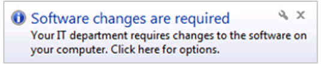
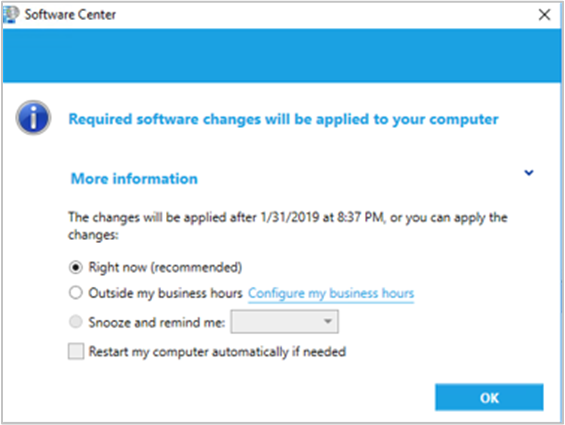
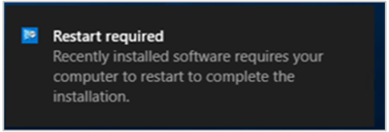
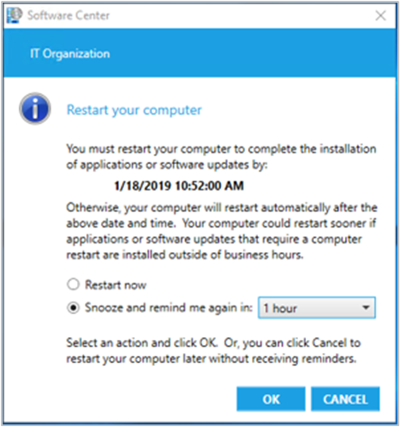

# User notifications

*Applies to: Configuration Manager (current branch)*

The Configuration Manager client and Software Center can display notifications to users that are signed-in to Windows. You can control many of these behaviors through client settings and the deployment settings.

> [!NOTE]
> By default, Windows 11 enables **focus assist** for the first hour after a user signs on for the first time. For more information, see [Reaching the Desktop and the Quiet Period](/windows-hardware/customize/desktop/customize-oobe-in-windows-11#reaching-the-desktop-and-the-quiet-period).
>
> Software Center notifications are currently suppressed during this time. For more information, see [Turn Focus assist on or off in Windows](https://support.microsoft.com/windows/turn-focus-assist-on-or-off-in-windows-5492a638-b5a3-1ee0-0c4f-5ae044450e09#ID0EBD=Windows_11).<!-- 11059565 -->

## Required deployments

When users receive required software, and select the **Snooze and remind me** setting, they can choose from the following options:

- **Later**: Specifies that notifications are scheduled based on the notification settings configured in client settings.

- **Fixed time**: Specifies that the notification is scheduled to display again after the selected time. For example, if you select 30 minutes, the notification displays again in 30 minutes.

:::image type="content" source="media/ComputerAgentSettings.png" alt-text="Computer Agent group in default client settings":::

The maximum snooze time is always based on the notification values configured in the client settings at every time along the deployment timeline. For example:

- You configure the **Deployment deadline greater than 24 hours, remind users every (hours)** setting on the **Computer Agent** page for 10 hours.

- The client displays the notification dialog more than 24 hours before the deployment deadline.

- The dialog shows snooze options up to but never greater than 10 hours.

- As the deployment deadline approaches, the dialog shows fewer options. These options are consistent with the relevant client settings for each component of the deployment timeline.

For a high-risk deployment, such as a task sequence that deploys an OS, the user notification experience is more intrusive. Instead of a transient taskbar notification, a dialog box like the following displays each time you're notified that critical software maintenance is required:

:::image type="content" source="media/client-toast-notification.png" alt-text="Required software dialog notifies you of critical software maintenance":::

## Replace toast notifications with dialog window

<!--3555947-->
Sometimes users don't see the Windows toast notification about a restart or required deployment. Then they don't see the experience to snooze the reminder. This behavior can lead to a poor user experience when the client reaches a deadline.

When [software changes are required](#software-changes-are-required) or deployments [need a restart](#restart-required), you have the option of using a more intrusive dialog window.

### Software changes are required

When you [deploy an application](../deploy-use/deploy-applications.md) as required with a deadline in the future, on the **User Experience** page of the Deploy Software Wizard, select the following user notification options:

- **Display in Software Center and show all notifications**
- **When software changes are required, show a dialog window to the user instead of a toast notification**

Configuring this deployment setting changes the user experience for this scenario.

From the following toast notification:

  

To the following dialog window:

### Restart required

In the [Computer Restart](../../core/clients/deploy/about-client-settings.md#computer-restart) group of client settings, enable the following option: **When a deployment requires a restart, show a dialog window to the user instead of a toast notification**.  

Configuring this client setting changes the user experience for all required deployments that require a restart of the following types:

- [Application](../deploy-use/deploy-applications.md)
- [Task sequence](../../osd/deploy-use/deploy-a-task-sequence.md)
- [Software update](../../sum/deploy-use/deploy-software-updates.md)

From the following toast notification:

  

To the following dialog window:

## Next steps

[Device restart notifications](../../core/clients/deploy/device-restart-notifications.md)
