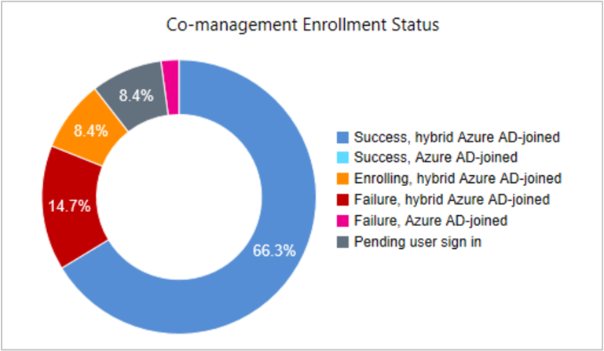

# How to monitor co-management in Configuration Manager

*Applies to: Configuration Manager (current branch)*

After you enable co-management, monitor co-management devices using the following methods:

- [Co-management dashboard](#co-management-dashboard)  

- [Deployment policies](#deployment-policies)

- [WMI device data](#wmi-device-data)

## Co-management dashboard

This dashboard helps you review machines that are co-managed in your environment. The graphs can help identify devices that might need attention.<!--1356648,1358980-->

In the Configuration Manager console, go to the **Monitoring** workspace, and select the **Cloud Attach** node.
   - For version 2103 and earlier, select the **Co-management** node.

### Client OS distribution

Shows the number of client devices per OS by version. It uses the following groupings:  

- Windows 7 & 8.x
- Windows 10 lower than 1709  
- Windows 10 1709 and later  

Hover over a graph section to show the percentage of devices in that OS group.

### Co-management status

A funnel chart that shows the number of devices with the following states from the enrollment process:
  
- Eligible devices
- Scheduled  
- Enrollment initiated  
- Enrolled  

### Co-management enrollment status

Shows the breakdown of device status in the following categories:

- Success, hybrid Azure AD-joined  
- Success, Azure AD-joined  
- Enrolling, hybrid Azure AD-joined  
- Failure, hybrid Azure AD-joined  
- Failure, Azure AD-joined  
- Pending user sign in  
   - To reduce the number of devices in this pending state, a new co-managed device automatically enrolls to the Microsoft Intune service based on its Azure AD *device* token. It doesn't need to wait for a user to sign in to the device for auto-enrollment to start. To support this behavior, the device needs to be running Windows 10, version 1803 or later. If the device token fails, it falls back to previous behavior with the user token. Look in the **ComanagementHandler.log** for the following entry:
    > `Enrolling device with RegisterDeviceWithManagementUsingAADDeviceCredentials`

Select a state in the tile to drill through to a list of devices in that state.  

### Workload transition

Displays a bar chart with the number of devices that you've transitioned to Microsoft Intune for the available workloads. For more information, see [Workloads able to be transitioned to Intune](workloads.md).

Hover over a chart section to show the number of devices transitioned for the workload.

### Enrollment errors

This table is a list of enrollment errors from devices. These errors can come from the MDM component in Windows, the core Windows OS, or the Configuration Manager client.

There are hundreds of possible errors. The following table lists the most common errors.
<!-- SCCMDocs issue 1064, BUG 3158555 -->

| Error | Description |
|---------|---------|
| 2147549183 (0x8000FFFF) | MDM enrollment hasn't been configured yet on Azure AD, or the enrollment URL isn't expected.  [Enable automatic enrollment](/intune/windows-enroll#enable-windows-automatic-enrollment) |
| 2149056536 (0x80180018) MENROLL_E_USERLICENSE | License of user is in bad state blocking enrollment  [Assign licenses to users](/intune/licenses-assign) |
| 2149056555 (0x8018002B) MENROLL_E_MDM_NOT_CONFIGURED | When trying to automatically enroll to Intune, but the Azure AD configuration isn't fully applied. This issue should be transient, as the device retries after a short time. |
| 2149056554 (0x‭8018002A‬) &nbsp; | The user canceled the operation  If MDM enrollment requires multi-factor authentication, and the user hasn't signed in with a supported second factor, Windows displays a toast notification to the user to enroll. If the user doesn't respond to toast notification, this error occurs. This issue should be transient, as Configuration Manager will retry and prompt the user. Users should use multi-factor authentication when they sign in to Windows. Also educate them to expect this behavior, and if prompted, take action. |
| 2149056532 (0x80180014) MENROLL_E_DEVICENOTSUPPORTED | Mobile device management isn't supported. Check device restrictions. |
| 2149056533 (0x80180015) MENROLL_E_NOTSUPPORTED | Mobile device management isn't supported. Check device restrictions. |
| 2149056514 (0x80180002) MENROLL_E_DEVICE_AUTHENTICATION_ERROR | Server failed to authenticate the user   There's no Azure AD token for the user. Make sure the user can authenticate to Azure AD. |
| 2147942450 (0x‭80070032‬) &nbsp; | MDM auto-enrollment is only supported on Windows RS3 and above.  Make sure the device meets the [minimum requirements](overview.md#windows) for co-management. |
| 3400073293 | ADAL user realm account response unknown  Check your Azure AD configuration, and make sure that users can successfully authenticate. |
| 3399548929 | Need user sign-in  This issue should be transient. It occurs when the user quickly signs out before the enrollment task happens. |
| 3400073236 | ADAL security token request failed.  Check your Azure AD configuration, and make sure that users can successfully authenticate. |
| 2149122477 | Generic HTTP issue |
| 3400073247 | ADAL-integrated Windows authentication is only supported in federated flow  [Plan your hybrid Azure Active Directory join implementation](/azure/active-directory/devices/hybrid-azuread-join-plan) |
| 3399942148 | The server or proxy wasn't found.  This issue should be transient, when the client can't communicate with cloud. If it persists, make sure the client has consistent connectivity to Azure. | 
| 2149056532 | Specific platform or version is not supported  Make sure the device meets the [minimum requirements](overview.md#windows) for co-management. |
| 2147943568 | Element not found  This issue should be transient. If it persists, contact Microsoft Support. |
| 2192179208 | Not enough memory resources are available to process this command.  This issue should be transient, it should resolve itself when the client retries. |
| 3399614467 | ADAL Authorization grant failed for this assertion  Check your Azure AD configuration, and make sure that users can successfully authenticate. |
| 2149056517 | Generic Failure from management server, such as DB access error  This issue should be transient. If it persists, contact Microsoft Support. |
| 2149134055 | Winhttp name not resolved  The client can't resolve the name of the service. Check the DNS configuration. |
| 2149134050 | internet timeout  This issue should be transient, when the client can't communicate with cloud. If it persists, make sure the client has consistent connectivity to Azure. |

For more information, see [MDM Registration Error Values](/windows/desktop/mdmreg/mdm-registration-constants).

## Deployment policies

Two policies are created in the **Deployments** node of the **Monitoring** workspace. One policy is for the pilot group and one for production. These policies report only the number of devices where Configuration Manager has applied the policy. They don't consider how many devices are enrolled in Intune, which is a requirement before devices can be co-managed.

The production policy (CoMgmtSettingsProd) is targeted to the **All Systems** collection. It has an applicability condition that checks the OS type and version. If the client runs a server OS or isn't Windows 10 or later, the policy doesn't apply, and no action is taken.

> [!TIP]
> For an example collection query for co-managed devices see, [Create queries in Configuration Manager](../core/servers/manage/create-queries.md#bkmk_comgmt).
 
## WMI device data

Query the **SMS_Client_ComanagementState** WMI class in the **ROOT\SMS\site_&lt;SITECODE>** namespace on the site server. You can create custom collections in Configuration Manager, which help determine the status of your co-management deployment. For more information on creating custom collections, see [How to create collections](../core/clients/manage/collections/create-collections.md).

The following fields are available in the WMI class:

- **MachineId**: A unique device ID for the Configuration Manager client

- **MDMEnrolled**: Specifies whether the device is MDM-enrolled

- **Authority**: The authority for which the device is enrolled

- **ComgmtPolicyPresent**: Specifies whether the Configuration Manager co-management policy exists on the client. If the **MDMEnrolled** value is `0`, the device isn't co-managed whatever co-management policy exists on the client.

A device is co-managed when the **MDMEnrolled** field and **ComgmtPolicyPresent** fields both have a value of `1`.