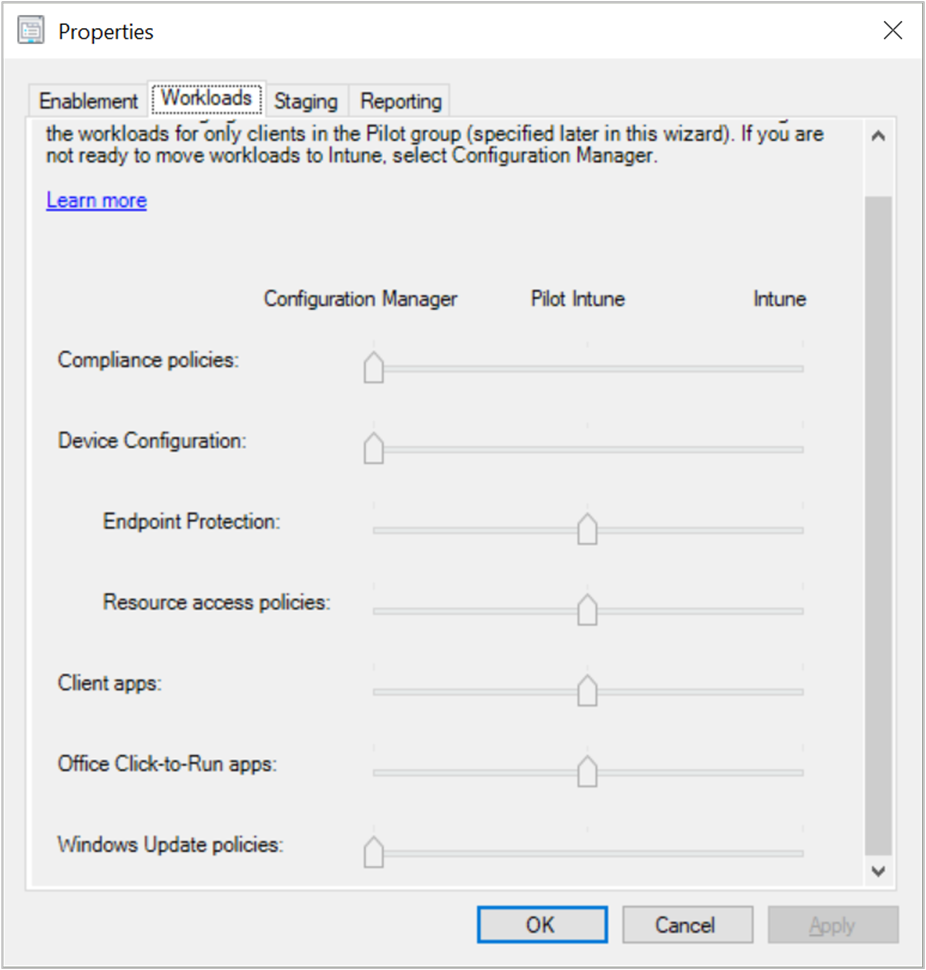
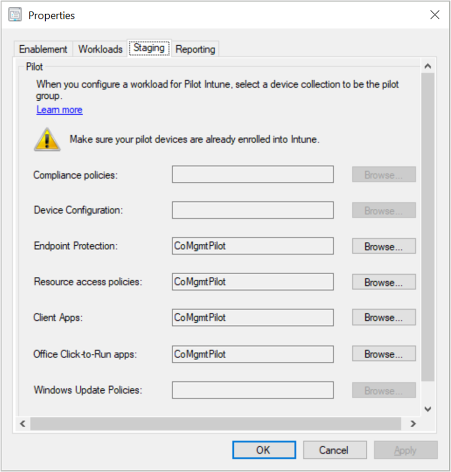

# How to switch Configuration Manager workloads to Intune

One of the benefits of co-management is switching workloads from Configuration Manager to Microsoft Intune. When a Windows 10 device has the Configuration Manager client and is enrolled to Intune, you get the benefits of both services. You control which workloads, if any, you switch the authority from Configuration Manager to Intune. Configuration Manager continues to manage all other workloads, including those workloads that you don't switch to Intune, and all other features of Configuration Manager that co-management doesn't support.

If you switch a workload to Intune, but later change your mind, you can switch it back to Configuration Manager.

For more information on the supported workloads, see [Workloads](workloads.md).

## Switch workloads starting in version 1906
<!--3555750 FKA 1357954 -->
Starting in version 1906, you can configure different pilot collections for each of the co-management workloads. Being able to use different pilot collections allows you to take a more granular approach when shifting workloads. You can switch workloads when you enable co-management, or later when you're ready. If you haven't already enabled co-management, do that first. For more information, see [How to enable co-management](how-to-enable.md). After you enable co-management, modify the settings in the co-management properties.

1. In the Configuration Manager console, go to the **Administration** workspace, expand **Cloud Services**, and select the **Co-management** node.  
2. Select the co-management object, and then choose **Properties** in the ribbon.  
3. Switch to the **Workloads** tab. By default, all workloads are set to the **Configuration Manager** setting. To switch a workload, move the slider control for that workload to the desired setting.  

    

    - **Configuration Manager**: Configuration Manager continues to manage this workload.  

    - **Pilot Intune**: Switch this workload only for the devices in the pilot collection. You can change the **Pilot collections** on the **Staging** tab of the co-management properties page.  

    - **Intune**: Switch this workload for all Windows 10 devices enrolled in co-management.  

4. Go to the **Staging** tab and change the **Pilot collection** for any of the workloads if needed.
  
   

> [!Important]  
> - Before you switch any workloads, make sure you properly configure and deploy the corresponding workload in Intune. Make sure that workloads are always managed by one of the management tools for your devices.
> - Starting in Configuration Manager version 1806, when you switch a co-management workload, the co-managed devices automatically synchronize MDM policy from Microsoft Intune. <!--1357377-->

## Switch workloads in version 1902 and earlier

You can switch workloads when you enable co-management, or later when you're ready. If you haven't already enabled co-management, do that first. For more information, see [How to enable co-management](how-to-enable.md). After you enable co-management, modify the settings in the co-management properties.

1. In the Configuration Manager console, go to the **Administration** workspace, expand **Cloud Services**, and select the **Co-management** node.  

2. Select the co-management object, and then choose **Properties** in the ribbon.
   - You'll be prompted to sign into Azure AD. The prompt doesn't block you from updating your onboarding. However, you'll be prompted each time you open the **Properties** page until you do sign in.

3. Switch to the **Workloads** tab. By default, all workloads are set to the **Configuration Manager** setting. To switch a workload, move the slider control for that workload to the desired setting.  

    

    - **Configuration Manager**: Configuration Manager continues to manage this workload.  

    - **Pilot Intune**: Switch this workload only for the devices in the pilot collection. You can change the **Pilot collection** on the **Staging** tab of the co-management properties page.  

    - **Intune**: Switch this workload for all Windows 10 devices enrolled in co-management.  

4. On the **Staging** tab of the co-management properties page, change the **Pilot collection** for your workloads if needed.

5. Click **OK** to save and exit co-management properties.

> [!Important]  
> - Before you switch any workloads, make sure you properly configure and deploy the corresponding workload in Intune. Make sure that workloads are always managed by one of the management tools for your devices. 
> - Starting in Configuration Manager version 1806, when you switch a co-management workload, the co-managed devices automatically synchronize MDM policy from Microsoft Intune. <!--1357377-->

## Next steps

[Monitor co-management](how-to-monitor.md)
