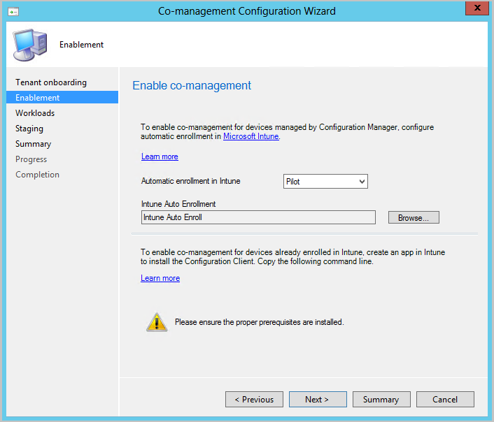
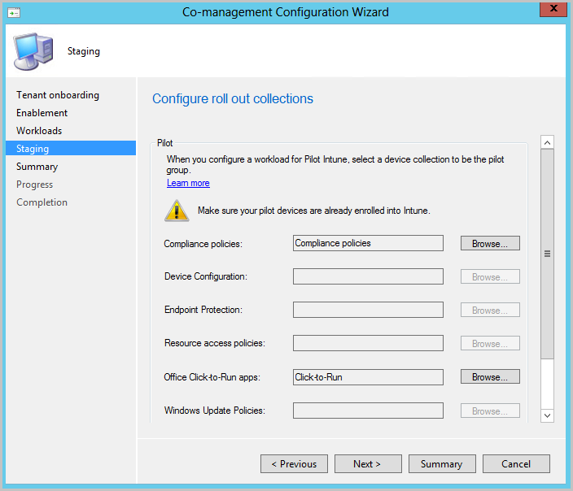

<!--3555750 FKA 1357954 --Don't apply H2/H3 in this include file since they are context driven by article-->

When enabling co-management, you can use the Azure Public Cloud, Azure US Government Cloud, or Microsoft Azure China 21Vianet (added in version 2006). To enable co-management starting in Configuration Manager version 1906, follow the instructions below:

1. In the Configuration Manager console, go to the **Administration** workspace, expand **Cloud Services**, and select the **Cloud Attach** node. Select **Configure Cloud Attach** in the ribbon to open the **Cloud Attach Configuration Wizard**.
   - For version 2103 and earlier, expand **Cloud Services** and select the **Co-management** node. Select **Configure co-management** in the ribbon to open the **Co-management Configuration Wizard**.

1. On the onboarding page of the wizard, configure the **Azure environment** to use. Choose one of the following environments:

   - Azure Public Cloud
   - Azure US Government Cloud.<!--4075452-->
   - Azure China Cloud (added in version 2006)<!--7133238-->
      - Update the Configuration Manager client to the latest version on your devices before onboarding to Azure China Cloud. <!--7630213--> 

   When you select Azure China Cloud or Azure US Government Cloud, the **Upload to Microsoft Endpoint Manager admin center** option for [tenant attach](../../tenant-attach/device-sync-actions.md) is disabled.

1. Select **Sign In**. Sign in as an Azure AD global administrator, and then select **Next**. You sign in this one time for the purposes of this wizard. The credentials aren't stored or reused elsewhere.

1. On the **Enablement** page, choose the following settings:

   - **Automatic enrollment into Intune** - Enables automatic client enrollment in Intune for existing Configuration Manager clients. This option allows you to enable co-management on a subset of clients to initially test co-management, and rollout co-management using a phased approach. If a device is  unenrolled by the user, on the next evaluation of the policy, it will re-enroll. <!--3330596-->

      - **Pilot** - Only the Configuration Manager clients that are members of the **Intune Auto Enrollment** collection are automatically enrolled to Intune.
      - **All** - Enable automatic enrollment for all Windows 10, version 1709 or later, clients.
      - **None** - Disable automatic enrollment for all clients.

   - **Intune Auto Enrollment** - This collection should contain all of the clients you want to onboard into co-management. It's essentially a superset of all the other staging collections.

   
      
      Automatic enrollment isn't immediate for all clients. This behavior helps enrollment scale better for large environments. Configuration Manager randomizes enrollment based on the number of clients. For example, if your environment has 100,000 clients, when you enable this setting, enrollment occurs over several days.<!--1358003-->

   - A new co-managed device now automatically enrolls to the Microsoft Intune service based on its Azure Active Directory (Azure AD) *device* token. It doesn't need to wait for a user to sign in to the device for auto-enrollment to start. This change helps to reduce the number of devices with the enrollment status *Pending user sign in*.<!-- 4454491 --> To support this behavior, the device needs to be running Windows 10, version 1803 or later. For more information, see [Co-management enrollment status](../how-to-monitor.md#co-management-enrollment-status).
   - If you already have devices enrolled to co-management, new devices now enroll immediately once they meet the [prerequisites](../overview.md#prerequisites).<!--4321130-->

1. For internet-based devices that are already enrolled in Intune, copy and save the command line on the **Enablement** page. You'll use this command line to install the Configuration Manager client as an app in Intune for internet-based devices. If you don't save this command line now, you can review the co-management configuration at any time to get this command line.

    > [!TIP]
    > The command line only shows if you've met all of the prerequisites, such as set up a cloud management gateway.<!-- MEMDocs#635 -->

1. On the **Workloads** page, for each workload, choose which device group to move over for management with Intune. For more information, see [Workloads](../workloads.md). If you only want to enable co-management, you don't need to switch workloads now. You can switch workloads later. For more information, see [How to switch workloads](../how-to-switch-workloads.md).  

    - **Pilot Intune** - Switches the associated workload only for the devices in the pilot collections you'll specify on the **Staging** page. Each workload can have a different pilot collection.
    - **Intune** - Switches the associated workload for all co-managed Windows 10 devices.  

    > [!Important]
    > Before you switch any workloads, make sure you properly configure and deploy the corresponding workload in Intune. Make sure that workloads are always managed by one of the management tools for your devices.  

1. On the **Staging** page, specify the pilot collection for each of the workloads that are set to **Pilot Intune**.

   

1. To enable co-management, complete the wizard.
