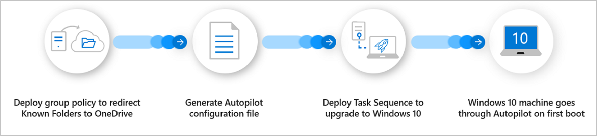

# Windows Autopilot with co-management

Receiving a new Windows device is exciting. However, it can take time to configure all your settings and apps so that you can be productive. Co-management solves this device provisioning problem with Windows Autopilot.

Autopilot provides a simplified experience for both you and your users in the following situations:

- Set up and pre-configure new Windows 10 or later devices
- Reset, recycle, and recover existing devices

Autopilot reduces the time, resources, and complexity associated with deploying, managing, and retiring devices. At the same time, the experience for your users is streamlined and easy from first boot.

Windows Autopilot supports several scenarios, all of which are maximized with co-management:

- Users can drive their own deployments of new devices into Microsoft Entra ID

- You can set up self-deploying new device deployments into Microsoft Entra ID for shared devices and kiosks

- With Windows Autopilot for existing devices, use Configuration Manager to migrate an existing device from earlier versions of Windows and Active Directory to later versions of Windows and Microsoft Entra ID

In the following video, senior program manager Danny Guillory and principal program manager Andrew McMurray discuss and demo Windows Autopilot with co-management:

> [!VIDEO https://aka.ms/docs/player?id=86b3188d-1f01-4655-b001-2274f072e910]

> [!NOTE]
> [Introducing Autopilot into co-management](./autopilot-enrollment.md). When you use [Windows Autopilot](/autopilot/overview) to provision a device, it first enrolls to Microsoft Entra ID and Microsoft Intune. If the intended end-state of the device is co-management, previously this experience was difficult because of installation of Configuration Manager client as Win32 app which introduces component timing and policy delays.

## Benefits

When you use co-management and Autopilot together, you make sure that new devices entering your network end up in the same state of management. In this setup, devices are enrolled in Intune and have a Configuration Manager client. It allows you to use the new Windows provisioning model, and helps you eliminate the need to create, maintain, and update custom OS images.

In all of these scenarios, you can automatically [enable co-management](how-to-prepare-Win10.md) by Intune. This automation assists with the provisioning process, and for ongoing management of the device.

With Autopilot, you don't need to worry about images and drivers. Focus on provisioning devices by this automated process using Intune and Configuration Manager via co-management.

Here's how using co-management and Autopilot together can help you right now:

### Reduce time, costs, and complexity

Windows Autopilot uses the OEM-optimized version of Windows that's preinstalled on the device. This configuration saves organizations the effort of having to maintain custom images and drivers for every model of device in use. Instead of reimaging the device, transform the existing Windows installation into a "business-ready" state. It applies settings and policies, installs apps, and changes the edition of Windows. For example, upgrading from Windows 10 Pro to Windows 10 Enterprise so that you can support advanced features.

### Improve the user experience

The best user experience causes the least disruption and helps them get back to focusing on their work. Windows Autopilot offers a simple approach to help your users get set up quickly with a few simple clicks and their Microsoft Entra credentials. For many organizations with a large field of remote employees, use Windows Autopilot to ship new devices straight from the manufacturer.

### Use Autopilot and Configuration Manager to migrate existing Windows devices to Windows 10 or later

With Windows Autopilot for existing devices, you create a configuration file and deploy it with a Configuration Manager task sequence. This process easily migrates existing devices from earlier versions of Windows to Windows 10 or later. You use a signature Windows 10 image in Configuration Manager, and then apply it to the existing Windows device with the Autopilot configuration. When the user starts the device, they use the Autopilot user-driven onboarding process.

Here are the steps for Autopilot for existing devices:

1. Deploy group policy to redirect known folders to OneDrive
2. Generate Autopilot configuration file
3. Deploy task sequence to upgrade to Windows 10 or later
4. The Windows machine goes through Autopilot on first boot

### Modernizing device provisioning for all types of workers

With Autopilot, you can now provide a hands-free OS deployment to unmanned devices or shared devices using the self-deploying mode. This setup meets the needs of all your different types of workers. Also, the Windows Autopilot Reset function makes sure that re-provisioning of a device to a new user is simple and easy. This process simplifies what has traditionally been a difficult task when you have seasonal or contract workers.

## Case study

The German logistics and rail freight company DB Schenker uses Autopilot to increase employee productivity and free its IT teams from working on day-to-day support tasks. DB Schenker has moved away from traditional imaging and replaced it with provisioning via the cloud. They now use Microsoft Entra join and Intune to get new devices up and running quickly.

Rather than have their remote workers waste time traveling to a location with IT services, DB Schenker now uses Windows Autopilot. They ship their workers hardware directly from the manufacturer to their local field office. The worker connects the new device to the internet, and they sign in with their Microsoft Entra credentials. The device then connects to the applications and services that DB Schenker's IT department assigns to the user's individual profile.

## Value proposition

Create satisfaction in your organization by creating a better user experience for your users. Use Windows Autopilot to drive down costs. Free up your time to focus on other projects to drive more value and impact for your organization.

## Configure

For more information, see the following articles:

- [Autopilot into co-management](./autopilot-enrollment.md)

- [Create device groups](/autopilot/enrollment-autopilot)

- [Windows Autopilot for existing devices](/autopilot/existing-devices)
