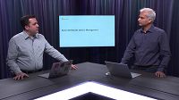

# Cloud connecting with co-management

Co-management adds new functionality to your existing Configuration Manager deployment, without changing how you already work. When you enable co-management, you immediately begin benefitting from the cloud. You can apply that value to your existing management infrastructure and processes.

In this co-management quickstart series, see how you can quickly drive new management value. Co-management is built to create features and tools you can use right now.

In the following video, Microsoft corporate vice president Brad Anderson introduces this co-management series:

> [!VIDEO https://aka.ms/docs/player?id=43180fed-54f8-4179-bcfc-98c0f9efcdbc]

| Immediate value | Getting started |
|-----------------|-----------------|
| - [Conditional access](#bkmk_ca)  - [Remote actions from Intune](#bkmk_remote)  - [Client health](#bkmk_client-health)  - [Hybrid Microsoft Entra ID](#bkmk_hybrid-aad)  - [Windows Autopilot](#bkmk_autopilot) | - [Paths to co-management](#bkmk_paths)  - [Set up hybrid Microsoft Entra ID](#bkmk_setup-hybrid-aad)  - [Upgrade Windows](#bkmk_upgrade-win10)  - [Get help from FastTrack](#bkmk_fasttrack) |

## Immediate value

|Title |Description |Link |
|-|-|-|
| **Conditional access with device compliance** | Control user access to corporate resources based on compliance rules from Intune. |  |
| **Remote actions from Intune** | Run remote actions from Intune for co-managed devices. For example, wipe and reset a device and maintain enrollment and account. |  |
| **Configuration Manager client health** | Maintain visibility of Configuration Manager client health from the Microsoft Intune admin center. |  |
| **Microsoft Entra ID** | With Microsoft Entra ID you can take advantage of improved productivity for your users and security for your resources, across both cloud and on-prem environments. |  |
| **Windows Autopilot** | Reduce time, resources, and complexity associated with deploying, managing, and retiring or recycling devices. Autopilot also creates a better experience for end users. |  |

## Getting started

If you want to enable co-management, start here to unblock the technical concerns you may have.

|Title |Description |Link |
|-|-|-|
| **Paths to co-management** | There are two primary ways for you to set up co-management, and it's important to understand the prerequisites for each path.  Each path requires some combination of Microsoft Entra ID, ConfigMgr, Intune, and Windows client. | [Learn more about paths to co-management.](quickstart-paths.md) |
| **Set up hybrid Microsoft Entra ID** | If your environment currently has domain-joined Windows 10 or later devices, set up hybrid Microsoft Entra ID before you can enable co-management. |  |
| **Upgrade Windows** | A supported version of Windows 10 or later is required for co-management. |  |
| **Get help from FastTrack** | The FastTrack organization is a large group of Microsoft engineers who specialize in helping all types of organizations deploy Microsoft 365 apps, including setting up co-management. |  |
