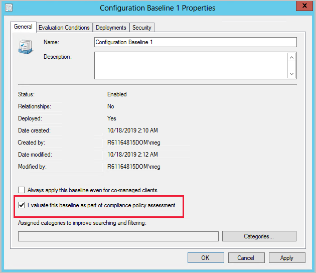

# Create configuration baselines in Configuration Manager

*Applies to: Configuration Manager (current branch)*

Configuration baselines in Configuration Manager contain predefined configuration items and optionally, other configuration baselines. After a configuration baseline is created, you can deploy it to a collection so that devices in that collection download the configuration baseline and assess their compliance with it.  

> [!TIP]
> There's no way to specify the order that the Configuration Manager client evaluates the configuration items in a baseline. It's non-deterministic.<!-- MEMDocs#175 -->

## Configuration baselines

 Configuration baselines in Configuration Manager can contain specific revisions of configuration items or can be configured to always use the latest version of a configuration item. For more information about configuration item revisions, see [Management tasks for configuration data](../../compliance/deploy-use/management-tasks-for-configuration-data.md).  

 There are two methods that you can use to create configuration baselines:  

- Import configuration data from a file. To start the **Import Configuration Data Wizard**, in the **Configuration Items** or **Configuration Baselines** node in the **Assets and Compliance** workspace, click **Import Configuration Data**. For more information, see [Import configuration data](import-configuration-data.md).

- Use the **Create Configuration Baseline** dialog box to create a new configuration baseline.  

## Create a configuration baseline

To create a configuration baseline by using the **Create Configuration Baseline** dialog box, use the following procedure:  

1. In the Configuration Manager console, click **Assets and Compliance** > **Compliance Settings** > **Configuration Baselines**.  

2. On the **Home** tab, in the **Create** group, click **Create Configuration Baseline**.  

3. In the **Create Configuration Baseline** dialog box, enter a unique name and a description for the configuration baseline. You can use a maximum of 255 characters for the name and 512 characters for the description.  

4. The **Configuration data** list displays all configuration items or configuration baselines that are included in this configuration baseline. Click **Add** to add a new configuration item or configuration baseline to the list. You can choose from the following items:  

   - **Configuration Items**  

   - **Software Updates**  

   - **Configuration Baselines**  
     > [!IMPORTANT]
     > You must limit each configuration baseline to no more than 1000 software updates.
5. Use the **Change Purpose** list to specify the behavior of a configuration item that you've selected in the **Configuration data** list. You can select from the following items:  

   -   **Required**: The configuration baseline is evaluated as noncompliant if the configuration item isn't detected on a client device. If it's detected, it's evaluated for compliance  

   -   **Optional**: The configuration item is only evaluated for compliance if the application it references is found on client computers. If the application is not found, the configuration baseline isn't marked as noncompliant (only applicable to application configuration items).  

   -   **Prohibited**: The configuration baseline is evaluated as noncompliant if the configuration item is detected on client computers (only applicable to application configuration items).  

   > [!NOTE]
   >  The **Change Purpose** list is available only if you clicked the option **This configuration item contains application settings** on the **General** page of the **Create Configuration Item Wizard**.  

6. Use the **Change Revision** list to select a specific or the latest revision of the configuration item to assess for compliance on client devices or select **Always Use Latest** to always use the latest revision. For more information about configuration item revisions, see [Management tasks for configuration data](../../compliance/deploy-use/management-tasks-for-configuration-data.md).  

7. To remove a configuration item from the configuration baseline, select a configuration item, and then click **Remove**.  

8. Starting in version 1806, select if you want to **Always apply this baseline for co-managed clients**. When checked, this baseline will apply even on clients that are managed by Intune.  This exception might be used to configure settings that are required by your organization but not yet available in Intune.

9. Optionally, click on **Categories** to assign categories to the baseline for searching and filtering. 

10. Click **OK** to close the **Create Configuration Baseline** dialog box and to create the configuration baseline.  

>[!NOTE]
> Modifying an existing baseline, such as setting **Always apply this baseline for co-managed clients**, will increment the baseline content version. Clients will need to evaluate the new version to update the baseline reporting.

##  Include custom configuration baselines as part of compliance policy assessment
<!--3608345-->

You can add evaluation of custom configuration baselines as a compliance policy assessment rule. When you create or edit a configuration baseline, you have an option to **Evaluate this baseline as part of compliance policy assessment**. When adding or editing a compliance policy rule, you have a condition called **Include configured baselines in compliance policy assessment**. For co-managed devices, and when you configure Intune to take Configuration Manager compliance assessment results as part of the overall compliance status, this information is sent to Microsoft Entra ID. You can then use it for conditional access to your Microsoft 365 Apps resources. For more information, see [Conditional access with co-management](../../comanage/quickstart-conditional-access.md).

To include custom configuration baselines as part of compliance policy assessment, do the following:

- Create and deploy a compliance policy to a *user* collection with a rule to [**Include configured baselines in compliance policy assessment**](#bkmk_CA).
- Select [**Evaluate this baseline as part of compliance policy assessment**](#bkmk_eval-baseline) in a configuration baseline deployed to a *device* collection.

> [!IMPORTANT]
> - The configuration baseline must be deployed to a *device* collection. Baselines deployed to *user* collections aren't honored when these settings are used. <!--13139787,13783318 --> 
> - When targeting devices that are co-managed, ensure you meet the [co-management prerequisites](../../comanage/overview.md#prerequisites). Co-managed clients ignore service windows for remediation when their compliance policies workload is managed by Intune. <!--12439085, 12412748-->
> - For devices managed by Configuration Manager, the client honors the service window for compliance policy remediation. To ignore the service window and remediate immediately, select **Check compliance** in the **Software Center**. <!--12439085, 12412748-->

### Example evaluation scenario

When a user is part of a collection targeted with a compliance policy that includes the rule condition **Include configured baselines in compliance policy assessment**, any baselines with the **Evaluate this baseline as part of compliance policy assessment** option selected that are deployed to the user or the user's device are evaluated for compliance. For example:

- `User1` is part of `User Collection 1`.
- `User1` uses `Device1`, which is in `Device Collection 1` and `Device Collection 2`.
- `Compliance Policy 1` has the **Include configured baselines in compliance policy assessment** rule condition and is deployed to `User Collection 1`.
- `Configuration Baseline 1` has **Evaluate this baseline as part of compliance policy assessment** selected and is deployed to `Device Collection 1`.
- `Configuration Baseline 2` has **Evaluate this baseline as part of compliance policy assessment** selected and is deployed to `Device Collection 2`.

In this scenario, when `Compliance Policy 1` evaluates for `User1` using `Device1`, both `Configuration Baseline 1` and `Configuration Baseline 2` are evaluated too.

- `User1` sometimes uses `Device2`.
- `Device2`is a member of `Device Collection 2` and `Device Collection 3`.
- `Device Collection 3` has `Configuration Baseline 3` deployed to it, but **Evaluate this baseline as part of compliance policy assessment** isn't selected.

When `User1` uses `Device2`, only `Configuration Baseline 2` gets evaluated when `Compliance Policy 1` evaluates.

> [!NOTE]
><!--5582516-->
> If the compliance policy evaluates a new baseline that has never been evaluated on the client before, it may report non-compliance. This occurs if the baseline evaluation is still running when the compliance is evaluated. To workaround this issue, click **Check compliance** in the **Software Center**.

###  Create and deploy a compliance policy with a rule for baseline compliance policy assessment

1. In the **Assets and Compliance** workspace, expand **Compliance Settings**, then select the **Compliance Policies** node.
1. Click **Create Compliance Policy** in the ribbon to bring up the **Create Compliance Policy Wizard**. 
1. On the **General** page, select **Compliance rules for devices managed with the Configuration Manager client**.
   - Devices must be managed with the Configuration Manager client to include custom configuration baselines as part of compliance policy assessment.
1. Select your platforms on the **Supported Platforms** pages.
1. On the **Rules** page, select **New**, then select the **Include configured baselines in compliance policy assessment** condition.

   

1. Click **OK**, then **Next** to get to the **Summary** page.
1. Verify your selections and click **Next** then **Close**.
1. In the **Compliance Policies** node, right-click on the policy you created, and select **Deploy**.
1. Choose your collection, alert generation settings, and your compliance evaluation schedule for the policy.
1. Click **OK** to deploy the compliance policy.

### Select a configuration baseline and check "Evaluate this baseline as part of compliance policy assessment"

1. In the **Assets and Compliance** workspace, expand **Compliance Settings**, then select the **Configuration Baselines** node.
1. Right-click on an existing baseline that's deployed to a device collection, then select **Properties**. If needed, you can create a new baseline.
   - The baseline must be deployed to a device collection, not a user collection.
1. Enable the **Evaluate this baseline as part of compliance policy assessment** setting.
   - For co-managed devices that have Intune as the **Device configuration** authority, ensure **Always apply this baseline even for co-managed clients** is also selected.
1. Click **OK** to save the changes to your configuration baseline.

   

### Log files for custom configuration baselines as part of compliance policy assessment

- ComplianceHandler.log
- SettingsAgent.log
- DCMAgent.log
- CIAgent.log

## Next steps

[Import configuration data](import-configuration-data.md)
