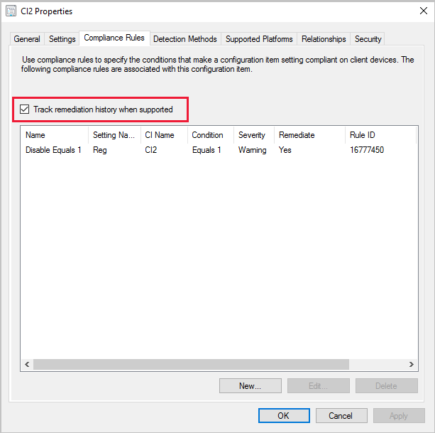

# Create custom configuration items for Windows desktop and server computers managed with the Configuration Manager client

*Applies to: Configuration Manager (current branch)*

Use the Configuration Manager **custom Windows Desktops and Servers** configuration item to manage settings  for Windows computers and servers that are managed by the Configuration Manager client.  

## Start the wizard

1. In the Configuration Manager console, go to the **Assets and Compliance** workspace, expand **Compliance Settings**, and select the **Configuration Items** node.  

2. On the **Home** tab of the ribbon, in the **Create** group, select **Create Configuration Item**.  

3. On the **General** page of the **Create Configuration Item Wizard**, specify a name, and optional description for the configuration item.  

4. Under **Specify the type of configuration item that you want to create**, select **Windows Desktops and Servers (custom)**.  
   - If you want to supply detection method settings that check for the existence of an application, select **This configuration file contains application settings**.  

5. To help you search and filter configuration items in the Configuration Manager console, select **Categories** to create and assign categories.  

## Detection methods  

Use this procedure to provide detection method information for the configuration item.  

> [!NOTE]  
> This information only applies if you select **This configuration item contains application settings** on the **General** page of the wizard.  

A detection method in Configuration Manager contains rules that are used to detect whether an application is installed on a computer. This detection occurs before the client assesses its compliance for the configuration item. To detect whether an application is installed, you can detect the presence of a Windows Installer file for the application, use a custom script, or select **Always assume application is installed** to assess the configuration item for compliance regardless of whether the application is installed.  

### To detect an application installation by using the Windows Installer file  

1. On the **Detection Methods** page of the **Create Configuration Item Wizard**, select the option to **Use Windows Installer detection**.  

2. Select **Open**, browse to the Windows Installer (.msi) file that you want to detect, and then select **Open**.  

3. The **Version** field automatically populates with the version number of the Windows Installer file. If the displayed value is incorrect, enter a new version number here.  

4. If you want to detect each user profile on the computer, select **This application is installed for one or more users**.  

### To detect a specific application and deployment type  

1. On the **Detection Methods** page of the **Create Configuration Item Wizard**, select to **Detect a specific application and deployment type**. Choose **Select**.   

2. In the **Specify Application** dialog box, select the application and an associated deployment type that you want to detect.  

### To detect an application installation by using a custom script  

When a Windows PowerShell script runs as a detection method, the Configuration Manager client calls PowerShell with the `-NoProfile` parameter. This option starts PowerShell without profiles. A PowerShell profile is a script that runs when PowerShell starts. <!--3607762--> 
 
1. On the **Detection Methods** page of the **Create Configuration Item Wizard**, select the option to **Use a custom script to detect this application**.  

2. In the list, select the language of the script. Choose from the following formats:  

    - **VBScript**  

    - **JScript**  

    - **PowerShell**  

3. Select **Open**, browse to the script that you want to use, and then select **Open**. 
   
   > [!IMPORTANT]
   > When using a signed PowerShell script, ensure you select **Open**.  You can't use copy and paste for a signed script. <!--8538617-->

## Specify supported platforms  

On the **Supported Platforms** page of the **Create Configuration Item Wizard**, select the Windows versions on which you want the configuration item to be assessed for compliance, or choose **Select all**.

You can also **Specify the version of Windows manually**. Select **Add** and specify each part of the Windows build number.

> [!NOTE]
> When specifying Windows Server 2016, the selection for `All Windows Server 2016 and higher 64-bit)` also includes Windows Server 2019. To specify Windows Server 2016 only, use the option to **Specify the version of Windows manually**. <!--5866480-->

##  Configure settings  

Use this procedure to configure the settings in the configuration item.  

Settings represent the business or technical conditions that are used to assess compliance on client devices. You can configure a new setting or browse to an existing setting on a reference computer.  

1. On the **Settings** page of the **Create Configuration Item Wizard**, select **New**.  

2. On the **General** tab of the **Create Setting** dialog box, provide the following information:  

    - **Name**: Enter a unique name for the setting. You can use a maximum of 256 characters.  

    - **Description**: Enter a description for the setting. You can use a maximum of 256 characters.  

    - **Setting type**: In the list, choose and configure one of the following setting types to use for this setting:  
        - [Active Directory query](#bkmk_adquery)
        - [Assembly](#bkmk_assembly)
        - [File system](#bkmk_file)
        - [IIS metabase](#bkmk_iis)
        - [Registry key](#bkmk_regkey)
        - [Registry value](#bkmk_regval)
        - [Script](#bkmk_script)
        - [SQL query](#bkmk_sql)
        - [WQL query](#bkmk_wql)
        - [XPath query](#bkmk_xpath)

    - **Data type**: Choose the format in which the condition returns the data before it's used to assess the setting. The **Data type** list isn't displayed for all setting types.  

        > [!Tip]  
        > The **Floating point** data type supports only three digits after the decimal point.  

3. Configure additional details about this setting under the **Setting type** list. The items you can configure vary depending on the setting type you've selected.  

4. Select **OK** to save the setting and close the **Create Setting** dialog box.  

###  Active Directory query

- **LDAP prefix**: Specify a valid prefix to the Active Directory Domain Services query to assess compliance on client computers. To do a global catalog search, use either `LDAP://` or `GC://`.  

- **Distinguished Name (DN)**: Specify the distinguished name of the Active Directory Domain Services object that is assessed for compliance on client computers.  

- **Search filter**: Specify an optional LDAP filter to refine the results from the Active Directory Domain Services query to assess compliance on client computers. To return all results from the query, enter `(objectclass=*)`.  

- **Search scope**: Specify the search scope in Active Directory Domain Services  

    - **Base**: Queries only the specified object  

    - **One Level**: This option isn't used in this version of Configuration Manager  

    - **Subtree**: Queries the specified object and its complete subtree in the directory  

- **Property**: Specify the property of the Active Directory Domain Services object that's used to assess compliance on client computers.  

    For example, if you want to query the Active Directory property that stores the number of times a user incorrectly enters a password, enter `badPwdCount` in this field.  

- **Query**: Displays the query constructed from the entries in **LDAP prefix**, **Distinguished name (DN)**, **Search Filter** (if specified), and **Property**.  

###  Assembly

An assembly is a piece of code that can be shared between applications. Assemblies can have the file name extension .dll or .exe. The global assembly cache is the folder `%SystemRoot%\Assembly` on client computers. This cache is where Windows stores all shared assemblies.  

- **Assembly name:** Specifies the name of the assembly object that you want to search for. The name can't be the same as other assembly objects of the same type. First register it in the global assembly cache. The assembly name can be up to 256 characters long.  

###  File system

- **Type**: In the list, select whether you want to search for a **File** or a **Folder**.  

- **Path**: Specify the path of the specified file or folder on client computers. You can specify system environment variables and the `%USERPROFILE%` environment variable in the path.  
 
   - The **File system** setting type doesn't support specifying a UNC path to a network share in the **Path** box.
   -  If you use the `%USERPROFILE%` environment variable in the **Path** or **File or folder name** boxes, the Configuration Manager client searches all user profiles on the client computer. This behavior could result in it finding multiple instances of the file or folder.  
   - If compliance settings don't have access to the specified path, a discovery error is generated. Additionally, if the file you are searching for is currently in use, a discovery error is generated.  

    > [!Tip]  
    > Select **Browse** to configure the setting from values on a reference computer.

- **File or folder name**: Specify the name of the file or folder object to search for. You can specify system environment variables and the `%USERPROFILE%` environment variable in the file or folder name. You can also use the wildcards `*` and `?` in the file name.  
  -  If you specify a file or folder name and use wildcards, this combination might produce a high number of results. It could also result in high resource use on the client computer, and high network traffic when reporting results to Configuration Manager.  

- **Include subfolders**: Also search any subfolders under the specified path.  

- **This file or folder is associated with a 64-bit application**: If enabled, only search 64-bit file locations such as `%ProgramFiles%` on 64-bit computers. If this option isn't enabled, search both 64-bit locations and 32-bit locations such as `%ProgramFiles(x86)%`.  
   - If the same file or folder exists in both the 64-bit and 32-bit system file locations on the same 64-bit computer, multiple files are discovered by the global condition.  

    

###  IIS metabase

- **Metabase path**: Specify a valid path to the Internet Information Services (IIS) metabase. For example, `/LM/W3SVC/`.  

- **Property ID**: Specify the numeric property of the IIS metabase setting.  

###  Registry key

- **Hive**: Select the registry hive that you want to search
  -  Select **Browse** to configure the setting from values on a reference computer. To browse to a registry key on a remote computer, enable the **Remote Registry** service on the remote computer.  

- **Key**: Specify the registry key name that you want to search for. Use the format `key\subkey`.  

- **This registry key is associated with a 64-bit application**: Search 64-bit registry keys in addition to the 32-bit registry keys on clients that are running a 64-bit version of Windows.  
   - If the same registry key exists in both the 64-bit and 32-bit registry locations on the same 64-bit computer, both registry keys are discovered by the global condition.  

###  Registry value

- **Hive**: Select the registry hive to search.  
  - Select **Browse** to configure the setting from values on a reference computer. To browse to a registry value on a remote computer, enable the **Remote Registry** service on the remote computer. You also need administrator permissions to access the remote computer.  

- **Key**: Specify the registry key name to search for. Use the format `key\subkey`.  

- **Value**: Specify the value that must be contained within the specified registry key.  

- **This registry key is associated with a 64-bit application**: Search the 64-bit registry keys in addition to the 32-bit registry keys on clients that are running a 64-bit version of Windows.  
  - If the same registry key exists in both the 64-bit and 32-bit registry locations on the same 64-bit computer, both registry keys are discovered by the global condition.  

###  Script

The value returned by the script is used to assess the compliance of the global condition. For example, when using VBScript, you could use the command **WScript.Echo Result** to return the *Result* variable value to the global condition. When you use Windows PowerShell as a discovery or remediation script, the Configuration Manager client calls PowerShell with the `-NoProfile` parameter. This option starts PowerShell without profiles. A PowerShell profile is a script that runs when PowerShell starts. <!--3607762-->  

- **Discovery script**: Select **Add Script**, and enter or browse to a script. This script is used to find the value. You can use Windows PowerShell, VBScript, or Microsoft JScript scripts.  

- **Remediation script (optional)**: Select **Add Script**, and enter or browse to a script. This script is used to remediate non-compliant setting values. You can use Windows PowerShell, VBScript, or Microsoft JScript scripts.
    > [!IMPORTANT]  
    > - To properly report a remediation failure, scripts need to throw exceptions rather than a nonzero exit code. <!--8760430-->

- **Run scripts by using the logged on user credentials**: If you enable this option, the script runs on client computers that use the credentials of the signed-in user.  

> [!IMPORTANT]
> - When using a signed PowerShell script, ensure you select **Open**.  You can't use copy and paste for a signed script. <!--8538617-->
> - Starting in 2207, you can define a **Script Execution Timeout (seconds)** when configuring [client settings](../../core/clients/deploy/about-client-settings.md#compliance-settings) for compliance settings. <!--14120481-->

###  SQL query

- **SQL Server instance**: Choose whether you want the SQL query to run on the default instance, all instances, or a specified database instance name. The instance name must refer to a local instance of SQL Server. To refer to a SQL Server Always On failover cluster instance or availability group, use a script setting.  

- **Database**: Specify the name of the Microsoft SQL Server database against which you want to run the SQL query.  

- **Column**: Specify the column name returned by the Transact-SQL statement that's used to assess the compliance of the global condition.  

- **Transact-SQL statement**: Specify the full SQL query you want to use for the global condition. To use an existing SQL query, select **Open**.  

    > [!IMPORTANT]  
    > SQL query settings don't support any SQL commands that modify the database. You can only use SQL commands that read information from the database.  

###  WQL query

- **Namespace**: Specify the WMI namespace that's assessed for compliance on client computers. The default value is `root\cimv2`.  

- **Class**: Specify the target WMI class in the above namespace.  

- **Property**: Specify the target WMI property in the above class.  

- **WQL query WHERE clause**: Specify a qualifying clause to reduce the results. For example, to only query the DHCP service in the Win32_Service class, the WHERE clause could be `Name = 'DHCP' and StartMode = 'Auto'`.   

###  XPath query

- **Path**: Specify the path of the .xml file on client computers that is used to assess compliance. Configuration Manager supports the use of all Windows system environment variables and the `%USERPROFILE%` user variable in the path name.  

- **XML file name**: Specify the file name containing the XML query in the above path.  

- **Include subfolders**: Enable this option to search any subfolders under the specified path.  

- **This file is associated with a 64-bit application**: Search the 64-bit system file location `%Windir%\System32` in addition to the 32-bit system file location `%Windir%\Syswow64` on Configuration Manager clients that are running a 64-bit version of Windows.  

- **XPath query**: Specify a valid full XML path language (XPath) query.  

- **Namespaces**: Identify namespaces and prefixes to be used during the XPath query.  

If you attempt to discover an encrypted .xml file, compliance settings find the file, but the XPath query produces no results. The Configuration Manager client doesn't generate an error.  

If the XPath query isn't valid, the setting is evaluated as noncompliant on client computers.  

##  Configure compliance rules  

Compliance rules specify the conditions that define the compliance of a configuration item. Before a setting can be evaluated for compliance, it must have at least one compliance rule. WMI, registry, and script settings let you remediate values that are found to be noncompliant. You can create new rules or browse to an existing setting in any configuration item to select rules in it.  

### To create a compliance rule  

1. On the **Compliance Rules** page of the **Create Configuration Item Wizard**, select **New**.  

2. In the **Create Rule** dialog box, provide the following information:  

    - **Name**: Enter a name for the compliance rule.  

    - **Description**: Enter a description for the compliance rule.  

    - **Selected setting**: Select **Browse** to open the **Select Setting** dialog box. Select the setting that you want to define a rule for, or select **New Setting**. When you're finished, choose **Select**.  

        > [!Tip]  
        > To view information about the currently selected setting, select **Properties**.  

    - **Rule type**: Select the type of compliance rule that you want to use:  

        - **Value**: Create a rule that compares the value returned by the configuration item against a value that you specify. For more information on the additional settings, see [Value rules](#bkmk_value).  

        - **Existential**: Create a rule that evaluates the setting depending on whether it exists on a client device or on the number of times it's found. For more information on the additional settings, see [Existential rules](#bkmk_exist).  

3. Select **OK** to close the **Create Rule** dialog box.  

###  Value rules  

- **Property**: The property of the object to check varies depending upon the selected setting. The available properties vary based on the type of setting. 

- **The setting must comply with the following...**: The available rules or permissions vary based on the type of setting.

- **Remediate noncompliant rules when supported**: Select this option for Configuration Manager to automatically remediate non-compliant rules. Configuration Manager supports this action with the following rule types:  

    - **Registry value**: If it's noncompliant, the client sets the registry value. If it doesn't exist, the client creates the value.  

    - **Script**: The client uses the remediation script that you specified with the setting.  

    - **WQL query**  

    > [!IMPORTANT]  
    > - To properly report a remediation failure, scripts need to throw exceptions rather than a nonzero exit code. <!--8760430-->
    > - You can only remediate noncompliant rules when the rule operator is set to **Equals**. 

- **Report noncompliance if this setting instance is not found**: If this setting isn't found on client computers, enable this option for the configuration item to report noncompliance.  

- **Noncompliance severity for reports**: Specify the severity level that's reported in Configuration Manager reports if this compliance rule fails. The following severity levels are available:  
    - **None**  
    - **Information**  
    - **Warning**  
    - **Critical**  
    - **Critical with event**: Computers that fail this compliance rule report a failure severity of **Critical**. This severity level is also logged as a Windows event in the application event log.  

###  Existential rules 

> [!NOTE]  
> The options shown might vary depending on the setting type you're configuring a rule for.  

- **The setting must exist on client devices**  

- **The setting must not exist on client devices**  

- **The setting occurs the following number of times:**  

- **Noncompliance severity for reports**: Specify the severity level that's reported in Configuration Manager reports if this compliance rule fails. The following severity levels are available:  
    - **None**  
    - **Information**  
    - **Warning**  
    - **Critical**  
    - **Critical with event**: Computers that fail this compliance rule report a failure severity of **Critical**. This severity level is also logged as a Windows event in the application event log.  

##  Track configuration item remediations
<!--4261411-->
*(Introduced in version 2002)*

Starting in Configuration Manager version 2002, you can **Track remediation history when supported** on your configuration item compliance rules. When this option is enabled, any remediation that occurs on the client for the configuration item generates a state message. The history is stored in the Configuration Manager database.

Build custom reports to view the remediation history by using the public view **v_CIRemediationHistory**. The `RemediationDate` column is the time, in UTC, the client ran the remediation. The `ResourceID` identifies the device. Building custom reports with the **v_CIRemediationHistory** view helps you:

- Identify possible issues with your remediation scripts
- Find trends in remediations such as a client that is consistently non-compliant each evaluation cycle.

### Enable the Track remediation history when supported option

- For new configuration items, add the **Track remediation history when supported** option in the **Compliance Rules** tab when you create a new setting on the wizard's **Settings** page.
- For existing configuration items, add the **Track remediation history when supported** option on the **Compliance Rules** tab in the configuration item **Properties**.

## Next steps

[Create configuration baselines](create-configuration-baselines.md)
