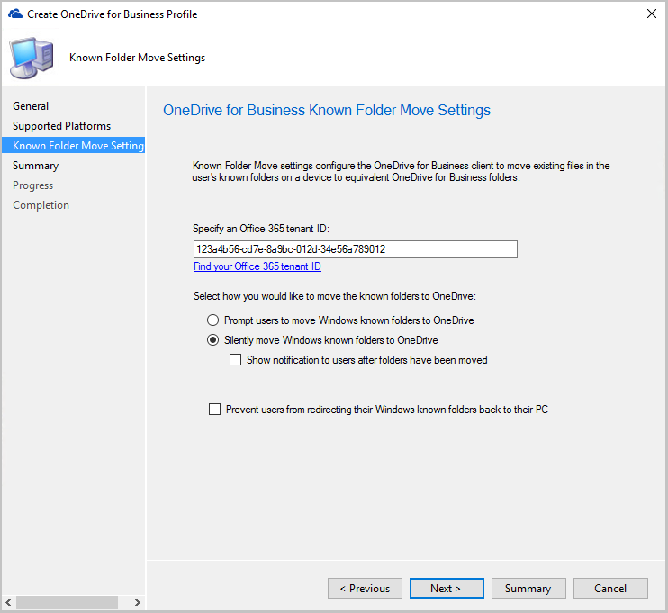

# OneDrive for Business Profiles

Starting in Configuration Manager version 1902, you can create OneDrive for Business Profiles for moving Windows known folders to OneDrive for Business. These folders include Desktop, Documents, and Pictures. In each profile, you can specify settings for moving the Windows known folders. For more information on OneDrive for Business, see [Redirect and move Windows known folders to OneDrive](/onedrive/redirect-known-folders). <!--3556021-->

## Prerequisites

- [Find your Microsoft 365 tenant ID](/onedrive/find-your-office-365-tenant-id)  

- Deploy the OneDrive sync client version 18.111.0603.0004 or later. For more information, see [Deploy OneDrive apps by using Configuration Manager](/onedrive/deploy-on-windows).  

##  Move Windows known folders to OneDrive
<!--3556021-->
Use Configuration Manager to move Windows known folders to OneDrive for Business. These folders include Desktop, Documents, and Pictures. To simplify your Windows upgrades, deploy these settings to Windows 7 clients before deploying a task sequence. 

1. In the Configuration Manager console, go to the **Assets and Compliance** workspace, expand **Compliance Settings**, and select the **OneDrive for Business Profiles** node.  

   
2. In the ribbon, select **Create OneDrive for Business Profile**.  

3. Specify a name to identify this policy, and select **Next**.  

4. Select the platforms that will be provisioned with the OneDrive for Business profile. When you're finished selecting the platforms, click **Next**.

     

5. On the **Settings** page:

    1. Specify your Microsoft 365 tenant ID.  

    2. Select one of the following options to move the known folders to OneDrive:  

        - **Prompt users to move Windows known folders to OneDrive**: With this option, the user sees a wizard to move their files. If they choose to postpone or decline moving their folders, OneDrive periodically reminds them.  

        - **Silently move Windows known folders to OneDrive**: When this policy applies to the device, the OneDrive client automatically redirects the known folders to OneDrive for Business.  

            - **Show notification to users after folders have been redirected**: If you enable this option, the OneDrive client notifies the user after it moves their folders.  

    3. **Prevent users from redirecting their Windows known folders back to their PC**: Disables the option in OneDrive for Business on the client for users to move these folders back to the device.  

       

6. Complete the wizard, then deploy the policy.  

## Deploy the OneDrive for Business Profile

1. In the Configuration Manager console, go to the **Assets and Compliance** workspace, expand **Compliance Settings**, and select the **OneDrive for Business Profiles** node.  

2. Select the profile, then select **Deploy** in the ribbon.

3. Specify the following settings for your deployment:

   1. **Collection**: Click **Browse...**, then select the collection for which you want to deploy the profile.  
   1. **Generate an alert**:

      - **When compliance is below**: Minimum percentage of client compliance to maintain otherwise an alert is generated.
      -  **Date and time**: The date alerts first start being generated based on profile compliance.
      - **Generate System Center Operations Manager alert**: Send a compliance alert to System Center Operations Manager.
   1. **Schedule**:

      - **Simple schedule**: By default, this setting uses a simple schedule to start the compliance evaluation every seven days.
      - **Custom schedule**: Define when to run the compliance evaluation. The start time is based on the local time for the computer that runs the Configuration Manager console at the time you create the schedule or you can use UTC.
 
      

4. Click **OK** to deploy the OneDrive for Business profile.

## Next steps

[Create remote connection profiles](create-remote-connection-profiles.md)