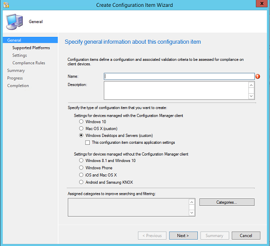

# Common tasks for managing compliance on devices with the Configuration Manager client

*Applies to: Configuration Manager (current branch)*

This article gives you an introduction to using Configuration Manager compliance settings by guiding you through some common scenarios that you might come across.  

 If you're already familiar with compliance settings, you can find detailed information about all the features you use in [Configuration items for devices managed with the Configuration Manager client](../../compliance/deploy-use/create-configuration-items.md).  

 Before you start, read [Get started with compliance settings](../../compliance/get-started/get-started-with-compliance-settings.md) to learn some basics about compliance settings. Read [Plan for and configure compliance settings](../../compliance/plan-design/plan-for-and-configure-compliance-settings.md) for information about necessary prerequisites.  

## General information for each scenario  
 In each scenario, you'll create a configuration item that performs a specific task. To open the Create Configuration Item Wizard and get started, take these steps:  

1.  In the Configuration Manager console, select **Assets and Compliance** > **Compliance Settings** > **Configuration Items**.  

1.  On the **Home** tab, in the **Create** group, select **Create Configuration Item**.  

1.  On the **General** page of the Create Configuration Item Wizard, shown in the following screenshot, specify a name and description for the configuration item. Then choose the appropriate configuration item type for each scenario in this article.  

       

## Scenario: Disable Bluetooth on Windows 10 or later devices

 In this scenario, your security department has determined that the Bluetooth capability on devices could be used to transmit sensitive corporate information outside the company. You decide to disable Bluetooth on these devices.  

1. On the **General** page of the Create Configuration Item Wizard, select the **Windows 10 or later** configuration item type, and then select **Next**.  

2. On the **Supported Platforms** page of the wizard, select all Windows 10 or later platforms.  

3. On the **Device Settings** page, select **Device**, and then select **Next**.  

4. On the **Device** page, select **Prohibited** as the value for **Bluetooth**.  

5. Select **Remediate noncompliant settings** to ensure the change is applied to all Windows 10 or later devices.  

6. Complete the wizard to create the configuration item.  

 You can now use the information in the [Common tasks for creating and deploying configuration baselines with Configuration Manager](../../compliance/plan-design/common-tasks-for-creating-and-deploying-configuration-baselines.md) article to help you deploy the configuration you've created to devices.  

## Scenario: Remediate an incorrect registry value on Windows desktop computers

> [!NOTE] 
> On Mac computers running the Configuration Manager client, you have two options for assessing compliance:  
> - Evaluate a macOS X preferences (plist) file.
> - Use a custom script and evaluate the results returned by the script.  
>
>For more information, see [How to create configuration items for macOS X devices managed with the Configuration Manager client](../../compliance/deploy-use/create-configuration-items-for-mac-os-x-devices-managed-with-the-client.md).  

 In this scenario, you discover that an important line-of-business app doesn't run correctly on some Windows 8.1 computers that you manage. You determine that this is because a registry key named **HKEY_LOCAL_MACHINE\SOFTWARE\Woodgrove\LOB App\Configuration\Configuration1** is set to a value of **0** on some computers. For the line-of-business app to run successfully, this value needs to be set to **1**.  

 In this procedure, you'll create a configuration item that monitors for and automatically remediates any incorrect registry key values that are found.  

1. On the **General** page of the Create Configuration Item Wizard, select the **Windows Desktops and Servers (custom)** configuration item type, and then select **Next**.  

2. On the **Supported Platforms** page of the wizard, select **Windows 8.1** (to ensure the configuration item applies only to affected computers).  

3. On the **Settings** page, select **New** to create a new setting.  

4. On the **General** tab of the **Create Setting** dialog box, configure these settings:  

   -   **Name** > **Example setting**  

   -   **Setting type** > **Registry value**  

   -   **Data type** > **Integer** (because the value contains a number only)  

   -   **Hive** > **HKEY_LOCAL_MACHINE**  

   -   **Key** > **SOFTWARE\Woodgrove\LOB App\Configuration\Configuration1**  

   -   **Value** > **1** (the required value)  

5. On the **Compliance Rules** tab of the **Create Setting** dialog box, select **New**. In the **Create Rule** dialog box, configure these settings:  

   -   **Name** > **Example Rule**  

   -   **Selected setting** > Verify that the selected setting is **Example setting**.

   -   **Rule type** > **Value**  

   -   **The setting must comply with the following rule** > Verify that the setting name is correct and configure the option to specify that the setting value must equal **1**.  

   -   **Remediate noncompliant rules when supported** > Select this check box to ensure that Configuration Manager will reset the registry key value to the correct value if it's incorrect.  

6. Complete the wizard to create the configuration item.  

 You can now use the information in the [Common tasks for creating and deploying configuration baselines](../../compliance/plan-design/common-tasks-for-creating-and-deploying-configuration-baselines.md) article to help you deploy the configuration you've created to devices.  

## Next steps

[Create and deploy configuration baselines](common-tasks-for-creating-and-deploying-configuration-baselines.md)
