# Device restart notifications in Configuration Manager

*Applies to: Configuration Manager (current branch)*

The notifications a user receives for a pending device restart can vary depending on the [Computer restart client settings](#client-settings) and which version of Configuration Manager you use. This article helps you configure the user experience for pending device restart notifications.

## Deployment types for restart notifications

The [Computer restart client settings](#client-settings) change the user experience for all required deployments that require a restart of the following types:

- [Application](../../../apps/deploy-use/deploy-applications.md)
- [Task sequence](../../../osd/deploy-use/manage-task-sequences-to-automate-tasks.md#BKMK_DeployTS)
- [Software update](../../../sum/deploy-use/deploy-software-updates.md)

## Restart notification types

When a device requires a restart, the client shows a notification to the end user of the upcoming restart. There are four general notifications users can receive.

### Toast notification

A Windows toast notification informs the user that the device needs to restart. The information in the toast notification can be different depending on which version of Configuration Manager you're running. This type of notification is native to the Windows OS. You may also see third-party software using this type of notification.

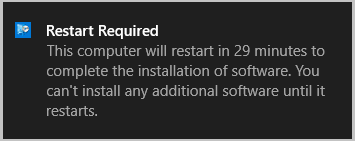

### Software Center notification with snooze

Software Center shows a notification with a snooze option and the time remaining before it forces the devices to restart. The message may be different depending on your version of Configuration Manager.

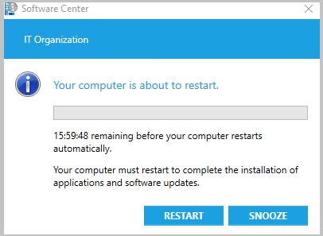

### Software Center final countdown notification

Software Center shows this final countdown notification that the user can't close or snooze.

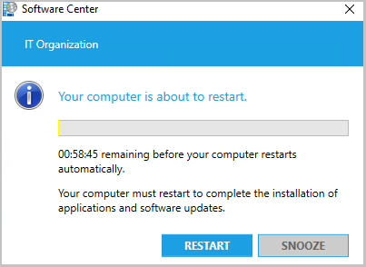

Starting in version 1906, the user won't see a progress bar in the restart notification until the pending restart is less than 24 hours away.

### Software Center notification before deadline

If the user proactively installs required software before the deadline, and it requires a restart, they'll see a different notification. The following notification occurs when both the user experience setting allows notifications and you don't use toast notifications for the deployment. For more information about configuring these settings, see [Deployment **User Experience** settings](../../../apps/deploy-use/deploy-applications.md#bkmk_deploy-ux) and [User notifications for required deployments](../../../apps/deploy-use/deploy-applications.md#bkmk_notify).

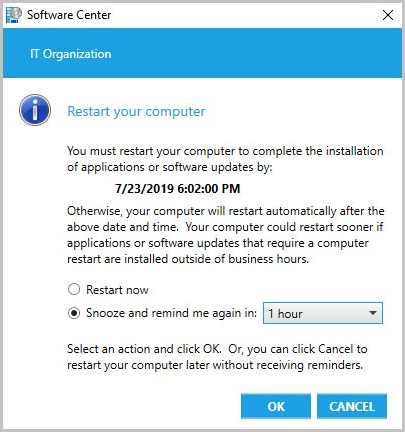

#### Available apps

When you don't use toast notifications, the dialog for software marked as **Available** is similar to proactively installed software. For **Available** software, the notification doesn't have a deadline for the restart and the user can choose their own snooze interval. For more information, see [Approval settings](../../../apps/deploy-use/deploy-applications.md#bkmk_approval).

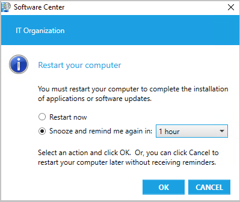

## Client settings

To control the client restart behaviors, configure the following device client settings in the **Computer Restart** group. For more information, see [How to configure client settings](configure-client-settings.md).

### Specify the amount of time after the deadline before a device gets restarted (minutes)

This setting must be shorter in duration than the shortest maintenance window applied to the computer. For more information about maintenance windows, see [How to use maintenance windows](../manage/collections/use-maintenance-windows.md).

The default value is 90 minutes. Starting in version 1906, the maximum value increased from 1440 minutes (24 hours) to 20160 minutes (two weeks).

> [!NOTE]
> This setting was previously titled **Display a temporary notification to the user that indicates the interval before the user is logged off or the computer restarts (minutes)**.

### Specify the amount of time that a user is presented a final countdown notification before a device gets restarted (minutes)

This setting must be shorter in duration than the shortest maintenance window applied to the computer. For more information about maintenance windows, see [How to use maintenance windows](../manage/collections/use-maintenance-windows.md).

The default value is 15 minutes.

> [!NOTE]
> This setting was previously titled **Display a dialog box that the user cannot close, which displays the countdown interval before the user is logged off or the computer restarts (minutes)**.

### Specify the frequency of reminder notifications presented to the user, after the deadline, before a device gets restarted (minutes)
<!--3976435-->
_Starting in version 1906_

This frequency duration value should be less than the value of **Specify the amount of time after the deadline before a device gets restarted (minutes)** minus the value of **Specify the amount of time that a user is presented a final countdown notification before a device gets restarted (minutes)**. Otherwise, the reminder notifications won't work.

The default value is 240 minutes.

> [!NOTE]
> This setting was previously titled **Specify the snooze duration for computer restart countdown notifications (minutes)**.

### When a deployment requires a restart, show a dialog window to the user instead of a toast notification
<!--3555947-->
Starting in version 1902, configuring this setting to **Yes** changes the user experience to be more intrusive. This setting applies to all deployments of applications, task sequences, and software updates. For more information, see [Plan for Software Center](../../../apps/plan-design/plan-for-software-center.md#bkmk_impact).

> [!IMPORTANT]
> In Configuration Manager 1902, under certain circumstances, the dialog box won't replace toast notifications. To resolve this issue, install the [update rollup for Configuration Manager version 1902](https://support.microsoft.com/help/4500571/update-rollup-for-configuration-manager-current-branch-1902). <!--4404715-->

## Device restart notifications (version 1906)
<!--3976435-->
Some customers prefer frequent restart notifications and allowing users a short time frame to postpone. Others allow users to postpone a restart for longer periods of time, and infrequently notify users of the pending restart. Starting in Configuration Manager version 1906, you have additional control over the timing and frequency of restart notifications.

### Install required software at or after the deadline

When required software is installed at or after the deadline, your users will see notifications depending on what client settings you selected.

If the setting **When a deployment requires a restart, show a dialog window to the user instead of a toast notification** is set to:

- **No**: Windows shows toast notifications until the deployment reaches the final countdown notification.

- **Yes**: Software Center shows a notification:

  - If the restart is greater than 24 hours away, it shows an estimated restart time. The timing of this notification is based on the setting: **Specify the amount of time after the deadline before a device gets restarted (minutes)**.

    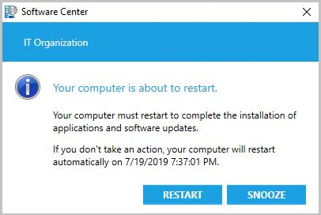

  - If the restart is less than 24 hours away, it shows a progress bar. The timing of this notification is based on the setting: **Specify the amount of time after the deadline before a device gets restarted (minutes)**.

    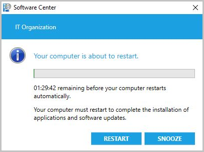

If the user selects **Snooze**, another temporary notification shows after the snooze period elapses. This behavior assumes it hasn't yet reached the final countdown. The timing of the next notification is based on the setting: **Specify the frequency of reminder notifications presented to the user, after the deadline, before a device gets restarted (minutes)**. If the user selects **Snooze**, and your snooze interval is one hour, then Software Center notifies the user again in 60 minutes. This behavior assumes it hasn't yet reached the final countdown.

When it reaches the final countdown, Software Center shows the user a notification they can't close. The progress bar is in red and the user can't **Snooze** it.

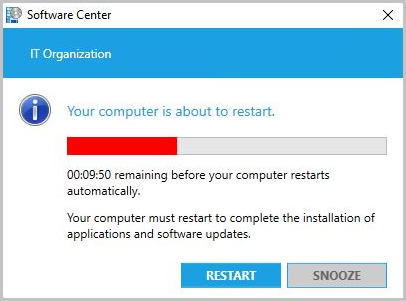

### Proactively install required software before the deadline

If the user proactively installs required software that needs restart before the deadline, they'll see a different notification. For more information about configuring these settings, see [Deployment **User Experience** settings](../../../apps/deploy-use/deploy-applications.md#bkmk_deploy-ux) and [User notifications for required deployments](../../../apps/deploy-use/deploy-applications.md#bkmk_notify).

The following notification occurs when both the user experience setting allows notifications and you don't use toast notifications for the deployment:

Once the deployment reaches its deadline, Software Center follows the behavior to [Install required software at or after the deadline](#install-required-software-at-or-after-the-deadline).

## Device restart notifications (version 1902)

<!--3555947-->
Sometimes users don't see the Windows toast notification about a restart or required deployment. Then they don't see the experience to snooze the reminder. This behavior can lead to a poor user experience when the client reaches a deadline.

Starting in version 1902, when software changes are required or deployments need a restart, you have the option of using a more intrusive dialog window.

In the [Computer Restart](#client-settings) group of client settings, enable the following option: **When a deployment requires a restart, show a dialog window to the user instead of a toast notification**.  

Configuring this client setting changes the user experience for all required deployments that require a restart from toast notifications:

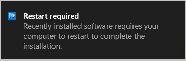  

To the more intrusive Software Center dialog window:

If the user didn't restart their device after the installation, then they'll get a notification as a reminder. This temporary reminder will appear to the user based on the client setting: **Display a temporary notification to the user that indicates the interval before the user is logged off or the computer restarts (minutes)**. This setting is the overall time the user has to restart the machine before a restart is forced.

- Temporary notification when you use toast notifications:

  

- Temporary notification when you use Software Center dialog window, not toast:

  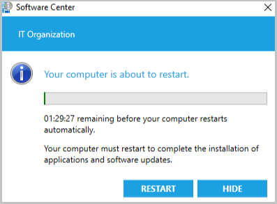

If the user doesn't restart after the temporary notification, they'll be given the final countdown notification that they can't close. The timing of when the final notification appears is based on the client setting: **Display a dialog box that the user cannot close, which displays the countdown interval before the user is logged off or the computer restarts (minutes)**. For instance, if the setting is 60, then an hour before a reboot is forced, the final notification appears to the user:

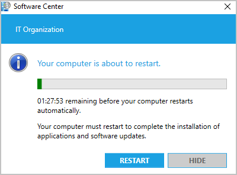

The following settings must be shorter in duration than the shortest [maintenance window](../manage/collections/use-maintenance-windows.md) applied to the computer:

- **Display a temporary notification to the user that indicates the interval before the user is logged off or the computer restarts (minutes)**
- **Display a dialog box that the user cannot close, which displays the countdown interval before the user is logged off or the computer restarts (minutes)**

> [!IMPORTANT]
> In Configuration Manager 1902, under certain circumstances, the dialog box won't replace toast notifications. To resolve this issue, install the [update rollup for Configuration Manager version 1902](https://support.microsoft.com/help/4500571/update-rollup-for-configuration-manager-current-branch-1902). <!--4404715-->

## Log files

To troubleshoot device restarts, use the **RebootCoordinator.log** and **SCNotify.log** files on the client. Based on the specific type of deployment, you may also have to use additional client [log files](../../plan-design/hierarchy/log-files.md).

## Next steps

- [How to configure client settings](configure-client-settings.md)
- [Application deployment **User Experience** settings](../../../apps/deploy-use/deploy-applications.md#bkmk_deploy-ux)
- [User notifications for required app deployments](../../../apps/deploy-use/deploy-applications.md#bkmk_notify)
