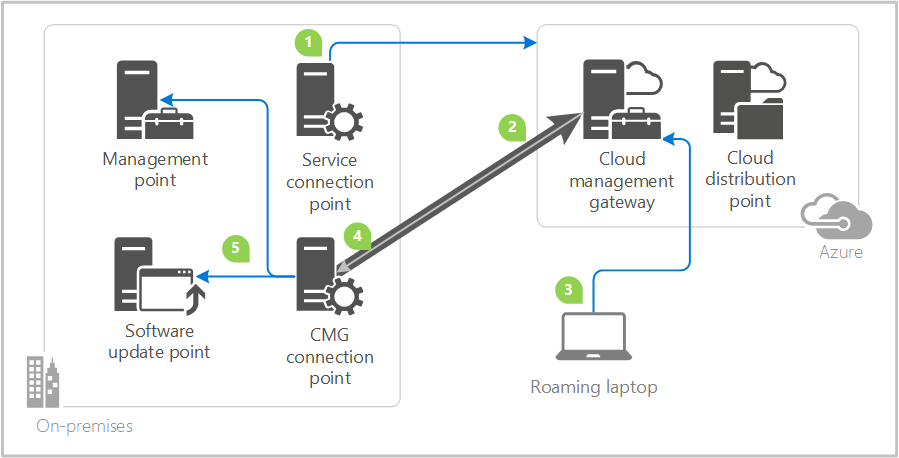

# Plan for the cloud management gateway in Configuration Manager

*Applies to: Configuration Manager (current branch)*

<!--1101764-->
The cloud management gateway (CMG) provides a simple way to manage Configuration Manager clients on the internet. By deploying the CMG as a cloud service in Microsoft Azure, you can manage traditional clients that roam on the internet without additional on-premises infrastructure. You also don't need to expose your on-premises infrastructure to the internet.

> [!NOTE]
> Configuration Manager doesn't enable this optional feature by default. You must enable this feature before using it. For more information, see [Enable optional features from updates](../../../servers/manage/install-in-console-updates.md#bkmk_options).<!--505213-->  

After establishing the prerequisites, creating the CMG consists of the following three steps in the Configuration Manager console:

1. Deploy the CMG cloud service to Azure.
2. Add the CMG connection point role.
3. Configure the site and site roles for the service.
Once deployed and configured, clients seamlessly access on-premises site roles regardless of whether they're on the intranet or internet.

This article provides the foundational knowledge to learn about the CMG, design how it fits in your environment, and plan the implementation.

## Scenarios

There are several scenarios for which a CMG is beneficial. The following scenarios are some of the more common:  

- Manage traditional Windows clients with Active Directory domain-joined identity. These clients include Windows 8.1 and Windows 10. It uses PKI certificates to secure the communication channel. Management activities include:  

  - Software updates and endpoint protection
  - Inventory and client status
  - Compliance settings
  - Software distribution to the device
  - Windows 10 in-place upgrade task sequence

- Manage traditional Windows 10 clients with modern identity, either hybrid or pure cloud domain-joined with Azure Active Directory (Azure AD). Clients use Azure AD to authenticate rather than PKI certificates. Using Azure AD is simpler to set up, configure and maintain than more complex PKI systems. Management activities are the same as the first scenario, as well as:  

  - Software distribution to the user  

- Install the Configuration Manager client on Windows 10 devices over the internet. Using Azure AD allows the device to authenticate to the CMG for client registration and assignment. You can install the client manually, or using another software distribution method, such as Microsoft Intune.  

- New device provisioning with co-management. When auto-enrolling existing clients, CMG isn't required for co-management. It is required for new devices involving Windows AutoPilot, Azure AD, Microsoft Intune, and Configuration Manager. For more information, see [Paths to co-management](../../../../comanage/quickstart-paths.md).

### Specific use cases

Across these scenarios the following specific device use cases may apply:

- Roaming devices such as laptops  

- Remote/branch office devices that are less expensive and more efficient to manage over the internet than across a WAN or through a VPN.  

- Mergers and acquisitions, where it may be easiest to join devices to Azure AD and manage through a CMG.  

- Workgroup clients. These devices may require additional configuration, such as certificates.<!-- SCCMDocs#1925 -->

    Starting in version 2002, Configuration Manager supports token-based authentication, which may help with management of remote workgroup clients. For more information, see [Token-based authentication for CMG](../../deploy/deploy-clients-cmg-token.md).

> [!Important]
> By default all clients receive policy for a CMG, and start using it when they become internet-based. Depending upon the scenario and use case that applies to your organization, you may need to scope usage of the CMG. For more information, see the [Enable clients to use a cloud management gateway](../../deploy/about-client-settings.md#enable-clients-to-use-a-cloud-management-gateway) client setting.

## Topology design

### CMG components

Deployment and operation of the CMG includes the following components:  

- The **CMG cloud service** in Azure authenticates and forwards Configuration Manager client requests to the CMG connection point.  

- The **CMG connection point** site system role enables a consistent and high-performance connection from the on-premises network to the CMG service in Azure. It also publishes settings to the CMG including connection information and security settings. The CMG connection point forwards client requests from the CMG to on-premises roles according to URL mappings.

- The [**service connection point**](../../../servers/deploy/configure/about-the-service-connection-point.md) site system role runs the cloud service manager component, which handles all CMG deployment tasks. Additionally, it monitors and reports service health and logging information from Azure AD. Make sure your service connection point is in [online mode](../../../servers/deploy/configure/about-the-service-connection-point.md#bkmk_modes).  

- The **management point** site system role services client requests per normal.  

- The **software update point** site system role services client requests per normal.  

- **Internet-based clients** connect to the CMG to access on-premises Configuration Manager components.

- The CMG uses a **certificate-based HTTPS** web service to help secure network communication with clients.  

- Internet-based clients use **PKI certificates or Azure AD** for identity and authentication.  

- A [**cloud distribution point**](../../../plan-design/hierarchy/use-a-cloud-based-distribution-point.md) provides content to internet-based clients, as needed.  

  - A CMG can also serve content to clients. This functionality reduces the required certificates and cost of Azure VMs. For more information, see [Modify a CMG](setup-cloud-management-gateway.md#modify-a-cmg).<!--1358651-->  

### Azure Resource Manager

<!-- 1324735 -->
Create the CMG using an **Azure Resource Manager deployment**. [Azure Resource Manager](https://docs.microsoft.com/azure/azure-resource-manager/resource-group-overview) is a modern platform for managing all solution resources as a single entity, called a [resource group](https://docs.microsoft.com/azure/azure-resource-manager/resource-group-overview#resource-groups). When deploying CMG with Azure Resource Manager, the site uses Azure Active Directory (Azure AD) to authenticate and create the necessary cloud resources. This modernized deployment doesn't require the classic Azure management certificate.  

> [!NOTE]
> This capability doesn't enable support for Azure Cloud Service Providers (CSP). The CMG deployment with Azure Resource Manager continues to use the classic cloud service, which the CSP doesn't support. For more information, see [available Azure services in Azure CSP](https://docs.microsoft.com/azure/cloud-solution-provider/overview/azure-csp-available-services).

Starting in Configuration Manager version 1902, Azure Resource Manager is the only deployment mechanism for new instances of the cloud management gateway. Existing deployments continue to work.<!-- 3605704 -->

In Configuration Manager version 1810 and earlier, the CMG wizard still provides the option for a **classic service deployment** using an Azure management certificate. To simplify the deployment and management of resources, the Azure Resource Manager deployment model is recommended for all new CMG instances. If possible, redeploy existing CMG instances through Resource Manager. For more information, see [Modify a CMG](setup-cloud-management-gateway.md#modify-a-cmg).

> [!IMPORTANT]
> The classic service deployment in Azure is deprecated for use in Configuration Manager. Version 1810 is the last to support creation of these Azure deployments. This functionality will be removed in a future Configuration Manager version.<!--SCCMDocs-pr issue #2993-->  

### Hierarchy design

Create the CMG at the top-tier site of your hierarchy. If that's a central administration site, then create CMG connection points at child primary sites. The cloud service manager component is on the service connection point, which is also on the central administration site. This design can share the service across different primary sites if needed.

You can create multiple CMG services in Azure, and you can create multiple CMG connection points. Multiple CMG connection points provide load balancing of client traffic from the CMG to the on-premises roles.

Starting in version 1902, you can associate a CMG with a boundary group. This configuration allows clients to default or fallback to the CMG for client communication according to [boundary group relationships](../../../servers/deploy/configure/boundary-groups.md). This behavior is especially useful in branch office and VPN scenarios. You can direct client traffic away from expensive and slow WAN links to instead use faster services in Microsoft Azure.<!--3640932-->

> [!NOTE]
> Internet-based clients don't fall into any boundary group.
>
> In Configuration Manager version 1810 and earlier, the CMG doesn't fall into any boundary group.

Other factors, such as the number of clients to manage, also impact your CMG design. For more information, see [Performance and scale](#performance-and-scale).

#### Example 1: standalone primary site

Contoso has a standalone primary site in an on-premises datacenter at their headquarters in New York City.

- They create a CMG in the East US Azure region to reduce network latency.
- They create two CMG connection points, both linked to the single CMG service.  

As clients roam onto the internet, they communicate with the CMG in the East US Azure region. The CMG forwards this communication through both of the CMG connection points.

#### Example 2: hierarchy

Fourth Coffee has a central administration site in an on-premises datacenter at their headquarters in Seattle. One primary site is in the same datacenter, and the other primary site is in their main European office in Paris.

- On the central administration site, they create a CMG service in the West US Azure region. They scale the number of VMs for the expected load of roaming clients in the entire hierarchy.
- On the Seattle-based primary site, they create a CMG connection point linked to the single CMG.
- On the Paris-based primary site, they create a CMG connection point linked to the single CMG.

As clients roam onto the internet, they communicate with the CMG in the West US Azure region. The CMG forwards this communication to the CMG connection point in the client's assigned primary site.

> [!TIP]
> You don't need to deploy more than one cloud management gateway for the purposes of geolocation. The Configuration Manager client is mostly unaffected by the slight latency that can occur with the cloud service, even when geographically distant.

## Requirements

- An **Azure subscription** to host the CMG.

- Your user account needs to be a **Full administrator** or **Infrastructure administrator** in Configuration Manager.<!-- SCCMDocs#2146 -->

- An **Azure administrator** needs to participate in the initial creation of certain components, depending upon your design. This persona can be the same as the Configuration Manager administrator, or separate. If separate, it doesn't require permissions in Configuration Manager.

  - To deploy the CMG, you need a **Subscription Owner**
  - To integrate the site with Azure AD for deploying the CMG using Azure Resource Manager, you need a **Global Admin**

- At least one on-premises Windows server to host the **CMG connection point**. You can colocate this role with other Configuration Manager site system roles.  

- The **service connection point** must be in [online mode](../../../servers/deploy/configure/about-the-service-connection-point.md#bkmk_modes).  

- Integration with **Azure AD** for deploying the service with Azure Resource Manager. For more information, see [Configure Azure services](../../../servers/deploy/configure/azure-services-wizard.md).  

- A [**server authentication certificate**](certificates-for-cloud-management-gateway.md#bkmk_serverauth) for the CMG.  

- **Other certificates** may be required, depending upon your client OS version and authentication model. For more information, see [CMG certificates](certificates-for-cloud-management-gateway.md).  

    When you use the site option to **Use Configuration Manager-generated certificates for HTTP site systems**, the management point can be HTTP. For more information, see [Enhanced HTTP](../../../plan-design/hierarchy/enhanced-http.md).

- In Configuration Manager version 1810 or earlier, if using the Azure classic deployment method, you must use an [**Azure management certificate**](certificates-for-cloud-management-gateway.md#bkmk_azuremgmt).  

    > [!TIP]  
    > Use the **Azure Resource Manager** deployment model. It doesn't require this management certificate.
    >
    > The classic deployment method is deprecated as of version 1810.  

- Clients must use **IPv4**.  

## Specifications

- All Windows versions listed in [Supported operating systems for clients and devices](../../../plan-design/configs/supported-operating-systems-for-clients-and-devices.md) are supported for CMG.  

- CMG only supports the management point and software update point roles.  

- CMG doesn't support clients that only communicate with IPv6 addresses.<!--495606-->  

- Software update points using a network load balancer don't work with CMG. <!--505311-->  

- CMG deployments using the Azure Resource Model don't enable support for Azure Cloud Service Providers (CSP). The CMG deployment with Azure Resource Manager continues to use the classic cloud service, which the CSP doesn't support. For more information, see [available Azure services in Azure CSP](https://docs.microsoft.com/azure/cloud-solution-provider/overview/azure-csp-available-services)  

### Support for Configuration Manager features

The following table lists CMG support for Configuration Manager features:

|Feature  |Support  |
|---------|---------|
| Software updates     |  |
| Endpoint protection     |  [Note 1](#bkmk_note1) |
| Hardware and software inventory     |  |
| Client status and notifications     |  |
| Run scripts     |  |
| Compliance settings     |  |
| Client install (with Azure AD integration)     |  |
| Software distribution (device-targeted)     |  |
| Software distribution (user-targeted, required) (with Azure AD integration)     |  |
| Software distribution (user-targeted, available) ([all requirements](../../../../apps/deploy-use/deploy-applications.md#deploy-user-available-applications-on-azure-ad-joined-devices)) |  |
| Windows 10 in-place upgrade task sequence      |  |
| Task sequences that aren't using boot images and are deployed with an option: **Download all content locally before starting task sequence**      |  |
| Task sequences that aren't using boot images  |  (1910)|
| CMPivot     |  |
| Any other task sequence scenario     |  |
| Client push     |  |
| Automatic site assignment     |  |
| Software approval requests     |  |
| Configuration Manager console     |  |
| Remote tools     |  |
| Reporting website     |  |
| Wake on LAN     |  |
| Mac, Linux, and UNIX clients     |  |
| Peer cache     |  |
| On-premises MDM     |  |
| BitLocker Management     |  |

|Key|
|--|
| = This feature is supported with CMG by all supported versions of Configuration Manager  |
| (*YYMM*) = This feature is supported with CMG starting with version *YYMM* of Configuration Manager  |
| = This feature isn't supported with CMG |

####  Note 1: Support for endpoint protection
<!-- 4350561 -->
For domain-joined devices to apply endpoint protection policy, they require access to the domain. Devices with infrequent access to the internal network may experience delays in applying endpoint protection policy. If you require that devices immediately apply endpoint protection policy after they receive it, consider one of the following options:

- Use co-management and switch the [Endpoint Protection workload](../../../../comanage/workloads.md#endpoint-protection) to Intune, and manage [Microsoft Defender Antivirus](https://docs.microsoft.com/mem/intune/configuration/device-restrictions-windows-10#microsoft-defender-antivirus) from the cloud.

- Use [configuration items](../../../../compliance/deploy-use/create-configuration-items.md) instead of the native [antimalware polices](../../../../protect/deploy-use/endpoint-antimalware-policies.md) feature to apply endpoint protection policy.

## Cost

> [!IMPORTANT]  
> The following cost information is for estimating purposes only. Your environment may have other variables that affect the overall cost of using CMG.

CMG uses the following Azure components, which incur charges to the Azure subscription account:

### Virtual machine

- CMG uses Azure Cloud Services as platform as a service (PaaS). This service uses virtual machines (VMs) that incur compute costs.  

- CMG uses a Standard A2 V2 VM.  

- You select how many VM instances support the CMG. One is the default, and 16 is the maximum. This number is set when creating the CMG, and can be changed afterwards to scale the service as needed.

- For more information on how many VMs you need to support your clients, see [Performance and scale](#performance-and-scale).

- See the [Azure pricing calculator](https://azure.microsoft.com/pricing/calculator/) to help determine potential costs.

    > [!NOTE]  
    > Virtual machine costs vary by region.

### Outbound data transfer

- Charges are based on data flowing out of Azure (egress or download). Any data flows into Azure are free (ingress or upload). CMG data flows out of Azure include policy to the client, client notifications, and client responses forwarded by the CMG to the site. These responses include inventory reports, status messages, and compliance status.  

- Even without any clients communicating with a CMG, some background communication causes network traffic between the CMG and the on-premises site.  

- View the **Outbound data transfer (GB)** in the Configuration Manager console. For more information, see [Monitor clients on CMG](monitor-clients-cloud-management-gateway.md).  

- See the [Azure bandwidth pricing details](https://azure.microsoft.com/pricing/details/bandwidth/) to help determine potential costs. Pricing for data transfer is tiered. The more you use, the less you pay per gigabyte.  

- *For estimating purposes only*, expect approximately 100-300 MB per client per month for internet-based clients. The lower estimate is for a default client configuration. The upper estimate is for a more aggressive client configuration. Your actual usage may vary depending upon how you configure client settings.  

    > [!NOTE]  
    > Performing other actions, such as deploying software updates or applications, increases the amount of outbound data transfer from Azure.

- Internet-based clients get Microsoft software update content from Windows Update at no charge. Don't distribute update packages with Microsoft update content to a cloud distribution point, otherwise you may incur storage and data egress costs.  

- Misconfiguration of the CMG option to **Verify client certificate revocation** can cause additional traffic from clients to the CMG. This additional traffic can increase the Azure egress data, which can increase your Azure costs.<!-- SCCMDocs#1434 --> For more information, see [Publish the certificate revocation list](security-and-privacy-for-cloud-management-gateway.md#bkmk_crl).  

### Content storage

- Internet-based clients get Microsoft software update content from Windows Update at no charge. Don't distribute update packages with Microsoft update content to a cloud distribution point, otherwise you may incur storage and data egress costs.  

- For any other necessary content, such as applications or third-party software updates, you must distribute to a cloud distribution point. Currently, the CMG supports only the cloud distribution point for sending content to clients.
   - When using a CMG for content storage, the content for third-party updates won't download to clients if the **Download delta content when available** [client setting](../../deploy/about-client-settings.md#allow-clients-to-download-delta-content-when-available) is enabled. <!--6598587--> 

- For more information, see the cost of using [cloud distribution points](../../../plan-design/hierarchy/use-a-cloud-based-distribution-point.md#bkmk_cost).  

- A CMG can also be a cloud distribution point to serve content to clients. This functionality reduces the required certificates and cost of Azure VMs. For more information, see [Modify a CMG](setup-cloud-management-gateway.md#modify-a-cmg).<!--1358651-->  

- CMG uses Azure locally redundant storage (LRS). For more information, see [Locally redundant storage](https://docs.microsoft.com/azure/storage/common/storage-redundancy-lrs).  

### Other costs

- Each cloud service has a dynamic IP address. Each distinct CMG uses a new dynamic IP address. Adding additional VMs per CMG doesn't increase these addresses.  

## Performance and scale

For more information on CMG scale, see [Size and scale numbers](../../../plan-design/configs/size-and-scale-numbers.md#bkmk_cmg).

The following recommendations can help you improve CMG performance:

- The connection between the Configuration Manager client and the CMG isn't region-aware. Client communication is largely unaffected by latency / geographic separation. It's not necessary to deploy multiple CMG for the purposes of geo-proximity. Deploy the CMG at the top-level site in your hierarchy and add instances to increase scale.

- For high availability of the service, create a CMG with at least two CMG instances and two CMG connection points per site.  

- Scale the CMG to support more clients by adding more VM instances. The Azure load balancer controls client connections to the service.  

- Create more CMG connection points to distribute the load among them. The CMG distributes the traffic to its connecting CMG connection points in a round-robin fashion.  

- When the CMG is under high load with more than the supported number of clients, it still handles requests but there may be delay.  

> [!NOTE]
> While Configuration Manager has no hard limit on the number of clients for a CMG connection point, Windows Server has a default maximum TCP dynamic port range of 16,384. If a Configuration Manager site manages more than 16,384 clients with a single CMG connection point, you must increase the Windows Server limit. All clients maintain a channel for client notifications, which holds a port open on the CMG connection point. For more information on how to use the netsh command to increase this limit, see [Microsoft Support article 929851](https://support.microsoft.com/help/929851).

## Ports and data flow

You don't need to open any inbound ports to your on-premises network. The service connection point and CMG connection point initiate all communication with Azure and the CMG. These two site system roles need to create outbound connections to the Microsoft cloud. The service connection point deploys and monitors the service in Azure, thus must be online mode. The CMG connection point connects to the CMG to manage communication between the CMG and on-premises site system roles.

The following diagram is a basic, conceptual data flow for the CMG:

1. The service connection point connects to Azure over HTTPS port 443. It authenticates using Azure AD or the Azure management certificate. The service connection point deploys the CMG in Azure. The CMG creates the HTTPS cloud service using the server authentication certificate.  

2. The CMG connection point connects to the CMG in Azure over TCP-TLS or HTTPS. It holds the connection open, and builds the channel for future two-way communication.  

3. The client connects to the CMG over HTTPS port 443. It authenticates using Azure AD or the client authentication certificate.  

4. The CMG forwards the client communication over the existing connection to the on-premises CMG connection point. You don't need to open any inbound firewall ports.  

5. The CMG connection point forwards the client communication to the on-premises management point and software update point.  

For more information when you host content in Azure, see [Use a cloud-based distribution point](../../../plan-design/hierarchy/use-a-cloud-based-distribution-point.md#bkmk_dataflow).

### Required ports

This table lists the required network ports and protocols. The *Client* is the device initiating the connection, requiring an outbound port. The *Server* is the device accepting the connection, requiring an inbound port.

| Client | Protocol | Port | Server | Description |
|--------|----------|------|--------|-------------|
| Service connection point | HTTPS | 443 | Azure | CMG deployment |
| CMG connection point | TCP-TLS | 10140-10155 | CMG service | Preferred protocol to build CMG channel [Note 1](#bkmk_port-note1) |
| CMG connection point | HTTPS | 443 | CMG service | Fallback protocol to build CMG channel to only one VM instance [Note 2](#bkmk_port-note2) |
| CMG connection point | HTTPS | 10124-10139 | CMG service | Fallback protocol to build CMG channel to two or more VM instances [Note 3](#bkmk_port-note3) |
| Client | HTTPS | 443 | CMG | General client communication |
| CMG connection point | HTTPS or HTTP | 443 or 80 | Management point | On-premises traffic, port depends upon management point configuration |
| CMG connection point | HTTPS or HTTP | 443 or 80 | Software update point | On-premises traffic, port depends upon software update point configuration |

####  Note 1: CMG connection point TCP-TLS ports

The CMG connection point first tries to establish a long-lived TCP-TLS connection with each CMG VM instance. It connects to the first VM instance on port 10140. The second VM instance uses port 10141, up to the 16th on port 10155. A TCP-TLS connection performs the best, but it doesn't support internet proxy. If the CMG connection point can't connect via TCP-TLS, then it falls back to HTTPS[Note 2](#bkmk_port-note2).

####  Note 2: CMG connection point HTTPS ports for one VM

If the CMG connection point can't connect to the CMG via TCP-TLS[Note 1](#bkmk_port-note1), it connects to the Azure network load balancer over HTTPS 443 only for one VM instance.  

####  Note 3: CMG connection point HTTPS ports for two or more VMs

If there are two or more VM instances, the CMG connection point uses HTTPS 10124 to the first VM instance, not HTTPS 443. It connects to the second VM instance on HTTPS 10125, up to the 16th on HTTPS port 10139.

### Internet access requirements

If your organization restricts network communication with the internet using a firewall or proxy device, you need to allow CMG connection point and service connection point to access internet endpoints.

For more information, see [Internet access requirements](../../../plan-design/network/internet-endpoints.md#bkmk_cloud).

## Next steps

- [Certificates for cloud management gateway](certificates-for-cloud-management-gateway.md)
- [Security and privacy for cloud management gateway](security-and-privacy-for-cloud-management-gateway.md)
- [Cloud management gateway size and scale numbers](../../../plan-design/configs/size-and-scale-numbers.md#bkmk_cmg)
- [Frequently asked questions about the cloud management gateway](cloud-management-gateway-faq.md)
- [Set up cloud management gateway](setup-cloud-management-gateway.md)
