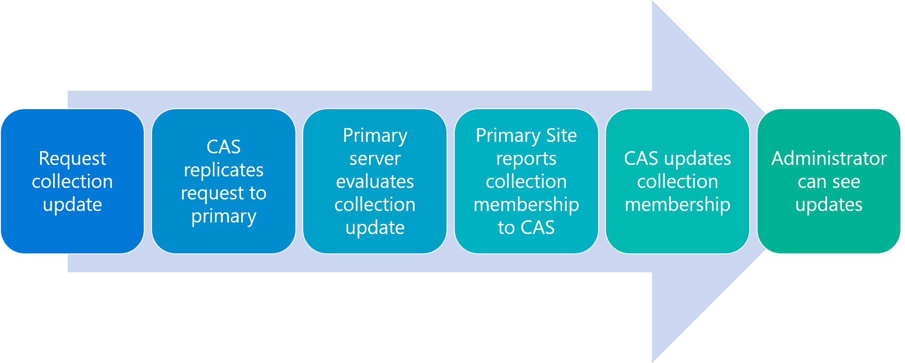

# Best practices for collections in Configuration Manager

*Applies to: Configuration Manager (current branch)*

Some collection management guidance can be contradictory. For example, for performance reasons, you should limit the number of collections that update frequently. But updating collections frequently is convenient, since most Configuration Manager functionality is dependent on collections. Carefully consider both performance impacts and business requirements when you design and configure collections and collection evaluation.

Use the following best practices for collections in Configuration Manager.  

## Configure maintenance window for updates

You can configure maintenance windows for device collections to restrict the times that Configuration Manager can install software on these devices. If you configure the maintenance window to be too small, the client may not install critical software updates. This state leaves the client vulnerable to the issues the update mitigates.

Important considerations to keep in mind when planning your maintenance windows:

- The default software update maximum run time is 60 minutes.
- When Configuration Manager calculates whether an update can install, it adds five minutes to the maximum run time to account for a restart.
- The remaining duration of a maintenance window must be longer than the maximum run time of the software update plus five minutes.

## Avoid frequent collection evaluation

A full collection evaluation evaluates not only the targeted collection, but also any collections that the collection limits if an update occurs. Also, a collection with no schedule is still evaluated if its limiting collection updates. So it's possible that some collections may be evaluated more often than you expect.

In a busy Configuration Manager environment, you can improve collection evaluation performance by scaling back schedules to avoid repeated collection evaluations. In a deep tree, you can decrease collection evaluation frequency as the collections descend deeper in the tree, because higher-level collection evaluations will also trigger lower-level collection evaluations.

## Understand the collection evaluation graph

Be aware of how the collection evaluation graph works so you can design an appropriate collection structure. Don't rely on full collection evaluation to always update all collections. If an incrementally updated collection updates on a schedule, referencing collections that aren't enabled for incremental updates may not update. Because updates likely occurred during incremental evaluations, a full evaluation may not update the collection, ending the collection evaluation graph for that cycle. In that case, no referencing collection evaluations occur. For more information, see [Collection evaluation graph](collection-evaluation.md#collection-evaluation-graph).

## <a name="bkmk_incremental"></a> Limit incremental updates

Enabling incremental updates for many collections might cause evaluation delays. It's best to limit the number of incrementally updated collections to 200. The exact number depends on:

- The total number of collections
- The frequency of new resources being added and changed in the hierarchy
- The number of clients in a hierarchy
- The complexity of collection membership rules in a hierarchy

If the incremental evaluation cycle is taking longer than the configured update frequency, then Configuration Manager is constantly processing collection evaluations, which could affect system performance. Reduce the number of incrementally updated collections, or increase the time between incremental evaluation cycles.

Given the potential impacts of incremental collections, it's important to have a policy or procedure for creating the collections and assigning update schedules. Examples of policy considerations might be:

- Only use incremental updates for collections that are used for security scoping, client settings, and maintenance windows. These collection updates affect client behavior and access to resources.
- For applications with no licensing approval, advertise applications to existing collections, and use global conditions to restrict availability.
- Outline appropriate periods for other collections that have full collection updates scheduled.

## Avoid evaluation of large trees from the CAS

In a Configuration Manager environment, the central administration site (CAS) doesn't evaluate collection membership. Primary sites are the only sites that evaluate collections. Secondary sites act as proxies that use only data they replicate from their primary site.

To request a collection update, the CAS sends a request to each primary site. The primary sites evaluate the collection and send the results back to the CAS. The collection evaluation results appear only after all collection evaluation instructions replicate to all sites, all sites evaluate all collections, and all data returns to the CAS and is combined.

The following diagram demonstrates the flow when the CAS requests a manual collection update:



A collection update from a CAS with multiple primary sites can be time consuming. If a collection doesn't evaluate in a timely fashion, it's tempting to repeat the request.

Once a collection evaluation thread begins and loads the evaluation graph, evaluation continues until the collection evaluation graph is empty. The thread then terminates and becomes available for the next evaluation. However, if another collection evaluation cycle queues while the thread is evaluating collections, the thread immediately restarts to attempt an evaluation of the "missed" cycle.

Each evaluation method runs in its own thread. It's possible that within the thread, Configuration Manager may attempt to graph the same collection more than once. Configuration Manager then drops the second and later requests.

To prevent these scenarios, avoid manual collection evaluations of large trees, especially when working from the CAS with multiple sites.

## Consider collection depth and cross-referencing

To strike a balance between business requirements and performance, it's important to understand the collection structure you create, and its dependencies on other collections. If you create a collection with rules that reference one or more collections that also refer to other collections, all of those collections are evaluated to create the membership of the collection.

The include and exclude collection rules in Configuration Manager make referencing collections easier than writing a custom WQL query. However, if using include and exclude collections results in a high-performance toll, you can use the WQL query method instead. Use the following example queries and replace the example collection ID `XYZ0003F` with the ID of the collection you want to include or exclude.

Include:

`Select * from SMS_R_System where SMS_R_System.ResourceId in (select ResourceID from SMS_CM_RES_COLL_XYZ0003F)`

Exclude:

`Select * from SMS_R_System where SMS_R_System.ResourceId not in (select ResourceID from SMS_CM_RES_COLL_XYZ0003F)`

## Use CEViewer to monitor collection evaluation

You can use the [Collection Evaluation Viewer (CEViewer)](../../../support/ceviewer.md) to monitor how many collections are being evaluated and how long each collection is taking to update. The CEViewer is in the *CD.Latest* folder on the site server.

> [!Tip]
> Starting in Configuration Manager version 2010, this functionality is built-in to the console. For more information, see, [How to view collection evaluation](collection-evaluation-view.md).

To manually do a similar check with SQL, you can use the following query:

```sql
SELECT [t2].[CollectionName], [t2].[SiteID], [t2].[value] AS [Seconds], [t2].[LastIncrementalRefreshTime], [t2].[IncrementalMemberChanges] AS [IncChanges], [t2].[LastMemberChangeTime] AS [MemberChangeTime]
FROM (
    SELECT [t0].[CollectionName], [t0].[SiteID], DATEDIFF(Millisecond, [t1].[IncrementalEvaluationStartTime], [t1].[LastIncrementalRefreshTime]) * 0.001 AS [value], [t1].[LastIncrementalRefreshTime], [t1].[IncrementalMemberChanges], [t1].[LastMemberChangeTime], [t1].[IncrementalEvaluationStartTime], v1.[RefreshType]
    FROM [dbo].[Collections_G] AS [t0]
    INNER JOIN [dbo].[Collections_L] AS [t1] ON [t0].[CollectionID] = [t1].[CollectionID]
    inner join v_Collection v1 on [t0].[siteid] = v1.CollectionID
    ) AS [t2]
WHERE ([t2].[IncrementalEvaluationStartTime] IS NOT NULL) AND ([t2].[LastIncrementalRefreshTime] IS NOT NULL) and (refreshtype='4' or refreshtype='6')
ORDER BY [t2].[value] DESC
```