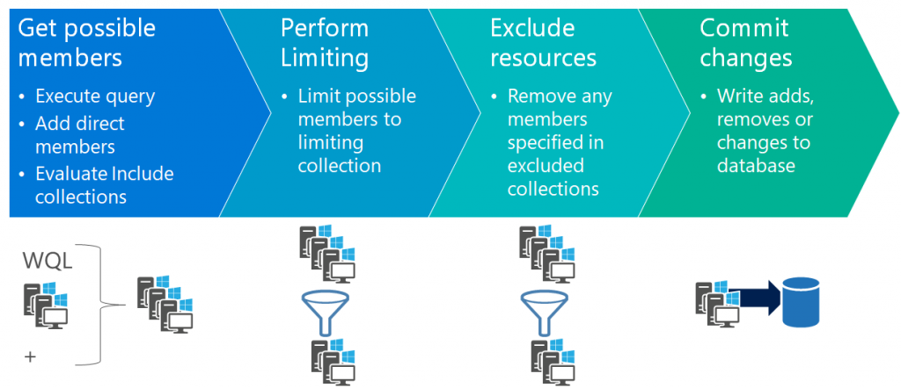
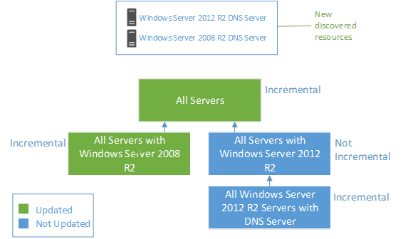
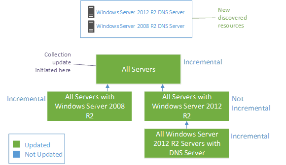
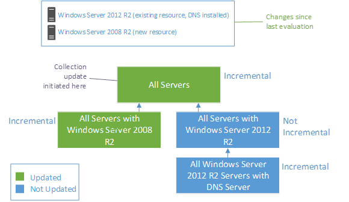

# Collection evaluation in Configuration Manager

*Applies to: Configuration Manager (current branch)*

Configuration Manager uses *collection evaluation* to update collection membership, based on the collection rules you define. Collection evaluation scope and timing differ depending on site and collection configuration and evaluation type.

It's important to understand collection evaluation behavior so you can make appropriate collection design decisions. For collection evaluation guidance and recommendations, see [Best practices for collections](best-practices-for-collections.md).

## Evaluation process

The [colleval.log](../../../plan-design/hierarchy/log-files.md#BKMK_ServerLogs) records when the collection evaluator creates, changes, and deletes collections.

At a high level, each individual collection evaluation and update follows these steps:

1. Execute the collection query.
1. Add any systems that are direct members.
1. Add members from Include collections.
1. Perform a logical `AND` between the returned results and the limiting collection.
1. Remove members from the *exclude* collections.

   If the exclude collections also have query rules, or have include or exclude collections, evaluate them also. If these collections themselves are limiting collections, evaluate any collections below them. After fully evaluating the tree, return the results to the calling collection.

1. Compare the result set from evaluating the direct members and include collections with the results of the exclude collections.
1. Write the changes to the database and perform updates.
1. Trigger any dependent collections to update as well. Dependent collections are collections that the current collection limits, or that refer to the current collection using include or exclude rules.

> [!TIP]
> You can use management insights in the Configuration Manager console to help you manage your collections. There's a group of insights specific to [Collections](../../../servers/manage/management-insights.md#collections). There are also several insights in the [Configuration Manager Assessment](../../../servers/manage/management-insights.md#configuration-manager-assessment) group for collections.<!-- MEMDocs#967 -->

## Collection evaluation types and triggers

These types of threads handle collection evaluation, depending on evaluation type:

- **Primary** for scheduled collection updates
- **Auxiliary** to manually update collections with dependent collections
- **Single** to manually update collections with no dependent collections
- **Express** for incremental collection updates

The following table describes collection evaluation triggers and their corresponding evaluation types.

| Trigger | Evaluation Type | Description |
|---------|-----------------|-------------|
|Manual|Single or Auxiliary|Manual is the highest priority collection evaluation. When an administrator requests a manual collection evaluation, the collection evaluator assigns the next available evaluation thread to the evaluation.|
|Scheduled|Primary|The process of scheduled evaluation is the same as manual evaluation, except the evaluation is time-driven rather than event-driven.|
|Staging|Single or Auxiliary|All collections directly or indirectly depend on **All Systems** or **All Users and User Groups**. Both of these collections do a full collection evaluation at 4:00 AM daily. A change to either of these collections triggers updates of dependent collections, based on a [full collection graph](#collection-evaluation-graph).
|Incremental|Express|Incremental evaluation uses a collection evaluation graph to evaluate and update dependent collections if an update to the incremental collection membership changes. Configuration Manager monitors and updates resources objects in all collections that are configured for incremental updates.  If a collection query is based on information that will be updated later, like hardware inventory, Configuration Manager only adds or removes the resource from the collection during the scheduled collection update.|

## Collection evaluation graph

A *collection evaluation graph* maps all collections that relate to the collection targeted for evaluation. A collection evaluation involves the targeted collection and any related collections in the collection evaluation graph.

When collection evaluation starts, Configuration Manager builds a graph that includes all collections that could possibly need evaluating as a result of changes to the target collection, starting from the highest level in the cycle. The collection evaluator then moves through the graph in order, evaluating each collection membership in turn. After the collection is fully evaluated, the collection evaluator removes lower-level collections that aren't affected by this cycle from the collection evaluation graph.

If one or more of the collections being evaluated has an include or exclude rule, the collection evaluator adds the included or excluded collection to the graph, along with any collections that collection limits. If there are any changes during the evaluation of the include and exclude collections, the graph continues on that branch before it returns to the main branch.

Configuration Manager builds two types of evaluation graphs, *incremental* or *full*.

### Incremental collection evaluation

When table data changes, a SQL Server trigger inserts a row in the **CollectionNotifications** table. The next time a collection evaluation schedule fires, it `AND`s the resource ID with the existing collection query and triggers updates on collections that are enabled for *incremental* collections.

Incremental collection evaluation executes one query per machine. The default site configuration for incremental collection evaluation is every five minutes.

An incremental collection evaluation graph maps referenced collections only if they're enabled for incremental evaluation. If an incremental evaluation is limited to a collection that isn't enabled for incremental evaluation, the graph evaluates the collection based on the existing membership of the limiting collection.

For example, the following diagram shows newly discovered resources that are applicable to all collections. However, collection evaluation only updates the **All Servers** and **All Domain Controllers** collections. The collection evaluator doesn't evaluate the other collections, because the **All Member Servers** collection isn't enabled for incremental evaluation.

### Full collection evaluation

Manual or scheduled collection evaluations build a *full* collection evaluation graph of all dependent collections. The graph includes all collections that reference the collection that is updating and subsequent collections. Configuration Manager continues to evaluate down the graph as long as updates occur to the collections being processed.

The following diagram shows how a scheduled or manual collection update request for the **All Servers** collection produces a full graph that includes all applicable collections. The new DNS server and domain controller resources are in scope of the membership queries of all collections, so all the collections update.

A full evaluation doesn't always evaluate all collections. The collection evaluation graph only continues to evaluate dependent collections if an update occurs to the current referenced collection. If an incrementally updated collection updates during scheduled incremental evaluations, referencing collections that aren't enabled for incremental updates may not update. A full evaluation doesn't update the collection, ending the collection evaluation graph and any referencing collection evaluations for that cycle.

In the following example, installing DNS on the existing server makes it a member of the **DNS Servers** collection, but because there's no update to its limiting **All Member Servers** collection, the full evaluation doesn't evaluate the **DNS Servers** collection. The next incremental evaluation cycle will evaluate the **DNS Servers** collection, because it's an incremental collection.

## Next steps

- [How to create collections](create-collections.md)
- [Best practices for collections](best-practices-for-collections.md)
- [View collection evaluation (starting in version 2010)](collection-evaluation-view.md)
- [Collection Evaluation Viewer](../../../support/ceviewer.md)
