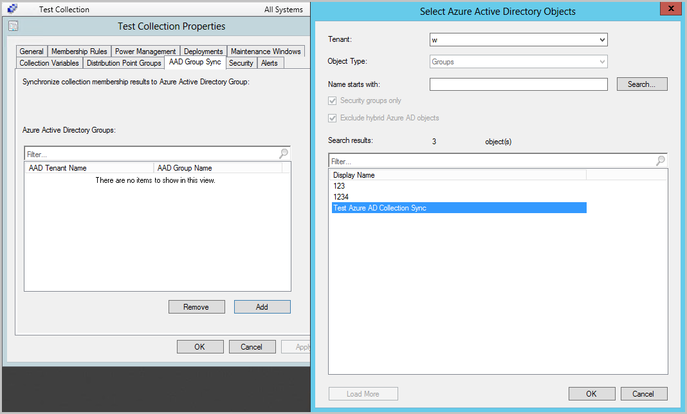

# How to create collections in Configuration Manager

*Applies to: Configuration Manager (current branch)*

Collections are groupings of users or devices. Use collections for tasks like managing applications, deploying compliance settings, or installing software updates. You can also use collections to manage groups of client settings or use them with role-based administration to specify the resources that an administrative user can access. Configuration Manager contains several built-in collections. For more information, see [Introduction to collections](introduction-to-collections.md).

> [!NOTE]
> A collection can contain users or devices, but not both.

The information in this article can help you create collections in Configuration Manager. You can also import collections that were created at the current  Configuration Manager site or at another one. For more information about how to export and import collections, see [How to manage collections](manage-collections.md).

## Collection rules

There are different types of rules that you can use to configure the members of a collection in Configuration Manager.

### Direct rule

Use direct rules to choose the users or computers that you want to add to a collection. The membership doesn't change unless you remove a resource from Configuration Manager. Before you can add the resources to a direct rule collection, Configuration Manager must have discovered them or you must have imported them. Direct rule collections have more administrative overhead than query rule collections because they require manual changes.

### Query rule

Dynamically update the membership of a collection based on a query that Configuration Manager runs on a schedule. For example, you can create a collection of users that are a member of the Human Resources organizational unit in Active Directory Domain Services. This collection is automatically updated when new users are added to or removed from the Human Resources organizational unit.

For example queries that you can use to build collections, see [How to create queries](../../../servers/manage/create-queries.md).

### Include collection rule

Include the members of another collection in a Configuration Manager collection. If the included collection changes, Configuration Manager updates the membership of the current collection on a schedule.

You can add multiple include collection rules to a collection.

### Exclude collection rule

Exclude collection rules let you exclude the members of one collection from another Configuration Manager collection. If the excluded collection changes, Configuration Manager updates the membership of the current collection on a schedule.

You can add multiple exclude collection rules to a collection. If a collection includes both include collection and exclude collection rules and there's a conflict, the exclude collection rule takes priority.

#### Example of an exclude collection rule

You create a collection that has one include collection rule and one exclude collection rule. The include collection rule is for a collection of Dell desktops. The exclude collection is for a collection of computers that have less than 4 GB of RAM. The new collection contains Dell desktops that have at least 4 GB of RAM.

##  Create a collection

1. In the Configuration Manager console, go to the **Assets and Compliance** workspace.

    - To create a *device collection*, select the **Device Collections** node. Then, on the **Home** tab of the ribbon, in the **Create** group, select **Create Device Collection**.

    - To create a *user collection*, select the **User Collections** node. Then, on the **Home** tab of the ribbon, in the **Create** group, select **Create User Collection**.

1. On the **General** page of the wizard, provide a **Name** and a **Comment**. In the **Limiting collection** section, select **Browse**, and then select a limiting collection. The collection you're creating will contain only members from the limiting collection.

1. On the **Membership Rules** page, in the **Add Rule** list, select the type of membership rule that you want to use for the collection. You can configure multiple rules for each collection. The configuration for each rule varies. For more information on configuring each rule, see the following sections of this article:

    - [Direct rule](#bkmk-direct)
    - [Query rule](#bkmk-query)
    - [Include collection rule](#bkmk-include)
    - [Exclude collection rule](#bkmk-exclude)

1. Also on the **Membership Rules** page, review the following settings.

    - **Use incremental updates for this collection**: Select this option to periodically scan for and update only new or changed resources from the previous collection evaluation. This process is independent of a full collection evaluation. By default, incremental updates occur at 5-minute intervals.

        > [!IMPORTANT]
        > Collections with query rules that use the following classes don't support incremental updates:
        >
        > - SMS_G_System_CollectedFile
        > - SMS_G_System_LastSoftwareScan
        > - SMS_G_System_AppClientState
        > - SMS_G_System_DCMDeploymentState
        > - SMS_G_System_DCMDeploymentErrorAssetDetails
        > - SMS_G_System_DCMDeploymentCompliantAssetDetails
        > - SMS_G_System_DCMDeploymentNonCompliantAssetDetails
        > - SMS_G_User_DCMDeploymentCompliantAssetDetails (for collections of users only)
        > - SMS_G_User_DCMDeploymentNonCompliantAssetDetails (for collections of users only)
        > - SMS_G_System_SoftwareUsageData
        > - SMS_G_System_CI_ComplianceState
        > - SMS_G_System_EndpointProtectionStatus
        > - SMS_GH_System_*
        > - SMS_GEH_System_*

    - **Schedule a full update on this collection**: Schedule a regular full evaluation of the collection membership.

        - When you disable this setting, the site clears the schedule. This change from previous behavior makes sure that the site doesn't continue to evaluate the query. To stop the site evaluating a collection on a schedule, disable this option.<!--3607726-->

        - You can't disable the evaluation of built-in collections like **All Systems**, but you can configure the schedule. This behavior allows you to customize this action at a time that meets your requirements.

            > [!TIP]
            > On built-in collections, only change the **Time** of the custom schedule. Don't change the **Recurrence pattern**. Future versions of Configuration Manager might enforce a specific recurrence pattern.

1. Complete the wizard to create the new collection. The new collection is displayed in the **Device Collections** node of the **Assets and Compliance** workspace.  

> [!NOTE]  
> To see new collection members, refresh or reload the Configuration Manager console. They don't appear in the collection until after the first scheduled update. You can also manually select **Update Membership** for the collection. It might take a few minutes for a collection update to complete.

##  Configure a direct rule for a collection

1. On the **Search for Resources** page of the **Create Direct Membership Rule Wizard**, specify the following information:

    - **Resource class**: Select the type of resource you want to search for and add to the collection. For example:

        - **System Resource**: Search for inventory data returned from client computers.
        - **Unknown Computer**: Select from values returned by unknown computers.
        - **User Resource**: Search for user information collected by Configuration Manager.
        - **User Group Resource**: Search for user group information collected by Configuration Manager.

    - **Attribute name**: Select the attribute associated with the selected resource class that you want to search for. For example:

        - If you want to select computers by their NetBIOS name, select **System Resource** in the **Resource class** list and **NetBIOS name** in the **Attribute name** list.

        - If you want to select users by their organizational unit (OU) name, select **User Resource** in the **Resource class** list and **User OU Name** in the **Attribute name** list.

    - **Exclude resources marked as obsolete**: If a client computer is marked as obsolete, don't include this value in the search results.

    - **Exclude resources that do not have the Configuration Manager client installed**: These resources won't be displayed in the search results.

    - **Value**: Enter a value to search the selected attribute name. Use the percent character (`%`) as a wildcard. For example:

        - To search for computers that have a NetBIOS name beginning with **M**, enter `M%` in this field.

        - To search for users in the Contoso OU, enter `Contoso` in this field.

1. On the **Select Resources** page, select the resources that you want to add to the collection in the **Resources** list, and then select **Next**.

##  Configure a query rule for a collection

In the **Query Rule Properties** dialog box, specify the following information.

- **Name**: Specify a unique name for the query.

- **Import Query Statement**: Opens the **Browse Query** dialog box. Select a [Configuration Manager query](../../../servers/manage/create-queries.md) to use as the query rule for the collection.

- **Resource class**: Select the type of resource you want to search for and add to the collection. Select a value from **System Resource** to search for inventory data returned from client computers or from **Unknown Computer** to select from values returned by unknown computers.

- **Edit Query Statement**: Opens the **Query Statement Properties** dialog box, where you can write a query to use as the rule for the collection. On the General tab, if you select the option to **Omit duplicate rows (select distinct)**, it may result in less rows returned but potentially quicker results. For more information about queries, see [Introduction to queries](../../../servers/manage/introduction-to-queries.md).

   - Starting in Configuration Manager 2010, you can preview the results when you're creating or editing a query for collection membership. For more information, see the [Preview collection queries](#bkmk-preview) section.

##  Configure an include collection rule

In the **Select Collections** dialog box, select the collections you want to include in the new collection, and then select **OK**.

##  Configure an exclude collection rule

In the **Select Collections** dialog box, select the collections you want to exclude from the new collection, and then select **OK**.

##  Preview collection queries

*(Introduced in 2010)*

Starting in Configuration Manager 2010, you can preview the results when you're creating or editing a query for collection membership. In the **Query Statement Properties**, select the green triangle to show the **Query Results Preview** window. Select **Stop** if you want to stop a long running query. <!--7380401-->
:::image type="content" source="./media/7380401-preview-collection-query.png" alt-text="Client data sources dashboard" lightbox="./media/7380401-preview-collection-query.png":::

###  Improvements to query preview
<!--8680235-->
*(Introduced in 2103)*

Starting in Configuration Manager version 2103, you have more options when using the collection query preview. The following improvements have been made to previewing collection queries:
- Limit the number of rows returned
   - Your limit can be between 1 to 10,000 rows. The default is 5000 rows. 
- Omit duplicate rows from the result set
  - If the **Omit duplicate rows** option isn't selected, the original query statement will be executed as is, even if the query contains the word **distinct**.
  - When the **Omit duplicate rows** option is selected, if the query already contains the word **distinct**, then the query runs as it is. When the query doesn't contain the word **distinct**, it's added to the query for the preview (mean override).
- Review statistics for the query preview such as number of rows returned and elapsed time.

:::image type="content" source="./media/8680235-limited-query-preview.png" alt-text="Limiting rows returned and omitting duplicate rows when previewing a quiery" lightbox="./media/8680235-limited-query-preview.png":::

> [!NOTE]
> - Elapsed times shown for the query preview may not be the same as actual execution of the target query.
> - **Query execution elapsed time** and **Displaying results elapsed time** shouldn't be added for a total elapsed time since these processes run in parallel.
##  Import a collection

When you export a collection from a site, Configuration Manager saves it as a Managed Object Format (MOF) file. Use this procedure to import that file into your site database. To complete this procedure, you need **Create** permissions on the collections class.

> [!IMPORTANT]
> Make sure the MOF file contains only collection data, is from a trusted source, and hasn't been tampered with.
>
> Also make sure to export the file from a site that's the same version of Configuration Manager as the import site.

For more information about exporting collections, see [How to manage collections](manage-collections.md).

1. In the Configuration Manager console, go to the **Assets and Compliance** workspace. Select either the **User Collections** or the **Device Collections** node.

1. On the **Home** tab of the ribbon, in the **Create** group, select **Import Collections**.

1. On the **General** page of the **Import Collections Wizard**, select **Next**.

1. On the **MOF File Name** page, select **Browse**. Browse to the MOF file that contains the collection information you want to import.

1. Complete the wizard to import the collection. The new collection is displayed in the **User Collections** or **Device Collections** node of the **Assets and Compliance** workspace. Refresh or reload the Configuration Manager console to see the collection members for the newly imported collection.

##  Use PowerShell

You can use PowerShell to create and import collections. For more information, see the following cmdlet articles:

- [New-CMCollection](/powershell/module/configurationmanager/new-cmcollection)

- [Set-CMCollection](/powershell/module/configurationmanager/set-cmcollection)

- [Import-CMCollection](/powershell/module/configurationmanager/import-cmcollection)

##  Synchronize members to Azure AD groups

<!--3607475-->

You can enable the synchronization of collection memberships to an Azure Active Directory (Azure AD) group. This synchronization allows you to use your existing on premises grouping rules in the cloud by creating Azure AD group memberships based on collection membership results. You can synchronize device or user collections. Only resources with an Azure AD record are reflected in the Azure AD group. Both hybrid Azure AD-joined and Azure AD-joined devices are supported. The synchronization of collection memberships is a one-way process from Configuration Manager to Azure AD. Ideally, Configuration Manager should be the authority for managing the membership for the target Azure AD groups.

Synchronizations can either be full or incremental and they have slightly different behaviors: <!--9718854-->

- Full synchronization: Occurs on the first synchronization after enabling it. You can force a full synchronization by selecting the collection, and then choosing **Synchronize Membership** from the ribbon. A full synchronization will overwrite members of the Azure AD group.

- Incremental synchronization: Occurs every 5 minutes. Changes made in Azure AD aren't reflected in Configuration Manager collections, but they aren't overwritten by Configuration Manager. <!--For example, if the Configuration Manager collection has two devices, and the Azure AD group has three different devices, after an incremental synchronization, the Azure AD group has five devices.-->

Example synchronization scenario:
1. From Azure AD, create a group called `Group1` and add `DeviceA`, `DeviceB`, and `DeviceC`.
   - Ideally, objects wouldn't be added from Azure AD since Configuration Manager should manage the group membership. 
1. From Configuration Manager, create a collection called `Collection1` then add `DeviceB`, and `DeviceC`.
1. [Enable synchronization](#enable-the-collection-to-synchronize) for `Collection1` to `Group1`.
1. The first synchronization is a full synchronization so, `Group1` now contains `DeviceB`, and `DeviceC`. `DeviceA` was removed from the group during the full synchronization.
1. Remove `DeviceC` from `Collection1` and wait for an incremental synchronization.
1. `Group1` now contains only `DeviceB`.
1. From Azure AD, add `DeviceD` to `Group1` and wait for an incremental synchronization.
1. `Group1` now contains `DeviceB` and `DeviceD`.
1. From Configuration Manager, select `Collection1`, and choose **Synchronize Membership** from the ribbon to force a full synchronization.
1. `Group1` now contains only `DeviceB`

### Prerequisites for Azure AD synchronization

- Integration with Azure AD for [cloud management](../../../servers/deploy/configure/azure-services-wizard.md)

- [Azure AD user discovery](../../../servers/deploy/configure/about-discovery-methods.md#azureaddisc)

- An HTTPS or [Enhanced HTTP](../../../plan-design/hierarchy/enhanced-http.md)-enabled management point

- Access to the **All Systems** collection

### Create a group and set the owner in Azure AD

1. Sign in to the [Azure portal](https://portal.azure.com).

1. Navigate to **Azure Active Directory** > **Groups** > **All groups**.

1. Select **New group**, enter a **Group name**, and optionally enter a **Group description**.

1. Make sure that **Membership type** is **Assigned**.

1. Select **Owners**, then add the identity that will create the synchronization relationship in Configuration Manager.

1. Select **Create** to finish creating the Azure AD group.

### Enable collection synchronization for the Azure service

1. In the Configuration Manager console, go to the **Administration** workspace. Expand **Cloud Services**, and select the **Azure Services** node.

1. Select the cloud management service for the Azure AD tenant where you created the group. Then in the ribbon, select **Properties**.

1. Switch to the **Collection Synchronization** tab, and select the option to **Enable Azure Directory Group Sync**.

1. Select **OK** to save the setting.

### Enable the collection to synchronize

1. In the Configuration Manager console, go to the **Assets and Compliance** workspace, and select either the **Device Collections** or **User Collections** node.

1. Select the collection to sync. Then in the ribbon, select **Properties**.

1. Switch to the **Cloud Sync** tab, and select **Add**.

1. If necessary, change the **Tenant** to where you created the Azure AD group.

1. Type in your search criteria in the **Name starts with** field, then select **Search**. If you leave the criteria blank, the search returns all groups from the tenant. If it prompts you to sign in, use the identity you specified as the owner for the Azure AD group.

1. Choose the target group, and then select **OK** to add the group. Select **OK** again to exit the collection's properties.

Wait about five to seven minutes before you can verify the group memberships in the Azure portal. To start a full synchronization, select the collection, and then in the ribbon select **Synchronize Membership**.

### Verify the Azure AD group membership

1. Go to the [Azure portal](https://portal.azure.com).

1. Navigate to **Azure Active Directory** > **Groups** > **All groups**.

1. Find the group you created and select **Members**.

1. Confirm that the members reflect the resources in the Configuration Manager collection. Only resources with Azure AD identity show in the group.

## Next steps

[Manage collections](manage-collections.md)
