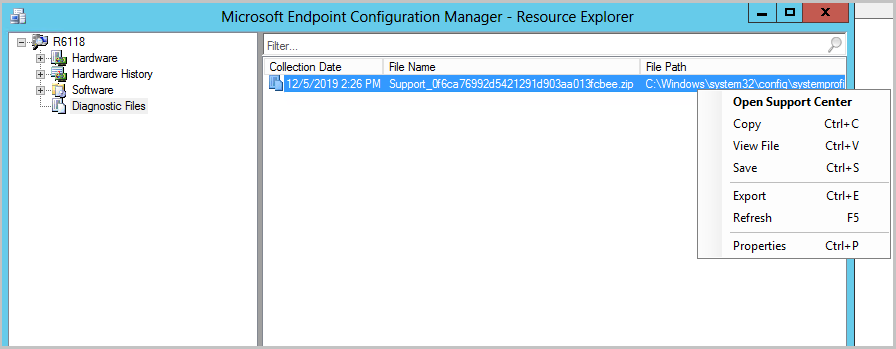

# How to use Resource Explorer to view software inventory in Configuration Manager

*Applies to: Configuration Manager (current branch)*

Use Resource Explorer in Configuration Manager to view information about software inventory that has been collected from computers in your hierarchy.  

> [!NOTE]  
>  Resource Explorer will not display any inventory data until a software inventory cycle has run on the client.  

 Resource Explorer provides the following software inventory information:  

-   **Software**:  

    -   **Collected Files** - Files that were collected during software inventory.  

    -   **File Details** - Files that were inventoried during software inventory that are not associated with a specific product or manufacturer.  

    -   **Last Software Scan** - Date and time of the last software inventory and file collection for the client computer.  

    -   **Product Details** - Software products that were inventoried by software inventory, grouped by manufacturer.  

## To run Resource Explorer from the Configuration Manager console  

1.  In the Configuration Manager console, choose **Assets and Compliance**

2.  In the **Assets and Compliance** workspace, choose **Devices** or open any collection that displays devices.  

3.  Choose the computer containing the inventory that you want to view and then, in the **Home** tab > **Devices** group, choose **Start** > **Resource Explorer**.

4.  You can right-click any item in the right-pane of the Resource Explorer window and choose **Properties** to view the collected inventory information in a more readable format.  
 
##  View and manage collected diagnostic files

Starting in Configuration Manager version 2002, use Resource Explorer to view and manage the files gathered when you use client notification to [collect client logs](../client-notification.md#client-diagnostics). 

1. From the **Devices** node, right-click on the device you want to view logs for.
1. Select **Start**, then **Resource Explorer**.
1. From **Resource Explorer**, click on **Diagnostic Files**.
1. In the **Diagnostic Files** list, you can see the collection date for the files. The name format of the client logs is `Support_<guid>.zip`.
1. Right-click on the zip file and select one of the following options:
    - **Open Support Center**: Launches [Support Center](../../../support/support-center.md).
    - **Copy**: Copies the row information from Resource Explorer.
    - **View file**: Opens the folder where the zip file is located with File Explorer.
    - **Save**: Opens a Save File dialog for the selected file.
    - **Export**: Saves the Resource Explorer columns shown in **Diagnostic Files**.
    - **Refresh**: Refreshes the file list.
    - **Properties**: Returns the properties on the selected file. 

## Next steps

[Use Support Center](../../../support/support-center.md) to view collected diagnostic files.
