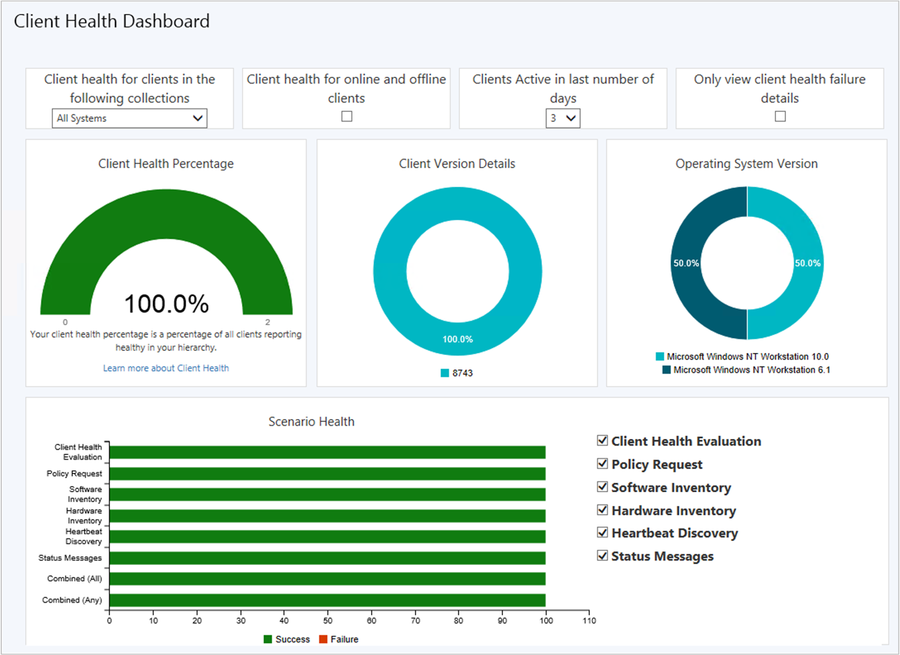

# How to monitor clients in Configuration Manager

*Applies to: Configuration Manager (current branch)*

Once you install the Configuration Manager client on the Windows devices in your site, monitor their health and activity in the Configuration Manager console.  

##  About client status

Configuration Manager provides the following types of information as client status:  

- **Client online status**: The site considers a device as **online** if it's connected to its assigned management point. To indicate that the client is online, it sends ping-like messages to the management point. If the management point doesn't receive a message in five minutes, the site considers the client as **offline**.  

- **Client activity**: The site considers the client as **active** if it has communicated with Configuration Manager in the past seven days. The site considers the client **inactive** if it hasn't done the following actions in seven days:  

    - Requested policy update  
    - Sent a heartbeat message  
    - Sent hardware inventory  

- **Client check**: The state of the periodic evaluation that the Configuration Manager client runs on the device. The evaluation checks the device and can remediate some of the problems it finds. For more information, see [Client health checks](#BKMK_ClientHealth).  

     On devices that run Windows 7, client check runs as a scheduled task. On later OS versions, client check runs automatically during the Windows maintenance window.  

     You can configure remediation not to run on specific devices, for example, a business-critical server. If there are additional items that you want to evaluate, use Configuration Manager compliance settings to monitor additional configurations. For more information about compliance settings, see [Plan for and configure compliance settings](../../../compliance/plan-design/plan-for-and-configure-compliance-settings.md).  

- **Decommissioned**: The site has marked the device record for deletion. This behavior can happen when a new registration for same device assigns to the same or a different primary site in a hierarchy. The site deletes these devices the next time it runs the site maintenance task **Delete Aged Discovery Data**.<!-- SCCMDocs issue #1418 -->  

- **Obsolete**: The site has discovered a new device record with the same hardware ID, so it marks the old record as obsolete. Reports don't count obsolete records of the same device multiple times. You can still target policies to obsolete devices. If the site doesn't get a heartbeat for an obsolete record after 90 days of inactivity, it removes the obsolete device when it runs the site maintenance task **Delete Obsolete Client Discovery Data**.

##  Monitor individual clients

1. In the Configuration Manager console, go to the **Assets and Compliance** workspace. Select either the **Devices** node or choose a collection under **Device Collections**.  

    The icons at the beginning of each row indicate the online status of the device:  

    |||  
    |-|-|  
    ||Device is online|  
    ||Device is offline|  
    ||Online status is unknown|  
    ||Client isn't installed on the device|  

2. For more detailed online status, add the client online status information to the device view. Right-click the column header and select the online status fields you want to add:

    - **Device Online Status**: Indicates whether the client is currently online or offline. (This status is the same information given by the icons.)  

    - **Last Online Time**: Indicates when the client online status changed to online  

    - **Last Offline Time** indicates when the status changed to offline  

3. Select an individual client in the list pane to see more status in the detail pane. This information includes client activity and client check status.  

##  Client health dashboard

<!--3599209-->
You deploy software updates and other apps to help secure your environment, but these deployments only reach healthy clients. Unhealthy Configuration Manager clients adversely effect overall compliance. Determining client health can be challenging depending upon the denominator: how many total devices should be in your scope of management? For example, if you discover all systems from Active Directory, even if some of those records are for retired machines, this process increases your denominator.

Starting in version 1902, view a dashboard with information about the health of Configuration Manager clients in your environment. View your client health, scenario health, and common errors. Filter the view by several attributes to see any potential issues by OS and client versions.

In the Configuration Manager console, go to the **Monitoring** workspace. Expand **Client status**, and select the **Client health dashboard** node.

> [!Tip]  
> There are no changes to ccmeval.  

By default, the client health dashboard shows online clients, and clients active in the past three days. Therefore, you may see different numbers in this dashboard than in other historical sources of client health. For example, other nodes under **Client Status**, or reports in the client status category.

### Filters

At the top of the dashboard, there's a set of filters to adjust the data displayed in the dashboard.

- **Collection**: By default, the dashboard displays devices in the **All Systems** collection. Select a device collection from the list to scope the view to a subset of devices in a specific collection.  

- **Online/offline**: By default, the dashboard displays only online clients. This state comes from the client notification channel that update a client's status every five minutes. For more information, see [About client status](monitor-clients.md#bkmk_about).  

- **Active \# days**: By default, the dashboard displays clients that are active in the last three days.  

- **Failure only**: Scope the view to only devices that are reporting a client health failure.  

    > [!Tip]  
    > Use this filter along with the client version and OS version tiles. For more information, see [Version tiles](#version-tiles).

### Client health percentage

This tile shows the overall client health in your hierarchy.

A healthy Configuration Manager client has the following properties:

- Online  
- Actively sending data  
- Passes all client health evaluation checks  

For more information, see [About client status](monitor-clients.md#bkmk_about).

A healthy client successfully communicates with the site. It reports all data based on the defined schedules in client settings.

Select a segment of this chart to drill down to a device list view.

### Version tiles

There are two tiles that show client health by Configuration Manager client version and OS version. These tiles are useful when you make changes to the filters, such as **Failure only**. They can help highlight whether any issues are consistent across a specific version. Use this information to help you make upgrade decisions.

Select a segment of these charts to drill down to a device list view.

### Scenario health

This bar chart shows the overall health for the following core scenarios:

- Client policy
- Heartbeat discovery
- Hardware inventory
- Software inventory
- Status messages

Use the selectors to adjust the focus on specific scenarios in the chart.

The following two bars are always shown:

- **Combined (All)**: the combination of all scenarios (AND)  
- **Combined (Any)**: at least one of the scenarios (OR)

> [!Tip]  
> Scenario health isn't measured from your configuration of client settings. These values can vary based upon the resultant set of policy per device. Use the following steps to adjust the evaluation periods for scenario health:
>
> - In the Configuration Manager console, go to the **Monitoring** workspace, and select the **Client Status** node.  
> - In the ribbon, select **Client Status Settings**.  
>
> By default, if a client doesn't send scenario-specific data in **7 days**, Configuration Manager considers it unhealthy for that scenario.

### Top 10 client health failures

This chart lists the most common failures in your environment. These errors come from Windows or Configuration Manager.

<!-- The following list includes some of the more common failures overall:

#### Failure 1 title
Failure 1 description

Solution for failure 1 -->

##  Monitor the status of all clients

1. In the Configuration Manager console, go to the **Monitoring** workspace, and select the **Client Status** node. Review the overall statistics for client activity and client checks across the site. Change the scope of the information by choosing a different collection.  

2. To drill down into detail about the reported statistics, choose the name of the reported information. For example, **Active clients that have passed client check or no results**. Then review the information about the individual clients.  

3. Select **Client Activity** to see charts showing the client activity in your Configuration Manager site.  

4. Select **Client Check** to see charts showing the status of client checks in your Configuration Manager site.  

    Configure alerts to notify you when client check results or client activity drops below a specified percentage. The site can also alert you when remediation fails on a specified percentage of clients. For more information, see [How to configure client status](../deploy/configure-client-status.md).  

##  Client health checks

Client check runs the following checks and remediations:  

|Client check|Remediation action|More information|  
|------------------|------------------------|----------------------|  
|Verify that client check has recently run|Run client check|Checks that client check has run at least one time in the past three days.|  
|Verify that client prerequisites are installed|Install the client prerequisites|Checks that client prerequisites are installed. Reads the file ccmsetup.xml in the client installation folder to discover the prerequisites.|  
|WMI repository integrity test|Reinstall the Configuration Manager client|Checks that Configuration Manager client entries are present in WMI.|  
|Verify that the client service is running|Start the client (SMS Agent Host) service|No additional information|  
|WMI Event Sink Test.|Restart the client service|Check whether the Configuration Manager related WMI event sink is lost|  
|Verify that the Windows Management Instrumentation (WMI) service exists|No remediation|No additional information|  
|Verify that the client was installed correctly|Reinstall the client|No additional information|  
|Verify that the antimalware service startup type is automatic|Reset the service startup type to automatic|No additional information|  
|Verify that the antimalware service is running|Start the antimalware service|No additional information|  
|Verify that the Windows Update service startup type is automatic or manual|Reset the service startup type to automatic|No additional information|  
|Verify that the client service (SMS Agent Host) startup type is automatic|Reset the service startup type to automatic|No additional information|  
|Verify that the Windows Management Instrumentation (WMI) service is running.|Start the Windows Management Instrumentation service|No additional information|  
|Verify that the Microsoft SQL CE database is healthy|Reinstall the Configuration Manager client|No additional information|  
|Microsoft Policy Platform WMI Integrity Test|Repair the Microsoft Policy Platform|No additional information|  
|Verify that the Microsoft Policy Platform Service exists|Repair the Microsoft Policy Platform|No additional information|  
|Verify that the Microsoft Policy Platform service startup type is manual|Reset the service startup type to manual|No additional information|  
|Verify that the Background Intelligent Transfer Service exists|No Remediation|No additional information|  
|Verify that the Background Intelligent Transfer Service startup type is automatic or manual|Reset the service startup type to automatic|No additional information|  
|Verify that the Network Inspection Service startup type is manual|Reset the service startup type to manual if installed|No additional information|  
|Verify that the Windows Management Instrumentation (WMI) service startup type is automatic|Reset the service startup type to automatic|No additional information|  
|Verify that the Windows Update service startup type on Windows 8 devices is automatic or manual|Reset the service startup type to manual|No additional information|  
|Verify that the client (SMS Agent Host) service exists.|No Remediation|No additional information|  
|Verify that the Configuration Manager Remote Control service startup type is automatic or manual|Reset the service startup type to automatic|No additional information|  
|Verify that the Configuration Manager Remote Control service is running|Start the remote control service|No additional information|  
|Verify that the wake-up proxy service (ConfigMgr Wake-up Proxy) is running|Start the ConfigMgr Wakeup Proxy service|This client check is made only if the **Power Management**: **Enable wake-up proxy** client setting is set to **Yes** on supported client operating systems.|  
|Verify that the wake-up proxy service (ConfigMgr Wake-up Proxy) startup type is automatic|Reset the ConfigMgr Wakeup Proxy service startup type to automatic|This client check is made only if the **Power Management**: **Enable wake-up proxy** client setting is set to **Yes** on supported client operating systems.|  

<!-- 
5/31/2019 ACz: need to confirm if these checks are still applicable
|WMI repository read and write test|Reset the WMI repository and reinstall the Configuration Manager client|Remediation of this client check is only performed on devices that run Windows Server 2003, Windows XP (64-bit) or earlier versions.|  
|Verify that the client WMI provider is healthy|Restart the Windows Management Instrumentation service|Remediation of this client check is only performed on devices that run Windows Server 2003, Windows XP (64-bit) or earlier.|  
 -->

## Client deployment log files

For more information about the log files used by client deployment and management operations, see [Log files](../../plan-design/hierarchy/log-files.md#BKMK_ClientLogs).
