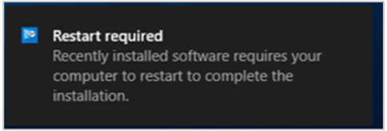

##  Replace toast notifications with dialog window
<!--3555947-->

Sometimes users don't see the Windows toast notification about a restart or required deployment. Then they don't see the experience to snooze the reminder. This behavior can lead to a poor user experience when the client reaches a deadline.

Now when deployments need a restart or software changes are required, you have the option of using a more intrusive dialog window. 

### Try it out!

Try to complete the tasks. Then send [Feedback](../../../../understand/product-feedback.md) with your thoughts on the feature.

#### Software changes are required

1. Deploy an [application](../../../../../apps/deploy-use/deploy-applications.md) as required with a deadline in the future.  

2. On the **User Experience** page of the Deploy Software Wizard, select the user notification option to **Display in Software Center and show all notifications**. Then select the following option: **When software changes are required, show a dialog window to the user instead of a toast notification**.  

3. Complete the Deploy Software Wizard.

Configuring this deployment setting changes the user experience for this scenario.

From the following toast notification:

  

To the following dialog window:

#### Restart required

1. Edit client settings. For more information, see [How to configure client settings](../../../../clients/deploy/configure-client-settings.md).  

2. In the **Computer Restart** group, enable the following option: **When a deployment requires a restart, show a dialog window to the user instead of a toast notification**.  

3. Create a required deployment for an [application](../../../../../apps/deploy-use/deploy-applications.md), [task sequence](../../../../../osd/deploy-use/deploy-a-task-sequence.md), or [software update](../../../../../sum/deploy-use/deploy-software-updates.md) that requires a restart.  

Configuring this client setting changes the user experience for all deployments in this scenario.

From the following toast notification:

  

To the following dialog window:

