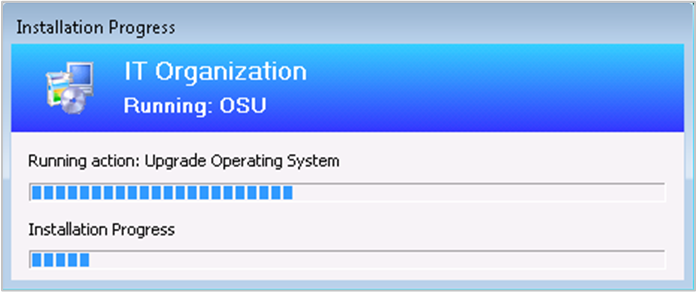

##  Progress status during in-place upgrade task sequence
<!--3747129-->

You now see a more detailed progress bar during a Windows 10 in-place upgrade task sequence. This bar shows the progress of Windows setup, which is otherwise silent during the task sequence. Users now have some visibility into the underlying progress. It helps with concerns that the upgrade process is suspended due to a lack of progress indication.  

