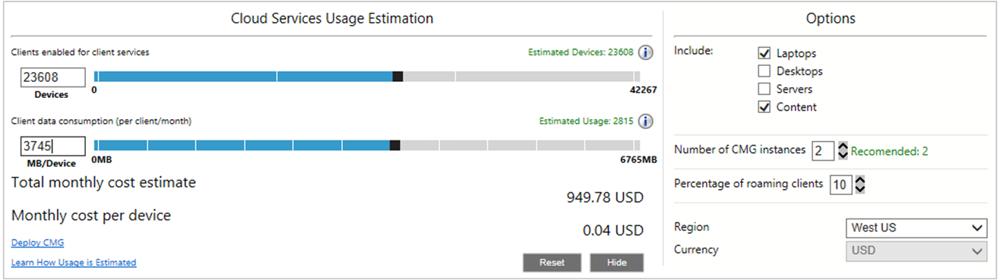

##  Cloud services cost estimator

<!--3555774-->

Some customers are concerned about the potential cost for attaching cloud services in Configuration Manager. This release introduces a new cost estimator tool in the Configuration Manager console. The tool uses the following data from your site database to estimate the cost of deploying the cloud management gateway:  

- Aggregate, average client usage of management points and distribution points  

- Azure pricing  

In the Configuration Manager console, go to the **Monitoring** workspace, and select the **Cloud Management** node.  

By default, the tool shows data based on the following settings:  

- Only laptop devices  

- Client policy only, not content  

- 30 days of client usage data  

- 10% of the total clients simultaneously communicating with the cloud service  

Select **Options** to include additional device types and content, adjust the number of CMG instances, adjust the percentage of simultaneous roaming clients, or change the Azure region.

#### Clients enabled for client services

The **Devices** value is what the tool uses for the cost estimates. It's initially the same as **Estimated devices**, based on the options that you specify. This value changes as you change the options. You can manually adjust this value by moving the slider control, or manually enter a value in the **Devices** field.

The **Estimated devices** value is based on the options that you specify. If you change the **Devices** value, this value doesn't change.

The value at the bottom far right of the slider control is the total number of applicable resources in the site database plus 20%. These devices are running the full Configuration Manager client (not MDM), and are active. The 20% buffer provides room in the slider control to estimate for future growth.

- **Laptops**: Devices capable of roaming with chassis type of portable, laptop, notebook, hand-held, docking station, or subnotebook  

- **Servers**: Devices that aren't one of the laptop chassis types, and the Windows OS is a server type.  

- **Desktops**: All other devices  

For example, in the above screenshot, there are 42,267 total active laptops, servers, and desktops with the Configuration Manager client. Based on the configured options, 23,608 laptops can use cloud services. The administrator hasn't changed the **Devices** value to estimate future growth.

#### Client data consumption (per client/month)

The **MB/Device** value is an estimate based on usage data from the site for the past 30 days. By default, it starts with per-device policy only. In other words, per-device communication with the management point. Select **Options** to include content, or per-device communication with distribution points. You can manually adjust this value by moving the slider control, or manually enter a value in the **MB/Device** field.

> [!Note]  
> When you first update the site, it starts collecting usage data for this tool. It can take several weeks for the tool's estimates to be most useful. In the meantime, manually set your own value for **MB/Device**.  

The **Estimated usage** value is based on the options that you specify. If you change the **MB/Device** value, this value doesn't change.

<!-- The value at the bottom far right of the slider control is the total amount of data usage for all applicable resources. It defaults to 5,000 MB. When you include content, the tool increases this value to include the estimated amount of content. -->

For example, in the above screenshot, 6,765 MB is a worst-case estimate, which provides an upper limit for the slider control. Based on the configured options and client usage data, the tool estimates 2,815 MB per client. The administrator manually changed the **MB/Device** value to 3,745 MB.

#### Total monthly cost estimate

This value is an estimated monthly cost for running CMG services in Azure. It's based on the specified options and the estimated number of devices.

> [!Important]  
> This value is a calculated estimate to help you make data-informed decisions for your environment.  

When you set the number of devices and MB/device, the tool automatically sets a recommended number of CMG instances on the options page. For more information about CMG scale and cost, see [Cost for CMG](../../../../clients/manage/cmg/cost.md). The data egress cost is an estimate based on the percentage of roaming clients on the options page. By default, the percentage is 10%.

For example, you have 37,198 devices that can potentially use the CMG. If you configure the percentage at 25%, the tool estimates the monthly cost of 2,422.80 USD. This estimate is based on 9,300 devices simultaneously communicating with the CMG.

#### Monthly cost per device

This value is an average of the **Total monthly cost estimate** across all **Devices**. For example, if you estimate 25% simultaneous usage for the monthly cost estimate of 2,422.80 USD, that's calculated to 0.07 USD per client for 37,198 devices.

### Limitations

In this release, the Azure regions, currencies, and prices are fixed. The tool uses the following values:

|Location | Currency | VM instance cost | GB cost |
|---------|---------|---------|---------|
| West US | $ | 99.28 | 0.087 |
| West Europe | € | 80.03 | 0.074 |
| North Europe | £ | 70.73 | 0.065 |

Technical preview environments are intended for lab use and can't have more than 10 clients. Due to the low number of clients, this tool may show very low estimates. You can always manually adjust the values. Average client data consumption is typically between 1 to 3 GB per device.
