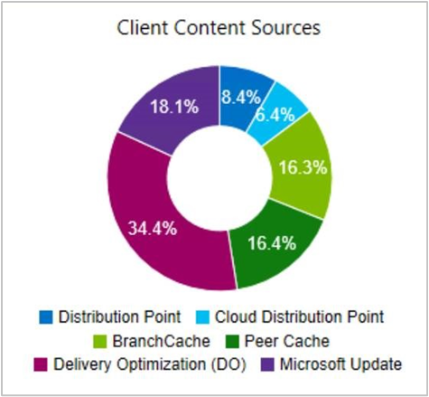

##  Delivery Optimization in client data sources dashboard

<!--3555759-->

The [Client data sources](../../../../servers/deploy/configure/monitor-content-you-have-distributed.md#client-data-sources-dashboard) dashboard now includes [Delivery Optimization](../../../../plan-design/hierarchy/fundamental-concepts-for-content-management.md#delivery-optimization) data. This dashboard helps you understand from where clients are getting content in your environment.

For example, the Client Content Sources tile displays the source from which clients got content:

To include Delivery Optimization on this dashboard, do the following actions:

- Configure the client setting, **Enable installation of Express Updates on clients** in the Software Updates group

- Deploy Windows 10 express updates

For more information, see [Manage Express installation files for Windows 10 updates](../../../../../sum/deploy-use/manage-express-installation-files-for-windows-10-updates.md).

The dashboard also includes the **Microsoft Update** source. Devices report this source when the Configuration Manager client downloads software updates from Microsoft cloud services. These services include Microsoft Update and Microsoft 365.
