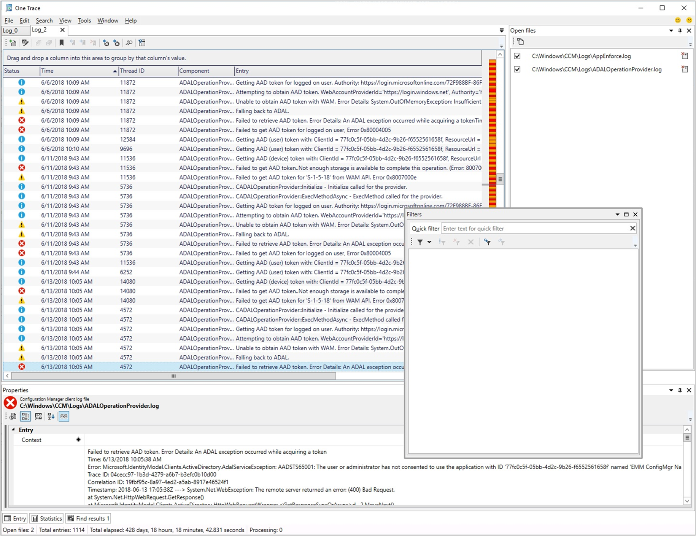

##  OneTrace log viewer

<!--3555962-->

OneTrace is a new log viewer with Support Center. It works similarly to CMTrace, with the following improvements:

- A tabbed view
- Dockable windows
- Improved search capabilities
- Ability to enable filters without leaving the log view
- Scrollbar hints to quickly identify clusters of errors
- Fast log opening for large files

OneTrace works with many types of log files, such as:

- Configuration Manager client logs
- Configuration Manager server logs
- Status messages
- Windows Update ETW log file on Windows 10
- Windows Update log file on Windows 7 & Windows 8.1

### Prerequisites

- .NET Framework version 4.6 or later

### Install

Find the Support Center installer on the site server at the following path: `cd.latest\SMSSETUP\Tools\SupportCenter\SupportCenterInstaller.msi`.

> [!Note]  
> Support Center and OneTrace use Windows Presentation Foundation (WPF). This component isn't available in Windows PE. Continue to use CMTrace in boot images with task sequence deployments.  
