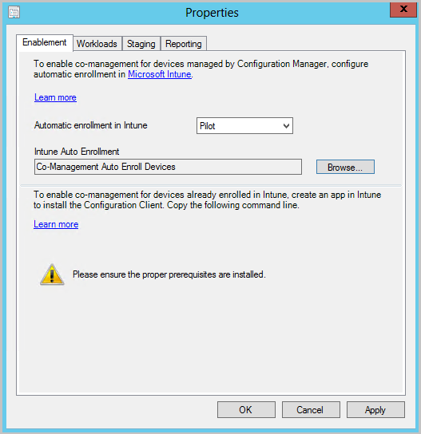
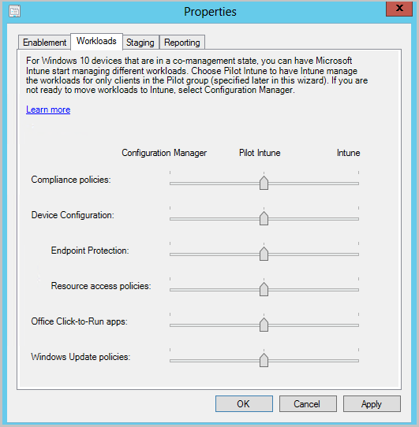
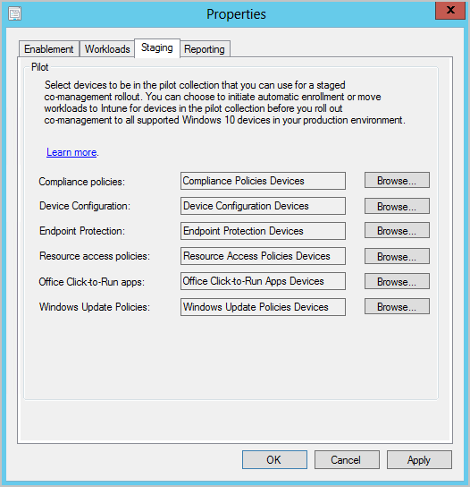

--- 
author: Banreet
ms.author: banreetkaur
ms.subservice: core-infra
ms.service: configuration-manager
ms.topic: include
ms.date: 06/12/2019

---

##  Multiple pilot groups for co-management workloads
<!--3555750 FKA 1357954-->

You can now configure different pilot collections for each of the co-management workloads. Being able to use different pilot collections allows you to take a more  granular approach when shifting workloads. This co-management change was made based on your product feedback.

- In the **Enablement** tab, you can now specify an **Intune Auto Enrollment** collection.
  - The **Intune Auto Enrollment** collection should contain all of the clients you want to onboard into co-management. It's essentially a superset of all the other staging collections.

  

- The **Workloads** tab hasn't changed and you can still choose which workloads to transition.

  

- In the **Staging** tab, instead of using one pilot collection for all workloads, you can now choose an individual collection for each workload.

    
  
These options are also available when you first [enable co-management](../../../../../comanage/how-to-enable.md).
