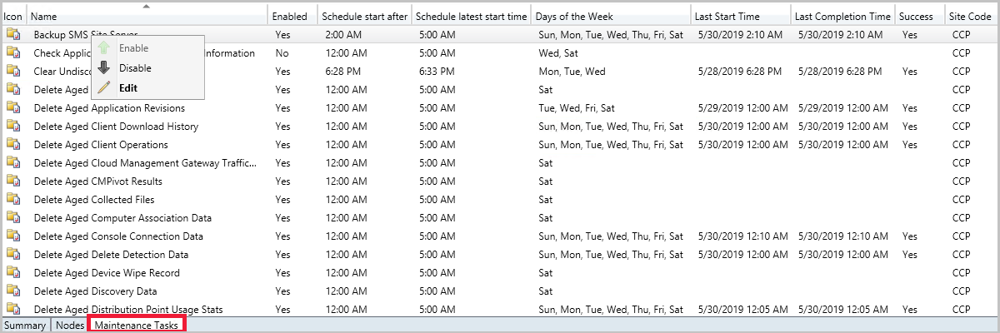

## Improvements to maintenance tasks

Site server maintenance tasks can now be viewed and edited from their own tab on the details view of a site server. The new **Maintenance Tasks** tab gives you information such as:

- If the task is enabled
- The task schedule
- Last start time
- Last completion time
- If the task completed successfully

### Try it out!

Try to complete the tasks. Then send [Feedback](../../../../understand/product-feedback.md) with your thoughts on the feature.

#### Edit a site maintenance task

1. In the **Administration** node, expand **Site Configuration**, then click on **Sites**.
1. Select a site from your list, then click on the **Maintenance Tasks** tab in the detail panel.
1. Right-click one of the maintenance tasks and select one of the following options: 
     - **Enable** - Turn on the task.
     - **Disable** - Turn off the task.
     - **Edit** - Edit the task schedule or its properties.

