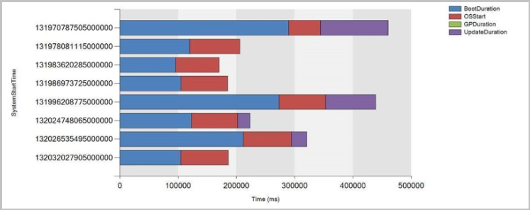

## <a name="bkmk_cmpivot"></a> Add joins, additional operators, and aggregators in CMPivot
<!--4054074-->

Based on your feedback for CMPivot, you now have additional arithmetic operators, aggregators, and the ability to add query joins such as using Registry and File together. The following items have been added:

### Table operators

|Table operators| Description|
|-----|-----|
| [join](/azure/kusto/query/joinoperator)| Merge the rows of two tables to form a new table by matching row for the same device|
|render|Renders results as graphical output|

The render operator already exists in CMPivot. Support for multiple series and the **with** statement were added. For more information, see the [examples](#bkmk_cmpivot-examples) section and Kusto's [join operator](/azure/kusto/query/joinoperator) article. 

#### Limitations for joins

1. The join column is always implicitly done on the **Device** field.
1. You can use a maximum of 5 joins per query.
1. You can use a maximum of 64 combined columns.

### Scalar operators

|Operator| Description|Example|
|-----|-----|-----|
| + | Add| `2 + 1, now() + 1d`|
| - |  Subtract| `2 - 1, now() - 1d`|
| * | Multiply| `2 * 2`|
| / | Divide | `2 / 1`|
| % | Modulo | `2 % 1`

### Aggregation functions

|Function| Description|
|-----|-----|
| percentile()| Returns an estimate for the specified nearest-rank percentile of the population defined by Expr|
| sumif() | Returns a sum of Expr for which Predicate evaluates to true|

### Scalar functions

|Function| Description|
|-----|-----|
| case()| Evaluates a list of predicates and returns the first result expression whose predicate is satisfied |
| iff() | Evaluates the first argument and returns the value of either the second or third arguments depending on whether the predicate evaluated to true (second) or false (third)|
 | indexof() | Function reports the zero-based index of the first occurrence of a specified string within input string|
| strcat() | Concatenates between 1 and 64 arguments |
| strlen()| Returns the length, in characters, of the input string|
| substring() | Extracts a substring from a source string starting from some index to the end of the string |
| tostring() | Converts input to a string operation |


### <a name="bkmk_cmpivot-examples"></a> Examples

- Show device, manufacturer, model, and OSVersion:

   ``` Kusto
   ComputerSystem
   | project Device, Manufacturer, Model
   | join (OperatingSystem | project Device, OSVersion=Caption)
   ```

- Show graph of boot times for a device:

   ``` Kusto
   SystemBootData
   | where Device == 'MyDevice'
   | project SystemStartTime, BootDuration, OSStart=EventLogStart, GPDuration, UpdateDuration
   | order by SystemStartTime desc
   | render barchart with (kind=stacked, title='Boot times for MyDevice', ytitle='Time (ms)')
   ```
 
   


## Improvements to CMPivot

To enable more people, such as security admins, to use CMPivot, we've expanded the ability for CMPivot to be run outside the console. We've also expanded the Security Admin role's default permissions. These changes give you the benefits of real-time queries across the organization.

### Connect to CMPivot Standalone without using the command line.
<!--4619340-->

- When you run CMPivot standalone, you'll be given a site connection prompt. 
- You'll find the CMPivot app in the following path: `<site install path>\tools\CMPivot\CMPivot.exe`. You can run it from that path, or copy the entire CMPivot folder to another location.
 
### Added CMPivot permissions to the Security Administrator role
<!--4683130-->

The following permissions have been added to Configuration Manager's built-in **Security Administrator** role:
- Read on SMS Script
- Run CMPivot on Collection
- Read on Inventory Report