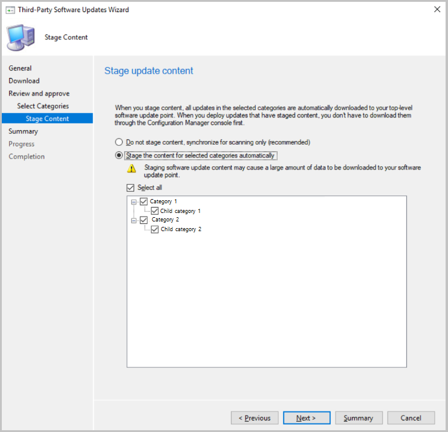

## Additional options for third-party update catalogs

You now have additional configuration options for how third-party update catalogs are synchronized into Configuration Manager. 

> [!IMPORTANT]
> These options are only available for v3 third-party update catalogs, which support categories for updates. These options are disabled for catalogs that aren't published in the new v3 format.

### Prerequisites

[Enable third-party updates](/sccm/sum/deploy-use/third-party-software-updates)

### New subscription to a third-party catalog

1. In the Configuration Manager console, go to the **Software Library** workspace. Expand **Software Updates** and select the **Third-Party Software Update Catalogs** node.
1. Select the catalog to subscribe and click **Subscribe to Catalog** in the ribbon.
1. Choose your options on the **Select Categories** page:

   - **Synchronize all update categories** (default)
       - Synchronizes all updates in the third-party update catalog into Configuration Manager.
   -  **Select categories for synchronization**
       - Choose which categories and child categories to synchronize into Configuration Manager.

      

1. Choose if you want to **Stage update content** for the catalog. When you stage the content, all updates in the selected categories are automatically downloaded to your top-level software update point meaning you don't need to ensure they're already downloaded before deploying. You should only automatically stage content for updates you are likely to deploy them to avoid excessive bandwidth and storage requirements.

   - **Do not stage content, synchronize for scanning only (recommended)**
     - Don't download any content for updates in the third-party catalog
   - **Stage the content for selected categories automatically**
     - Choose the update categories that will automatically download content.
     - The content for updates in selected categories will be downloaded to the top-level software update point's WSUS content directory.

      

### Edit an existing subscription

1. In the Configuration Manager console, go to the **Software Library** workspace. Expand **Software Updates** and select the **Third-Party Software Update Catalogs** node.
1. Right-click on the catalog and select **Properties**.
1. Choose your options on the **Select Categories** tab.
   - **Synchronize all update categories** (default)
       - Synchronizes all updates in the third-party update catalog into Configuration Manager.
   -  **Select categories for synchronization**
       - Choose which categories and child categories to synchronize into Configuration Manager.
1. Choose your options for the **Stage update content** tab.
   - **Do not stage content, synchronize for scanning only (recommended)**
     - Don't download any content for updates in the third-party catalog
   - **Stage the content for selected categories automatically**
     - Choose the update categories that will automatically download content.
     - The content for updates in selected categories will be downloaded to the top-level software update point's WSUS content directory. 

### Known issues

Saving setting for v3 catalogs with large numbers of categories may take longer than expected. We're working on improving this issue.