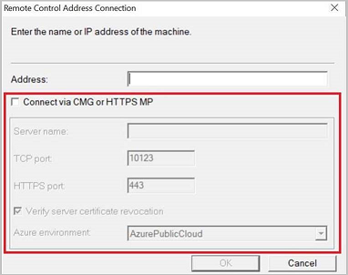

## Remote control anywhere using Cloud Management Gateway
<!--4575930-->

> [!IMPORTANT]
> This feature was removed in Configuration Manager technical preview branch version 2112. For more information, see [A new remote assistance tool](../../../2021/technical-preview-2112.md#bkmk_cmgrc).

An admin or helpdesk operator can now connect to a client via remote control over the Internet via cloud management gateway.

### Prerequisites

- **Remote control user requirements:**
   - The Azure Active Directory (Azure AD) user needs to be discovered by Configuration Manager.
   - The user needs to be a permitted viewer for remote control under the **Remote Tools** page in the **Client Settings**.
- **Remote control client requirements:**
   - Remote control needs to be enabled under the **Remote Tools** page in the **Client Settings**.
   - The client needs to be upgraded to the latest version.
   - The client needs to be online from the Cloud Management Gateway

### Known issues

For internet clients communicating with Cloud Management Gateway using Azure AD authentication, remote control may not work as expected.

### Try it out!

Try to complete the tasks. Then send [Feedback](../../../../understand/product-feedback.md) with your thoughts on the feature.

#### Connect to a client from the console

1. Choose a client that is communicating via CMG using a client PKI certificate. Make sure the client is online from the admin console. 
1. Launch the remote control viewer from the console by right-clicking on a client, selecting **Start**, then **Remote Control**.

#### Use the standalone remote control viewer

1. Launch the standalone remote control viewer from `adminconsole\bin\i386\CmRcViewer.exe`. The folder and file are located where the admin console is installed.
1. From the **File** menu, click on **Connect** to open the connection dialog.
1. Fill in the following options:
   - **Address**: The target address of the client. To connect using CMG, you must use the FQDN. You can't use the hostname or IP address.
       - For the **Try it out!** scenario, choose a client that is communicating via CMG using a client PKI certificate. Make sure the client is online from the admin console.  
   - **Connect via CMG or HTTPs MP**: This option allows for fallback from a TCP direct connection to use the CMG service.
   - **Server name**: The CMG service name to which the current user and target client can connect.
   - **TCP port**: If needed, change the default port from 10123.
   - **HTTPS port**: If needed, change the default port from 443.
   - **Verify server certificate revocation**: If the CRL DP location isn't accessible for the current user, disable this option for testing purposes.
   - **Azure environment**: This option will prompt for sign in with your Azure AD credentials. Then, select the Azure environment for that user.
1. Click **OK** to connect. Remote control will attempt a direct connection first, then fallback to CMG for connection. 

    
