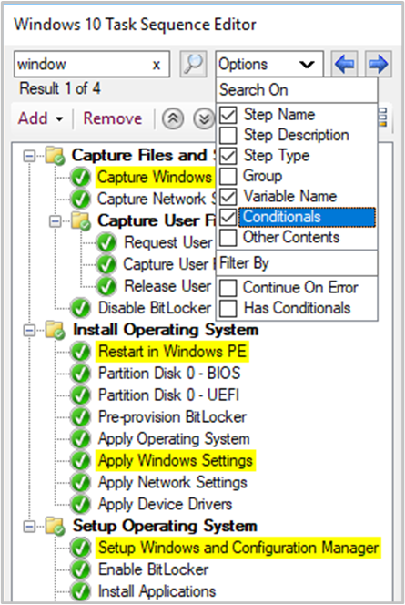

##  Search the task sequence editor

<!--4621085-->

If you have a large task sequence with many groups and steps, it can be difficult to find specific steps. Based on your feedback, you can now search in the task sequence editor. This action lets you more quickly locate steps in the task sequence.

Search using the following criteria:

- Step name
- Step type
- Step description
- Group name
- Variable name
- Conditions
- Other content, for example, strings like variable values or command lines

You can also filter for all steps with the following attributes:

- Continue on error
- Has conditions

When you search, the editor window highlights in yellow the steps that match your search criteria.

You can quickly access these search fields and navigate the search results with the following keyboard shortcuts:

- **CTRL** + **F**: enter a search string
- **CTRL** + **O**: select the search options to scope the results
- **F3** or **Enter**: step forward through the results
- **SHIFT** + **F3**: step backwards through the results
