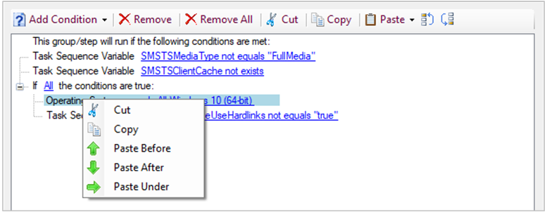

##  Copy and paste task sequence conditions

<!-- 4621098 -->
If you want to reuse the conditions from one task sequence step to another, based on your feedback, you can now copy and paste conditions in the task sequence editor. Select a condition to cut or copy it. If a condition has children, it copies the entire block. If there's a condition on the clipboard, you can paste it with the following options:

- Paste before
- Paste after
- Paste under (only applies to nested conditions)

Use standard keyboard shortcuts to copy (**CTRL** + **C**) and cut (**CTRL** + **X**). The standard **CTRL** + **V** keyboard shortcut does the **Paste after** action.

There are also new options to move conditions up or down the list.

> [!Note]  
> You can copy and paste conditions between steps in a task sequence. It doesn't support this action between different task sequences.
