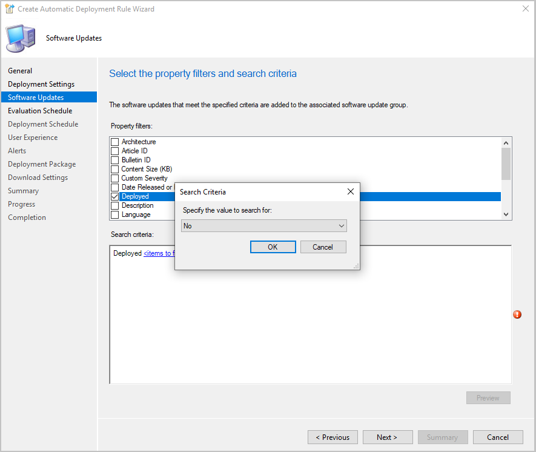

## Additional software update filter for ADRs

As a result of your feedback, now you can use **Deployed** as an update filter for your automatic deployment rules. This filter helps identify new updates that may need to be deployed to your pilot or test collections. The software update filter can also help avoid redeploying older updates. When using **Deployed** as a filter, be mindful that you may have already deployed the update to another collection, such as a pilot or test collection.

### Try it out!

Try to complete the tasks. Then send [Feedback](../../../../understand/product-feedback.md) with your thoughts on the feature.

To create a new ADR:

1. Go to **Software Library** > **Software Updates** > **Automatic Deployment Rules**.
1. In the ribbon, click **Create Automatic Deployment Rule**.
1. Specify your settings on the **General** and **Deployment Settings** pages in the wizard.
1. When you get to the **Software Updates** page, select **Deployed** and choose either **Yes** or **No**.
1. Complete the rest of your ADR selections by following the rest of the wizard.

Change an existing ADR:

1. Go to **Software Library** > **Software Updates** > **Automatic Deployment Rules**.
1. Right-click on the automatic deployment rule you want to modify and select **Properties**.
1. In the **Software Updates** tab, select **Deployed** and choose either **Yes** or **No**. 
1. Click **OK** to save and close the properties page. The new filter will be used the next time the rule is run.

