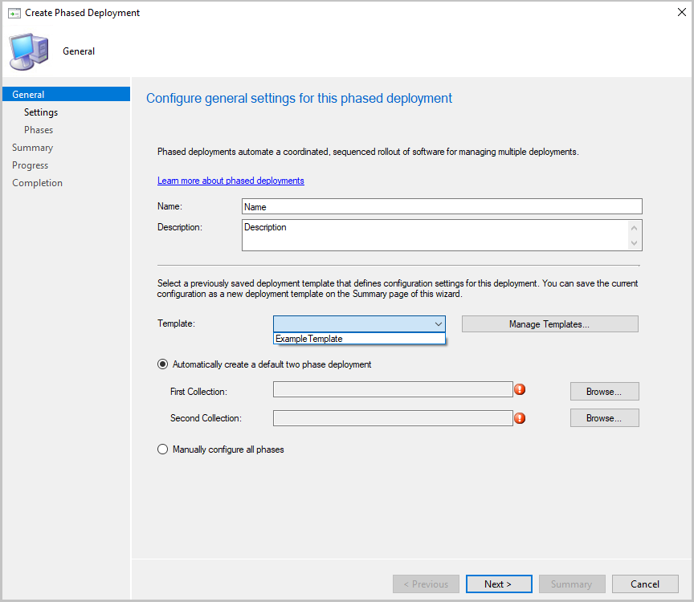
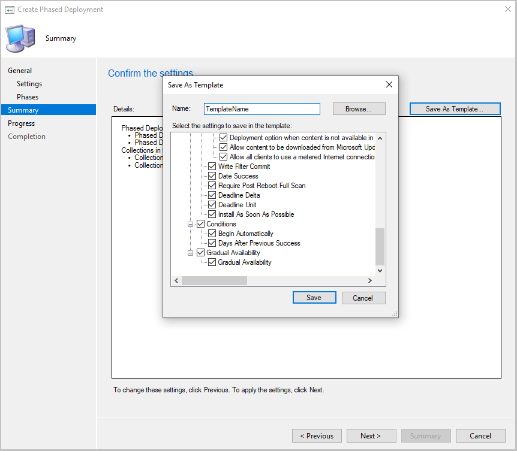

## Phased deployment templates
<!--4961086-->
In the same way that it's possible to create deployment templates, it's now possible to create and use phased deployment templates for software updates. Templates will save you time when configuring other phased deployments with similar settings.

### Try it out!

Try to complete the tasks. Then send [Feedback](../../../../understand/product-feedback.md) with your thoughts on the feature.

Create a phased deployment template:

1. In the ribbon, select **Create Phased Deployment** for one of the following objects:

   - Task sequence
   - Software update or software update group
   - Application

1. Specify your usual settings for your phased deployment.
1. When you get to the **Summary** page, click the **Save As Template...** option.
1. Give your template a name and select which settings to save in your template.
1. Click **Save**. Use your new template the next time you create a phased deployment.

