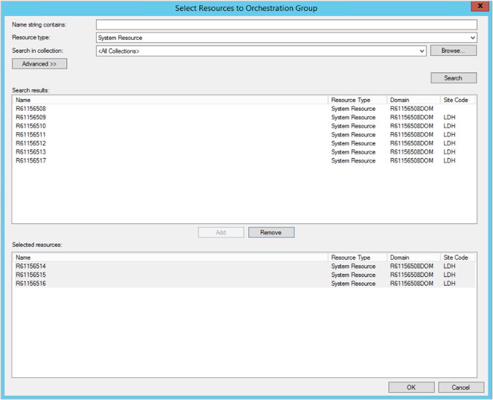

##  Orchestration Groups

<!--3098816-->

Create an orchestration group to better control the deployment of software updates to devices. Many server administrators need to carefully manage updates for specific workloads, and automate behaviors in between. For example:

- As the software updates administrator, you manage all updates for your organization.
- You have one large collection for all servers and one large collection for all clients. You deploy all updates to these collections.
- The SQL Server administrators want to control all the software installed on the SQL Servers. They want to patch five servers in a specific order. Their current process is to manually stop specific services before installing updates, and then restart the services afterwards.
- You create an orchestration group and add all five SQL Servers. You also add pre- and post-scripts, using the PowerShell scripts provided by the SQL Server administrators.
- During the next update cycle, you create and deploy the software updates as normal to the large collection of servers. The SQL Server administrators run the deployment, and the orchestration group automates the order and services.

An orchestration group gives you the flexibility to update devices based on a percentage, a specific number, or an explicit order. You can also run a PowerShell script before and after the devices run the update deployment.

Members of an orchestration group can be any Configuration Manager client, not just servers. The orchestration group rules apply to the devices for all software update deployments to any collection that contains an orchestration group member. Other deployment behaviors still apply. For example, maintenance windows and deployment schedules.

> [!NOTE]
> The **Orchestration Groups** feature is the evolution of the [Server Groups](../../../../../sum/deploy-use/service-a-server-group.md) feature. An orchestration group is a new object in Configuration Manager.

### Prerequisites

- Enable the **Orchestration Groups** feature. For more information, see [Enable optional features](../../../../servers/manage/optional-features.md).

    > [!NOTE]
    > When you enable **Orchestration Groups**, the site disables the **Server Groups** feature. This behavior avoids any conflicts between the two features.

- To see all of the orchestration groups and updates for those groups, your account needs to be a **Full Administrator**.

### Try it out!

Try to complete the tasks. Then send [Feedback](../../../../understand/product-feedback.md) with your thoughts on the feature.

1. In the Configuration Manager console, go to the **Assets and Compliance** workspace, and select the **Orchestration Group** node.

1. In the ribbon, select **Create Orchestration Group** to open the **Create Orchestration Group Wizard**.

1. On the **General** page, give your orchestration group a **Name** and optionally a **Description**.

1. On the **Member Selection** page, first specify the current **Site code**. Then select **Browse** to add device resources as members of this orchestration group. **Search** for devices by name, and then **Add** them. Select **OK** when you finish adding devices to the selected resources list.

    

1. On the **Rule Selection** page, select one of the following options:

   - **Allow a percentage of the machines to be updated at the same time**, then select or enter a number for this percentage. Use this setting to allow for future flexibility of the size of the orchestration group. For example, your orchestration group contains 50 devices, and you set this value to 10. During a software update deployment, Configuration Manager allows five devices to simultaneously run the deployment. If you later increase the size of the orchestration group to 100 devices, then 10 devices update at once.

   - **Allow a number of the machines to be updated at the same time**, then select or enter a number for this specific count. Use this setting to always limit to a specific number of devices, whatever the overall size of the orchestration group.

   - **Specify the maintenance sequence**, then sort the selected resources in the proper order. Use this setting to explicitly define the order in which devices run the software update deployment.

1. On the **PreScript** page, enter a PowerShell script to run on each device *before* the deployment runs. The script should return a value of `0` for success, or `3010` for success with restart. You can also specify a **Script timeout** value, which fails the script if it doesn't complete in the specified time.

1. On the **PostScript** page, enter a PowerShell script to run on each device *after* the deployment runs. The behavior is otherwise the same as the PreScript.

1. Complete the wizard.

In the **Orchestration Group** node, select an orchestration group. In the ribbon, select **Show Members**. You can see the members of the group, and their orchestration status.

To test the behavior of the orchestration group, [deploy software updates](../../../../../sum/deploy-use/deploy-software-updates.md) to a collection that contains the members of the orchestration group. Orchestration starts when any client in the group tries to install any software update at deadline or during a maintenance window. It starts for the entire group, and makes sure that the devices update by following the orchestration group rules.

> [!TIP]
> Orchestration groups only apply to software update deployments. They don't apply to other deployments.

### Monitor

Use the following log files on the site server to help monitor and troubleshoot:

- **Policypv.log**: shows that the site targets the orchestration group to the clients
- **SMS_OrchestrationGroup.log**: shows the behaviors of the orchestration group

### Orchestration group known issues

- Don't add a machine to more than one orchestration group.

- When searching a collection to select resources for an orchestration group, only choose **All Desktop and Server Clients**.

- There are several actions currently available on an orchestration group, but only the default **Show Members** action works. This action currently doesn't show the name of the device, only the resource ID.

- The **Orchestration Type** values correspond to the following types:

    | Value | Orchestration Type |
    |-------|---------|
    |**1**|Number|
    |**2**|Percentage|
    |**3**|Sequence|

- The **Current State** values correspond to the following states:

    | Value | Current State |
    |-------|---------|
    |**1**|Idle|
    |**2**|Waiting, the device is waiting its turn|
    |**3**|In progress, installing an update|
    |**4**|Failed|
    |**5**|Reboot pending|
