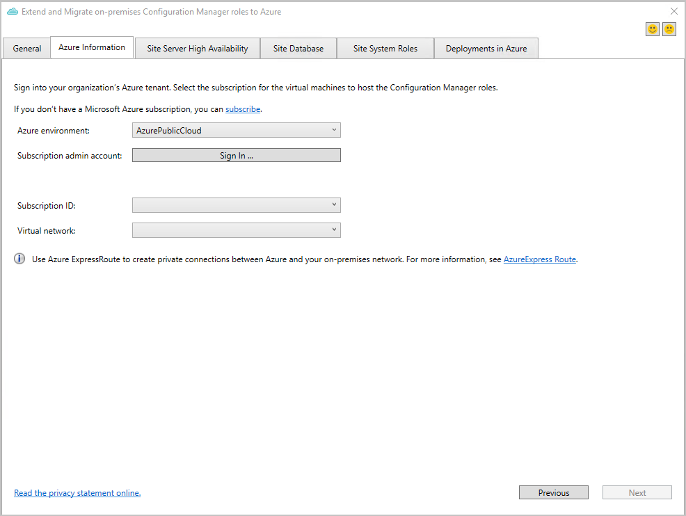
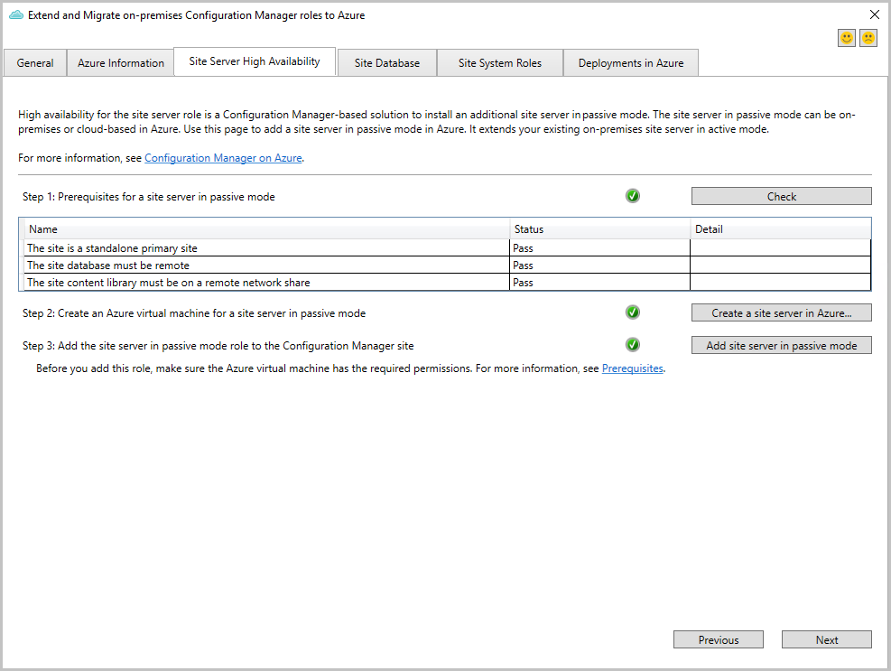
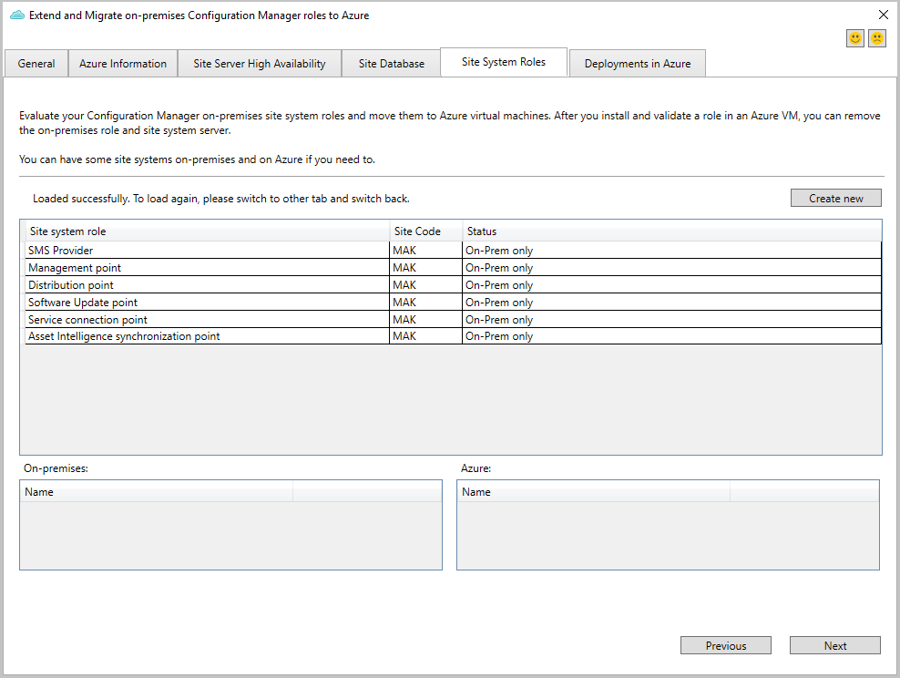
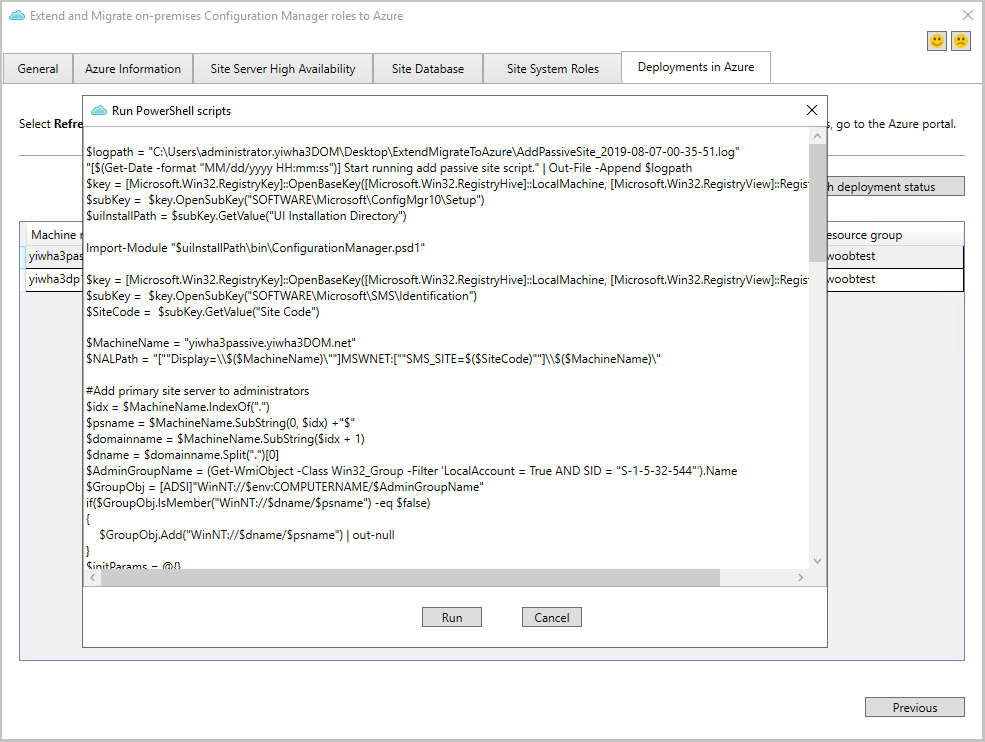

##  Extend and migrate an on-premises site to Microsoft Azure

<!--3556022-->

This new tool helps you to programmatically create Azure virtual machines (VMs) for Configuration Manager. It can install with default settings site roles like a passive site server, management points, and distribution points. Once you validate the new roles, use them as additional site systems for high availability. You can also remove the on-premises site system role and only keep the Azure VM role.

### Prerequisites

- An Azure subscription

- Azure virtual network with ExpressRoute gateway

<!-- - A standalone primary site. A hierarchy with a central administration site isn't currently supported. can comment this out because TP only supports a standalone primary!-->

- Your user account needs to be a Configuration Manager **Full Administrator** and have administrator rights on the primary site server.

- To add a passive server, the primary site must meet the [site server high availability requirements](../../../../servers/deploy/configure/site-server-high-availability.md#prerequisites). For example, it requires a [remote content library](../../../../plan-design/hierarchy/remote-content-library.md).

### Try it out!

Try to complete the tasks. Then send [Feedback](../../../../understand/product-feedback.md) with your thoughts on the feature.

1. Sign on to the primary site server and run the following tool in the Configuration Manager installation directory: `Cd.Latest\SMSSETUP\TOOLS\ExtendMigrateToAzure\ExtendMigrateToAzure.exe`

1. Review the information on the **General** tab, and then switch to the **Azure Information** tab.

1. On the  **Azure Information** tab, choose your **Azure environment**, and then **Sign in**.
  
    > [!TIP]
    > You may need to add `https://*.microsoft.com` to your trusted websites list to correctly sign in.

    

1. After you sign in, select your **Subscription ID** and **Virtual network**. The tool only lists networks with an ExpressRoute gateway.

#### Site Server High Availability

1. On the **Site Server High Availability** tab, select **Check** to evaluate your site's readiness.

    If any of the checks fail, select **More detail** to determine how to remediate the problem. For more information about these prerequisites, see [Site server high availability](../../../../servers/deploy/configure/site-server-high-availability.md#prerequisites).

2. If you want to extend or migrate your site server to Azure, select **Create a site server in Azure**. Then fill in the following fields:

    |Name|Description|
    |---|---|
    |**Subscription**|Read only. Shows the subscription name and ID.|
    |**Resource group**| Lists available resource groups. If you need to create a new resource group, use the [Azure portal](https://portal.azure.com), and then rerun this tool.|
    |**Location**| Read only. Determined by your virtual network's location|
    |**VM Size**|Choose a size to fit your workload. Microsoft recommends the **Standard_DS3_v2**.|
    |**Operating system**|Read only. The tool uses Windows Server 2019.|
    |**Disk type**|Read only. The tool uses Premium SSD for best performance.|
    |**Virtual network**|Read only.|
    |**Subnet**|Select the subnet to use. If you need to create a new subnet, use the [Azure portal](https://portal.azure.com).|
    |**Machine name**|Enter the name of the passive site server VM in Azure. It's the same name shown in the [Azure portal](https://portal.azure.com).|
    |**Local admin username**|Enter the name of the local administrative user that the Azure VM creates before it joins the domain.|
    |**Local admin password**|The password of the local administrative user. To protect the password during Azure deployment, store the password as a secret in [Azure Key Vault](/azure/key-vault/key-vault-overview). Then, use the reference here. If needed, create a new one from the [Azure portal](https://portal.azure.com).|
    |**Domain FQDN**|The fully qualified domain name for the Active Directory domain to join. By default, the tool gets this value from your current machine.|
    |**Domain username**|The name of the domain user allowed to join the domain. By default, the tool uses the name of the currently signed in user.|
    |**Domain password**|The password of the domain user to join the domain. The tool verifies it after you select **Start**. To protect the password during Azure deployment, store the password as a secret in [Azure Key Vault](/azure/key-vault/key-vault-overview). Then, use the reference here. If needed, create a new one from the [Azure portal](https://portal.azure.com).|
    |**Domain DNS IP**|Used for joining the domain. By default, the tool uses the current DNS from your current machine.|
    |**Type**|Read only. It shows *Passive Site Server* as the type.|

    1. To start provisioning the Azure VM, select **Start**. To monitor the deployment status, switch to the **Deployments in Azure** tab in the tool. To get the latest status, select **Refresh deployment status**.

        > [!TIP]
        > You can also use the [Azure portal](https://portal.azure.com) to check the status, find errors, and determine potential fixes.

    1. When the deployment finishes, go to your SQL Servers, and grant permissions for the new Azure VM. For more information, see [Site server high availability - Prerequisites](../../../../servers/deploy/configure/site-server-high-availability.md#prerequisites).

3. To add the Azure VM as a site server in passive mode, select **Add site server in passive mode**.

Once the site adds the site server in passive mode, the **Site Server High Availability** tab shows the status.

Next, go to the [Deployments in Azure](#bkmk_deploy-azure) tab to finish the deployment.

#### Site database

The tool doesn't currently have any tasks to migrate the database from on-premises to Azure. You can choose to move the database from an on-premises SQL Server to an Azure SQL Server VM. The tool lists the following articles on the **Site Database** tab to help:

- [Backup and restore the database](../../../../servers/manage/backup-and-recovery.md)
- [Configure a SQL Server Always On availability group and allow the data to replicate](../../../../servers/deploy/configure/sql-server-alwayson-for-a-highly-available-site-database.md#changes-for-site-backup)
- [Migrate a SQL Server database to an Azure SQL Server VM](/azure/azure-sql/virtual-machines/windows/migrate-to-vm-from-sql-server)

#### Site system roles

1. Switch to the **Site System Roles** tab. To provision a new site system role with the default settings, select **Create new**. You can provision roles such as the management point, distribution point, and software update point. Not all roles are currently available in the tool.

    

1. In the provisioning window, fill in the fields to provision the site role's VM in Azure. These details are similar to the above list for the site server.

1. To start provisioning the Azure VM, select **Start**. To monitor the deployment status, switch to the **Deployments in Azure** tab in the tool. To get the latest status, select **Refresh deployment status**.

    > [!TIP]
    > You can also use the [Azure portal](https://portal.azure.com) to check the status, find errors, and determine potential fixes.

Repeat this process to add more site system roles.

Next, go to the [Deployments in Azure](#bkmk_deploy-azure) tab to finish the deployment.

When the deployment finishes, go to the Configuration Manager console to make additional changes to the site role.

####  Deployments in Azure

1. Once Azure creates the VM, switch to the **Deployments in Azure** tab in the tool. Select **Deploy** to configure the role with the default settings.

1. Select **Run** to start the PowerShell script.

    

Repeat this process to configure more roles.